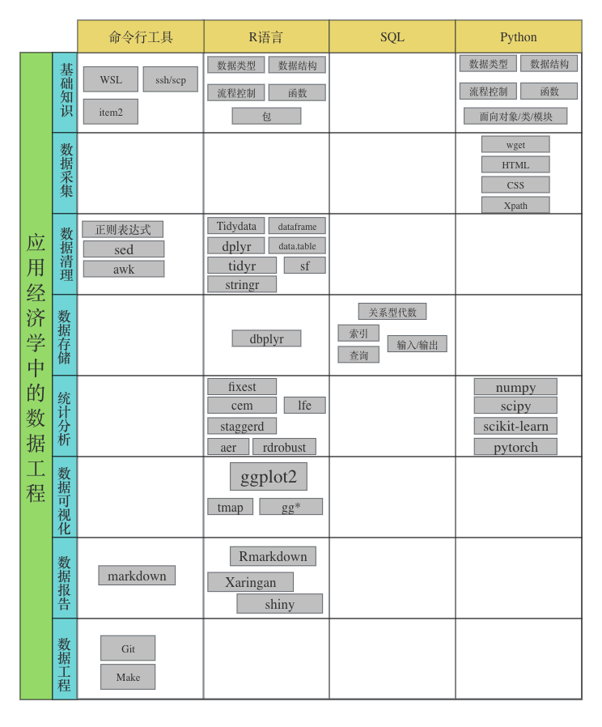
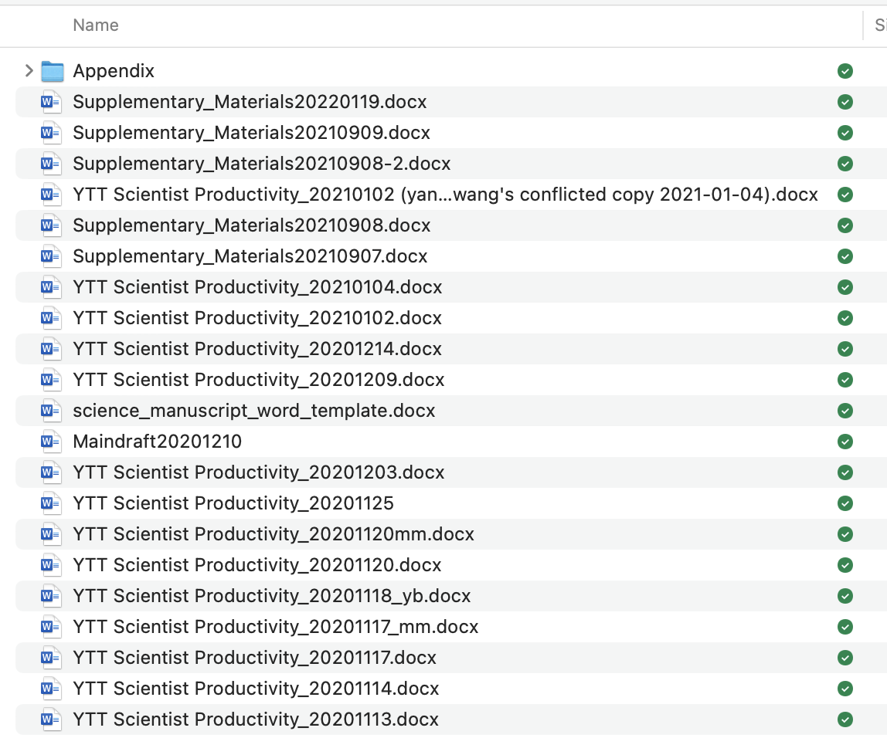
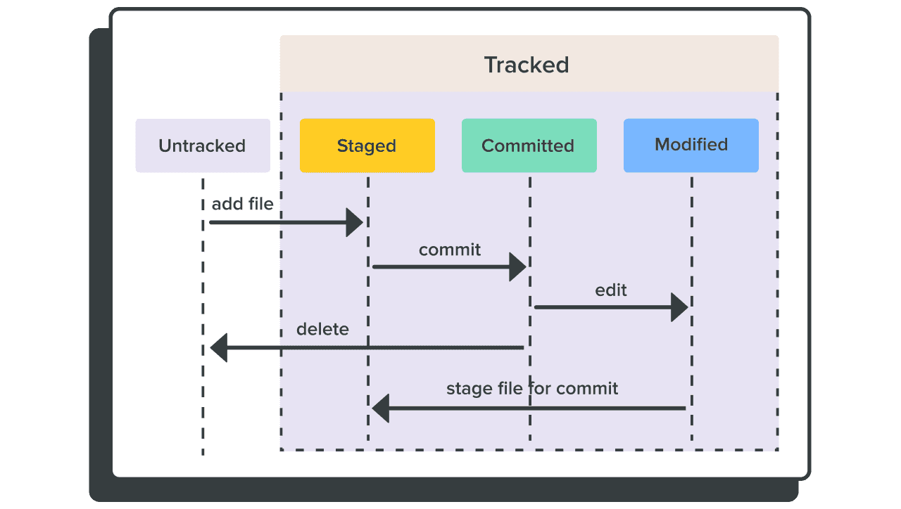
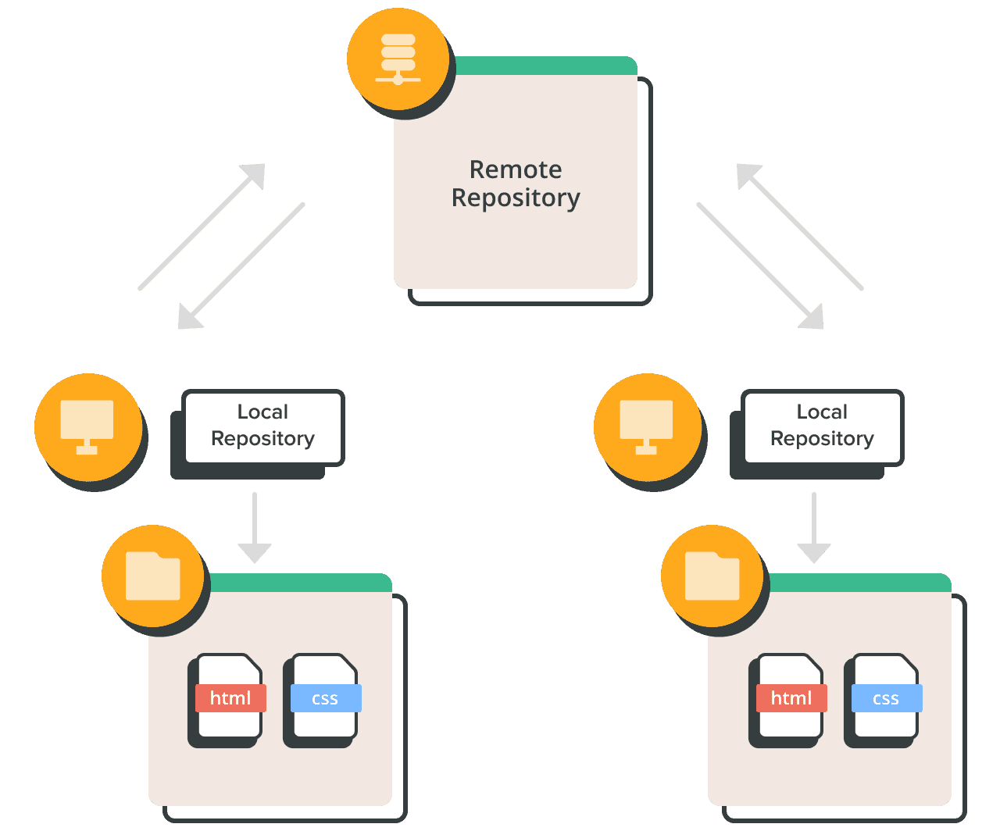
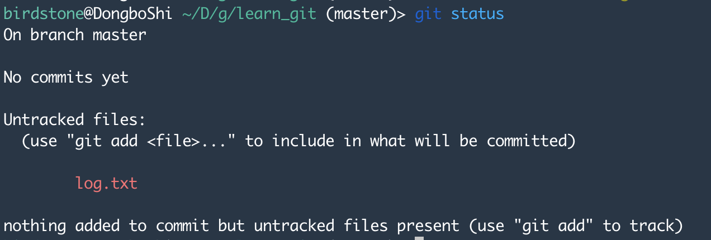
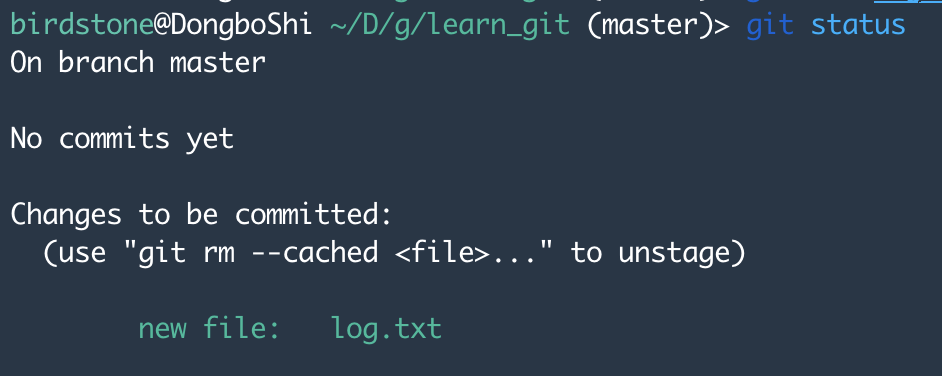
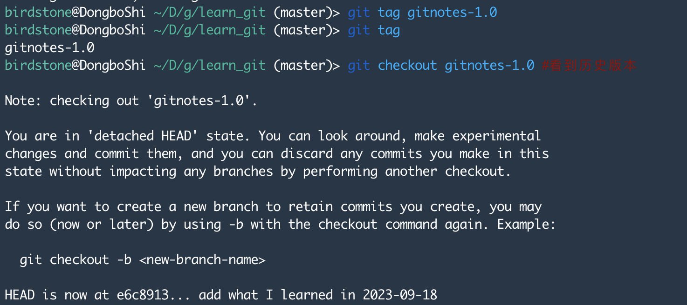
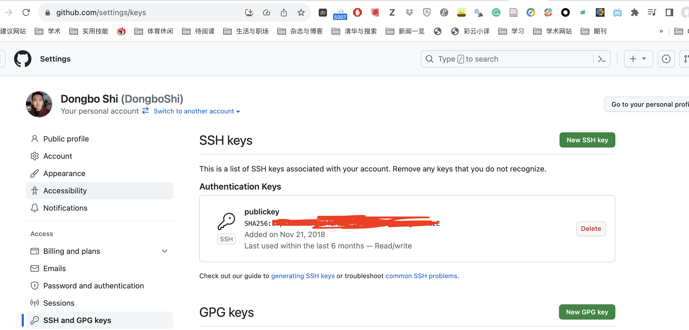
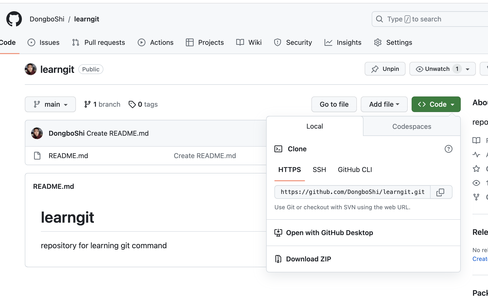
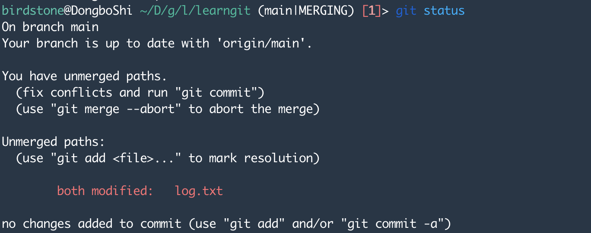

\mainmatter

# 数据工程：重塑经济学研究的流程 {#flow}

> 浦东就是上海，上海就是浦东。*--- 让子弹飞*


## 人工智能时代的社会科学研究：机遇与挑战

### 社会科学的三圈分类


我们可以用上面图中的三个圈对社会科学相关研究进行一个粗略的分类，我们把三个圈分别编码为A-理论/形式模型，B-编程，C-统计模型。A对应于社会科学中的纯理论研究，例如2020年诺奖得主Milgrom的Mutitask Model。这一类研究基于科学家对于社会的基本假设，并在基础上构建了对社会运行规律的预测。此外，还有很多纯粹文学论述式的理论研究，这类研究类似于某种辩论，若没有实证证据的支持，其科学性将非常受限。遗憾的是，这类研究依然充斥着中文社会科学知识界。B部分为纯粹的计算机科学，其目的在于通过计算机解决实际工程问题，追求的是预算效率。C部分则是统计学，其目的在于为实践中的因果推断问题提供合适的间接的统计工具，社会科学是统计学工具的应用领域之一，进入社会科学领域后，统计学便多了一个名字，计量经济学。

第一、传统社会科学。A与C的交集当前绝大多数的实证社会科学研究是 ，以理论模型作为选题的出发点，在理论的指导下，通过统计模型结合观测数据检验相关的假设。实际上社会科学内部有存在着复杂的鄙视链与学科纷争，这些纷争可以归结为三个方面的原因，即理论数学化程度的差异，工具可复现性的差异，关心研究对象的差异。正式基于这三个方面的优势，经济学成为了社会科学的"灭霸"。这种"理论-假设-实证"的道路是在社会科学研究科学化的过程中通过总结经典物理学研究范式得出来的教条。而如今的物理学早已走向数据驱动和唯象理论，即更加注重从实验现象出发来修正理论，这一趋势并没有得到社会科学界的重视。

在社会科学研究中，还有着持续的定量与定性的方法论争论，而这种争论是一个伪命题，不同的研究问题自然对应了不同的研究工具。正如当初金山找对叶问说，今日北方拳输给南方拳了。而叶问回答:你错了，不是南北拳的问题，是你的问题!

第二、管理科学与工程。B与A的交集构成了管理科学与工程，其以工程的视角解决管理学问题，以模拟的方式拟补实证数据的缺失。本质上，这是一个工程学科，不过近些年来越来越重视实证数据。

第三、人工智能（AI）。AI是B与C的交集，综合了大规模数据的存储与运算技术，强大的运算能力以及统计学的知识。

第四、下一代社会科学。A、B、C的交集组成了下一代社会科学的基础，新兴的经济学家他们不是程序员（例如Raj Chetty），却可以通过中级以上能力的计算机语言在收集、预处理数据方面保持强大的改变游戏规则的能力；他们不一定是统计学家，但是具备过硬的统计模型基础来保证实证研究的可靠性；同时他们还具备扎实的理论基础(形式模型能力)来设计一流的研究问题。这一代社会科学将致力于提高研究的透明度来应对社会科学的可复现性危机。尤其关注因果关系的识别。他们不是专业的程序员

本书正是为了有志于从事新一代社会科学的学者而写的，尽管对理论以及模型的探索永远不会过时，大数据技术与人工智能高速发展的今天，社会科学早已进入数据驱动的时代，就像物理学的实验时代。

### AI智能发展的三要素

人工智能，由于这个很有想象空间的的名字，导致不明就里的围观群众对其赋予了太多浪漫的或者恐慌的想象。这其中社会科学的学生和老师不在少数。为了理解人工智能对于社会科学的影响，我们就需要卸下对人工智能的想象。

人工智能之前还有一个名字，机器学习，不过感觉对于我们解释人工智能并没有什么帮助。说白了，目前的人工智能技术能实现的功能就是一个分类器，例如，预测一个学者能否入选杰出青年科学基金。大家至少都接触过一个分类器，即0-1变量的Logistic回归，在这个回归中，我们可以使用候选学者的学历、导师、工作单位、性别、年龄、发表学术论文的情况、获奖情况（据说现在特别看重）等作为自变量，以是否真正入选"杰青"作为因变量。如果你可以看懂这个例子，那么恭喜你，已经可以说自己是人工智能专家了，因为实际上很多专家连回归都没有跑过。所以，人工智能实际上就是一个高级的0-1回归，高级的地方在于人工智能的算法不仅可以使用非线性的模型，更在于其实现了及其高且稳健的分类准确率，从而达到商业应用的水平。不同人工智能算法的差别主要在与分类时候使用的方法，例如，人工神经网络特别像结构方程模型，随机森林就是一堆二叉树。

由此可见，人工智能的基础学科有且只有两个，统计学和计算机。前者解决随机空间中不同模型的收敛性与一致性问题，后者解决计算难度的问题。所以，如果一个学校这两个学科都不好，那他的人工智能学科大概率是骗钱的。

但是，人工智能在过去3-5年的蓬勃发展并不是得益于统计学的理论突破，而是得益于计算机工程技术方面的发展，主要是算料、算力以及算法的突破。第一、算料，即数据。传感器技术的发展，互联网的发展使得数据的采集越来越及时，积累越来越多，数据储存和运输的成本也越来越低。这就是所谓的大数据，在人工智能火爆之前，流行于各种媒体经济学家口中的名词，一夜之间，连几千个人的数据描述都可以成为"大数据"了。实际上大数据是一个商业概念，而不是一个学术概念，因此大数据很难界定，也存在太多误用。但是，无论如何从任何角度考察，大数据都必须要大，至少可以认为一台笔记本电脑可以打开的一定不是大数据。以这个标准来看，是否误用就很容易鉴定出来了。第二、算力，主要是讲计算机集群。这方面的突破在于分布式运算，如果追求单个超级计算机的提升，迟早会遇到物理定律的瓶颈。而分布式运算可以将全球各地的大量的小型乃至微型计算机联合起来使用，从而大大降低了大规模运算的门槛，达到了一百万个臭皮匠，肯定打死一个诸葛亮的水平。第三，算法。有了前两个条件作为基础，各种深度学习算法就可以大显神威，例如Alpha GO背后有一个极大的神经网络来辅助。就好比不考虑体重的拳击比赛都是耍流氓一样，以后围棋这类的智力运动也得考虑分级别竞争了，只不过分级的标准不是体重，也不是年龄，而是能耗。只有在一个能量级别上的竞争才是奥林匹克的。

### AI对社会科学研究的冲击

从Alpha GO横空出世以来，人工智能以摧枯拉朽之势横扫了几乎所有学科，社会科学当然也不能幸免。面对人工智能的冲击，不同的人，站在不同的立场，做出了各种反应。很快就有人站出来讨论其发展对于各种社会科学的影响，包括促进社会科学研究转型，甚至重构社会科学的研究范式。当然有人指出人工智能与大数据不过如此。也有人趁势提出智能社会科学、计算社会科学等新兴学科。

作为经济学与公共政策的研究和教育从业者，直观感受到的AI的冲击主要来自于三个方面：

**最直接的冲击是人的冲击。** 人工智能从对低技能劳动力的替代逐步发展到对高技能劳动力的替代，尤其是ChatGPT的出现直接引发了高技能劳动者的恐慌。研究论文指出，尽管科学与批判性思维技能受到GPT的冲击较弱，但是编程和写作技能受到GPT的冲击很强。[^02-dataeng-1]这可能意味着依赖写作的社会科学研究人员在未来的职业发展上，会面临更大挑战。在社会科学研究内部，人工智能火爆之后最直接的冲击是突然涌来一大批计算机技术过硬的人抢社会科学研究的饭碗。拿着人工智能的工具来解决社会科学问题，"计算社会科学"这个大旗下就聚集了一部分交叉学科背景的学者。这种冲击带来的感受是非常直接，应对学科外来的冲击，社会科学家们分化除了"投降派"与"抵抗派"，前者积极拥抱变化，但有时候不免看轻本学科的独特价值与理论积累，一切以技术与数据论高低；后者则完全拒绝接变化，竖起来"人文主义"、"理论贡献"各种大旗来抵抗技术冲击。最近，反对量化研究，反对过度理科化的声音一直就没有间断过。

[^02-dataeng-1]: Eloundou T, Manning S, Mishkin P, et al. GPTs are GPTs: An Early Look at the Labor Market Impact Potential of Large Language Models[J]. arXiv, 2023.

我们说，这两种不可取的，长期来看，技术冲击是降维的、碾压式的，是改变游戏规则的。"大清"的命运不会因为一支辫子军的存在而改变。对了，这个用数学语言叫做"收敛"；当然完全以技术论高低，放弃自身理论也是不可取的。在应对AI冲击时，经济学家是最开放也是最积极的。

**工具更新带来的惊慌。**外来人员带来的直接影响就是工具，AI作为一项新兴技术（很多时候甚至不需要AI相关的技术）发挥了改变游戏规则的作用。所谓的改变游戏规则，便是直接拉开了竞争的层面，可以实现降维竞争，例如早3-4年建立一个数据库可能会带来研究产出上的量级差异。具体而言，改变游戏规则体现在两个方面：一是可以通过技术手段获取并建立用于经济学研究的数据库，这一类的数据往往是"全体"数据，直接省去了抽样的问题；二是通过机器学习等手段定义、识别新的经济变量，例如有研究使用机器学习来识别价格决定机制。这必然会带来学术界的惊慌失措。

**对研究范式的冲击**。AI的发展还直接冲击了社会科学的研究范式。一方面，覆盖全体的数据模式直接改变了传统的抽样调查；另一方面，AI对社会科学的看家范式-"因果推断"也产生了冲击，AI在无因果关系时依旧可以产生非常出色的预测性能，这本身就是对因果关系必要性的挑战。计算机学者甚至定义了全新的因果模型，这是值得我们关注的。

### AI为社会科学研究创造的机遇

前面说了那么多技术发展引发的社会科学研究内部的冲击与担忧，但是跳出来看，任何技术进步所带来的机遇往往超过其带来的问题。AI至少为社会科学研究范式和研究议题等方面创造了大量机遇。

#### 给研究范式带来的机遇

1.  AI和大数据的发展，直接让经济学家从抽样数据发展成为全体数据的研究，从此再也不用为抽样偏差而担心，最典型的例子就是Raj Chetty的一系列基于美国居民总体的税收数据的研究（<https://www.opportunityatlas.org/>），这就是典型的改变游戏规则的降维打击。这意味着数据要素在未来的社会科学研究中的重要性会加强，数据驱动会成为研究的主流范式。

2.  机器学习让我们可以去测度那些不可测的变量。例如可以通过机器学习的方式去测算每一个企业的创业质量[^02-dataeng-2]。特别地，大量非结构化数据的出现，使得类似于人类情绪，人与人之间的社会关联等重要但是非常难测试的变量可以被测度出来，进而引起研究范式的变革。

3.  机器学习允许因果推断从估计平均因果效应发展到估计个体因果效应的差异。例如，Athey和Imbens将分类回归树引入因果识别框架中，来考察异质性的因果效应。[^02-dataeng-3]在公共政策中引入异质分析是非常必要的，这有助于厘清一项公共政策的受益者与受损者，进而对增强公共政策的科学性，并对受损者的福利进行合理的补偿。

4.  最后，人工智能作为一项共性技术可以提升所有科学家科研的效率。著名的AI经济学家Anton Korinek探讨了大语言模型LLM与认知自动化对经济学研究的影响[^02-dataeng-4]，发现LLM在研究想法设计、写作、文本提炼、代码写作与解释等方面变现出了出色的能力，短期内可以有效提升经济学家的研究效率，但是其在数学能力方面依然差很多。

[^02-dataeng-2]: Fazio, C., Guzman, J. & Stern, S. (2019). *The Impact of State-Level R&D Tax Credits on the Quantity and Quality of Entrepreneurship*. 1--40. <https://mail.google.com/mail/u/1/>

[^02-dataeng-3]: Athey，S. ，Imbens，G. ，Machine Learning Methods for Estimating Heterogeneous Causal Effects[J]. Statistics，2015，113( 27) : 7353-7360.

[^02-dataeng-4]: Korinek, A. (2023). Language Models and Cognitive Automation for Economic Research. NBER Working Paper, No. 30957.

#### 作为研究对象带来的新的研究议题

AI不仅仅是一项技术进步，而是作为一种新兴的经济主体参与到现代经济当中，如何认识AI对经济社会的影响已经成为当前社会科学研究的热点。美国经济研究局从2018年秋季开始每年都会组织关于人工智能经济学的学术会议，探讨AI的经济学研究新进展。当前，主要的研究议题包括：

-   AI如何影响经济增长

-   AI如何影响财富分配

-   AI如何影响劳动力市场

-   AI如何影响产业组织与国际贸易

-   如何对AI进行监管

#### AI也没有解决多少问题

最后，我们要说的是AI其实也没有解决太多问题，你大爷永远是你大爷。 首先，目前社会上大部分打着大数据旗号的社会科学研究都是骗人的，连基本的数据量大都做不到，比如说最近清华2007级毕业十周年发布的《毕业生十周年大数据报告》，3000人就敢号称大数据，当时就想冲上去打演讲人的脸。第二，即使是数据量大，如果不是总体数据也不解决抽样偏误问题，这样的数据其实没有太大优势；第三，AI 本身还比较弱，不具有因果性质，这方面远不能影响到实证研究的发展，还经常反过来借鉴计量经济学的成功；最后，观测数据在因果推断方面是不及实验数据的，这和数据量以及用什么工具技术都没关系。

综上所述，AI在挑战传统社会科学研究的同时，也为社会科学研究带来了空前的机遇。无论是应对挑战还是抓住机遇，都首先要求我们了解AI，学习AI，掌握AI的前沿进展。数据工程则是这一切的基础。

## 数据工程与数据科学

AI的发展直接带火了一个工作岗位--*数据分析*。按照[Oracle](https://www.oracle.com/cn/data-science/what-is-data-science/)的说法，*数据科学涉及统计学、科学方法、人工智能 (AI) 和数据分析等多个领域，旨在从数据中提取价值。在实践中运用数据科学的人称为数据科学家，他们综合利用一系列技能来分析从网络、智能手机、客户、传感器和其他来源收集的数据，以获得切实可行的洞察*。人们相信数据中蕴含着大量的有经济价值的信息，通过数据挖掘或可以提升生产环节的效率，或可以提升营销环节的效果，亦或可以优化库存管理中的成本。几乎一夜之间，无论是传统行业还是新兴行业的公司都开始建立自己的数据分析中心，并大量招募数据科学家。这些岗位往往都伴有可观的报酬。

尽管理想很丰满，但现实却是骨感的。在实践中，数据并不是非常整齐的放在那里等待着数据科学家去分析挖掘的。当数据科学家磨刀霍霍冲向战场的时候才发现，他们的主要工作其实是数据的采集与清理。于是人们开始从头建立整个数据分析的流程，并在此过程中探讨如何保证流程的一致性与效率，这项工作已经大大超出了数据科学家的范畴，而形成了本书所界定的**数据工程**。

数据工程指的是利用软件工程思维，针对特定的数据分析情景，建立一整套数据分析流程的学科。数据分析流程至少包括数据采集、数据清理、数据可视化、数据分析与自动化数据分析报告等部分。数据工程可以看做是软件工程在数据分析领域中的实现。由于数据分析的特殊情景，数据工程又具有一定的特殊性。在数据工程中，数据工程师往往使用高级语言，例如Python和R。由于大量的数据分析项目本身就是科学研究项目，因此，数据工程更加看重整个分析流程的可复现性。

数据工程是数据科学的工程基础。数据工程的质量直接决定了后续数据科学分析的水平。从这个角度来说，一个优秀的数据科学家首先必须是一名优秀的数据工程师。无论是在学术研究还是在工业实践中，数据工程能力必将会成为从业人员必备的基本技能。

### 数据工程的灵魂：数据流

数据工程至少要完成以下任务：数据采集、数据清理、数据可视化、数据分析以及分析报告写作。整个任务流程统称为数据流(data pipeline)。

-   数据采集指的是原始数据的生成过程，原始数据既可以来自统计调查、问卷调查以及网络。在某些情境中，数据采集任务需要人工输入与校对，这部分不满足一次与可复现原则，因此数据采集会被列为数据工程之外的独立模块。

-   数据清理任务将原始数据整理成为可用于统计分析与数据可视化的整洁数据(tidy data)。tidy data是对应于经济学研究实证研究的数据结构，在第N章中我们将详细介绍tidy data的概念。数据清理占数据工程50%-80%的工作量，是数据工程中繁琐的"脏活"。本书依赖大神Hadley Wickham (如果你不知道他的名字，那基本上可以断言你被教你R的老师给骗了)开发的`tidyr`、`stringr`与`dplyr`包来完成数据清理任务。

-   数据可视化将数据包含的信息以图形的方式呈现出来。数据可视化是数据分析的精髓。相比于表格，图形可以传达更加丰富的信息，因此数据可视化的质量直接决定了一个研究报告的质量。如果一个结论不能在图上看出来，那就说明这个结论很有可能是"伪造"的。可视化在探索性分析阶段也发挥了重要的作用，当我们想了解一个新数据时，第一步最好是画一个数据分布图。还记得刘军老师在他的课上，经常会说"先画个图看看"，如今这句话也成了我的口头禅了。本书中我们着重介绍通过`ggplot2`包(也是Hadley Wickham开发的)来实现数据可视化，在地理数据可视化会依托`sf`包。

-   数据分析包括探索性分析与统计分析。前者以了解数据的基本结构为目的，后者为寻找数据中蕴含的相关关系或因果关系为目的。在实际操作中，初学者往往重视统计分析而轻视探索性分析，毕竟线性回归表格能带来的成就感可能远远超过了算平均数。但是，有经验的数据科学家往往更加重视探索性分析，通过简单数据描述即可洞察数据中蕴含的基本信息，以及检查数据是否存在缺失等问题。如果统计分析已经完成后才发现数据质量存在问题，那会浪费大量的时间和精力。

-   数据报告写作指的是将数据分析的结果与结论转化为分析报告的过程。我们认为分析分析的写作也满足数据工程的指导原则，可以通过程序一次生成，这既节约了大量的排版时间，又保证了研究的可复现性。自动化完成数据分析报告的过程被称为文学式编程(literate programming)，本书使用R语言社区中最重要的华人科学家谢益辉编写的`RMardown`及其衍生包(`Xaringan`,`Rbookdown`,`Rblogdown`,`Rpagedown`等)来完成文学式编程。经济学家对于文学式编程应该并不陌生，LaTex是文学式编程的代表语言。相比于LaTex，RMarkdown在不失去大部分功能的情况下更加轻量化，并且更具兼容性。这一切的改善都可以归功于谢益辉的贡献。

### 数据工程的钥匙：数据结构

如果要列举数据工程最重要的三件事情，那么一定是：数据结构、数据结构以及数据结构！

数据结构是计算机中存储、组织数据的方式。经济学中最常见的数据结构为表格，表格有行列两个要素。图(网络)也是经济学中常见的数据结构。

数据结构的重要性体现在两个方面。

首先，数据结构的选取决定了解决问题的方式与难度。例如，在表达与计算网络时，选择表结构就意味着繁复的计算以及冗余的储存。换句话说，表结构并不是解决网络问题的*最佳工具*。在设计数据任务时，一旦设想好每个步骤的数据结构，其他问题就会迎刃而解。

第二，数据结构意味着接口或封装，在数据工程中不同任务的接口是输入与输出数据，良好定义的数据结构便是基础。在一个数据任务内部，数据结构可以被用作不同函数之间的接口，从而实现更好的封装。

### 数据工程师的工具箱

根据数据工程不同的任务，我将最佳工具总结如下，这也将是本书的主要知识点。



读者可以在不同阶段选择学习不同的工具。虽然本书的主要内容是介绍使用R进行数据分析，我们也会在附件中介绍其他主要的工具，特别是对于新手阶段使用的工具的基本用法。

在新手村阶段，推荐读者选择Vscode(Mac用户直接使用Item2)作为文本编译器，并使用Markdown作为文学编程语言，并学习Linux命令行的基本语法。另外，我们推荐选择Papers作为文献管理软件。

## 数据工程的四个指导原则

综合当前数据分析的特点与我们从事数据科学研究的经验，本书提出数据工程的四大原则。我们认为只有满足以下四个原则的数据工程才是一项合格的数据工程。只要有一个原则不符合，该数据工程就还是一个未完成的项目。

### 可复现性原则

可复现(reproducible)是数据工程的第一原则。实际上，可复现更是整个科学研究的根本原则。科学区别于巫术的根本在于其理论的可证性。现代科学的进步是在全球科学家的分散研究中集体推动的。因此，一项研究能够被科学同行复现这是保证科学研究的科学性的最低要求。可复现性还保证了同行可以在彼此研究进展的基础上继续前进。当科学研究越来越依靠数据驱动的时候，数据工程的可复现性就成为了科学研究可复现性的基础。另一方面，在业界的数据工程也需要可复现，这样可以保证基于数据分析的决策是可追踪与检验的，从而增强决策的科学性，降低决策风险。因此，我们将可复现列为数据工程的第一大原则，是数据工程最重要最根本的原则。

遗憾的是，作为科学基本要求的可复现性，近些年来越来越成为学术界的"奢求"。科学正在面临**可复现性危机**。

***插入一个模块***，那种贴画一样的格式，加进去。整合饶毅的例子。 这个东西叫做block

\BeginKnitrBlock{rmdnote}<div class="rmdnote">Reproducibility is a major advantage of command-line interfaces, but what does it mean in practice?
We define it as follows: "A process in which the same results can be generated by others using publicly accessible code."

This may sound simple and easy to achieve (which it is if you carefully maintain your R code in script files), but has profound implications for teaching and the scientific process.</div>\EndKnitrBlock{rmdnote}

### 模块化与正交分解原则

模块化是工业革命的基石，亚当斯密在《国富论》中将市场经济的描述为分工协作系统。分工使得人们可以专心从事自己有比较优势的工作，再通过市场交易来实现整个社会的帕累托改进。数据工程中也要充分利用分工合作的优势，将数据处理项目拆分成为不同的组成模块。特别地，不同模块之间通过事先定义好的输入/输出数据作为接口。在定义好数据接口的情况下，其中某个模块的代码修改，不应影响其他模块的数据处理，即不同代码模块之间是正交的。

### 最佳工具原则

数据工程正交分解之后，可以为每一个模块选择最佳工具。选择过程中，尽量使用高级语言和语法糖。只有在性能分析之后，才在必要时使用低级语 言进行性能加速。例如，虽然R语言和Python都可以完成网络数据爬取，但是Python明显更加胜任，因此Python是网络爬虫的最佳工具。R则在大部分情形中，是数据清理与可视化的最佳工具。

最后，最佳工具是随时间变化的，我们要时刻保持开放的心态，不断学习新的最佳工具。

### 一次原则

一次原则是数据工程的最后一个原则，包括两个含义：一是从数据输入到形成数据分析报告，需要全部通过代码一次完成，不能在过程中存在任何人工干预；二是在数据工程中不做任何重复工作。


## GNU 环境

### POSIX
POSIX（Portable Operating System Interface），是关于计算机操作
系统的国际标准。它规定了操作系统的基本工具和程序接口。同一个程序，在任何满足POSIX标准的运算环境中，都会得到相同的结果，这就保证了科学研究结果的可复现性。

### GNU
满足 POSIX 的操作系统有 GNU/Linux，macOS，或者其他的类Unix系统。GNU是GNU is not Unix的缩写,是自由软件运动形成的POSIX环境，是科学计算的首选。我们推荐Debian系统。Microsoft Windows系统不满足POSIX标准，可以使用Windows Subsystem for Linux （简称 WSL）扩展来在 Windows上实现POSIX环境。具体实现方式参见视频（视频链接）。

Mac OS中使用Gentoo、homebrew等配置环境。推荐使用item2作为客户端工具。item2的配置可参考https://iterm2.com/documentation.html。

### 命令行

本节介绍一些常用的命令行命令

```
ls list structure, 列出当前路径中的文件
cd change directory, 改变当前路径
sudo 使用管理员权限执行操作
apt Advanced Package Tool 软件管理器
apt update
apt install nano diffutils patch
nano 文件编辑器，与 emacs, vi, VSCode 等互换
查找 ^W 、替换 ^R 、保存 ^O 、退出 ^X
注： ^W 代表按住 Ctrl 键，再按 W。
```

GNU标准定义了推荐的参数格式，命令的各个部分由**半角**空格分隔。命令行有两种参数，短参数用`-`接一个字母，例如`ls -a`；长参数用`--`接一个单词，例如，`ls --color==tty`。短参数的好处是可以将不同的参数放在一起，例如`ls -lrta`。

特别地，不要强迫自己记住所有的参数，经常使用`man`查看帮助文档即可，例如`man ls`。

### 编辑器

编辑器用于撰写、修改和调试程序，我们大部分时间都会在编辑器中度过。一个趁手的编辑器就好似一件趁手的兵器，可以极大提升生产力。编译器（editor）不同于文书处理器（word processor，如 WPS，Word），排版功能对程序没有帮助，可视化的排版功能对于程序来说没有价值。最常见的编辑器有GNU nano、Vim、GNU Emacs，其中 Vim 和 Emacs 都有对应的图形版本。`nano`适用于临时任务，Vim和Emacs是两大主流编辑器，并形成了稳定的用户阵营，被其拥趸称为“神的编辑器”与“编辑器之神”，读者可以根据自身偏好选择其中一款长期学习使用。

尽管Vim和Emacs提供了无限的扩展性，但都需要一个漫长的学习过程。新进崛起的，Visual Studio Code （简称 VSCode）则以快速上手著称。对于新手来说也更友好。

## 版本控制

版本控制，也称为源代码控制，指的是单人或多人，对于同一（代码）文件的变更情况进行记录、追踪、维护和控制的过程。版本控制在多人协作时至关重要。设想一个简单的情景，你与合作者共同修改一篇论文，你们需要对对方的论文进行修改，有时候甚至同时对某个版本的稿件进行修改。于是，为了区分不同版本的文件，你的文件夹会出现类似下面的奇观：



为了管理不同版本的文件，最原始的方法便是通过不断给文件叠加后缀来区分，并且要配合人工的沟通，与合作者约定不要在同一个时间在同一个文件上工作，如果一不小心没有约定好，就会出现相互冲突的文件，此时就需要有人手工合并不同版本。

即使是单人工作也会遇到版本问题，相信很多读者经历过某一个版本的代码是顺利运行或者结果比较好的，但是忘了保存，后来无论如何想不起来这个版本的代码怎么写的了！

更重要的是这些操作都违法了"一次原则"和"可复现原则"。这些都是版本控制需要解决的问题，这些问题如果不解决，将会在很大程度上限制生产力。版本控制工具需要满足多人写作的需求，还需要可追溯任何版本，同时不重复储存文件，满足"一次原则"。

### Git

Git是Linux发明人 Linus Torvalds 发明的一个解决版本控制问题的"最佳工具"，可以支持超过5000人团队协作维护Linux。Git的思想是将时间轴看作离散的时间存档点，每一存档就相当于对文件系统进行一次快照，对比与上一次存档点的文件差异，储存文件的差分（diff）。例如，在第二次快照中文件A变成了A1，此时储存文件A1与A的差异，diff = A1-A。对于没有改变的文件，如Version2中的B文件，则不进行新的储存。由于快照时间是不会完全一致的，因此当存在一个共享的版本存储仓库时（例如Github），可以满足多人协同的目标。每一次快照储存的版本都是可以追溯的，满足可复现原则。由于每次快照只储存差分文件，没有重复储存，因此满足一次原则。


```{=html}
<div class="grViz html-widget html-fill-item-overflow-hidden html-fill-item" id="htmlwidget-e427d8cf6d241bd5eaa3" style="width:672px;height:10%;"></div>
<script type="application/json" data-for="htmlwidget-e427d8cf6d241bd5eaa3">{"x":{"diagram":"graph R {\n  rankdir= TB\n  node [shape=box]\n  \n  node1 [style=\"rounded, filled\",label = \"Version1\",fillcolor = goldenrod]\n  node2 [style=\"rounded, filled\", label = \"File A\",fillcolor = Gainsboro]\n  node3 [style=\"rounded, filled\", label = \"File B\",fillcolor= Gainsboro]\n  node4 [style=\"rounded, filled\", label = \"File C\",fillcolor= Gainsboro]\n  node1 -- node2 -- node3 -- node4\n  \n  node5 [style=\"rounded, filled\", label = \"Version2\",fillcolor = goldenrod]\n  node6 [style=\"rounded, filled\",  label = \"A1\",fillcolor = Gainsboro]\n  node7 [style=\"rounded, filled,dashed\",  label = \"B\", fillcolor= Gainsboro]\n  node8 [style=\"rounded, filled\",  label = \"C1\",fillcolor= Gainsboro]\n  node5 -- node6 -- node7 -- node8\n  \n  node9 [style=\"rounded, filled\", label = \"Version3\",fillcolor = goldenrod]\n  node10 [style=\"rounded, filled, dashed\",  label = \"A1\",fillcolor = Gainsboro]\n  node11 [style=\"rounded, filled,dashed\",  label = \"B\", fillcolor= Gainsboro]\n  node12 [style=\"rounded, filled\",  label = \"C2\",fillcolor= Gainsboro]\n  node9 -- node10 -- node11 -- node12\n  \n  node13 [style=\"rounded, filled\", label = \"Version4\",fillcolor = goldenrod]\n  node14 [style=\"rounded, filled\",  label = \"A2\",fillcolor = Gainsboro]\n  node15 [style=\"rounded, filled\",  label = \"B1\", fillcolor= Gainsboro]\n  node16 [style=\"rounded, filled,dashed\",  label = \"C2\",fillcolor= Gainsboro]\n  node13 -- node14 -- node15 -- node16\n  \n  node17 [style=\"rounded, filled\", label = \"Version5\",fillcolor = goldenrod]\n  node18 [style=\"rounded, filled,dashed\",  label = \"A2\",fillcolor = Gainsboro]\n  node19 [style=\"rounded, filled\",  label = \"B2\", fillcolor= Gainsboro]\n  node20 [style=\"rounded, filled\",  label = \"C3\",fillcolor= Gainsboro]\n  node17 -- node18 -- node19 -- node20\n}","config":{"engine":"dot","options":null}},"evals":[],"jsHooks":[]}</script>
```

### Git的三种状态

Git 一共有三种状态。第一是"已暂存"，表示文件添加到追踪系统中，使用`git add`命令来实现；第二是"已提交"，即这个版本已经存好了，使用 `git commit` 把"已暂存"的文件送到新的"已提交"状态上；第三是"已修改"，即在前一个版本提交之后又做了别的改动，修改之后使用`git add`命令把文件的差分添加到"已暂存"状态。整个 Git 就是这样三个状态循环往复，每次循环得到一个"已提交"的版本，成为下一步工作的基础。



### Git仓库

仓库 (repository) 是用于存储文件的文件夹，可以分为本地仓库与远程仓库。本地仓库位于单人用户的本地计算机上，本地的 `git` 仓库存在于 `.git/` 文件夹下。它是一个隐藏的路径，用来存储 `git` 状态等内部信息， `.git/config` 可被编辑器修改配置。远程仓库托管在远程服务器上并在多个团队成员之间共享。用户可以使用`ssh`命令建立本地仓库与远程仓库的通信，进而实现团队协作。使用`git push`将本地仓库的"已提交"状态同步到远程仓库，使用`git pull`将远程仓库的"已提交"状态同步到本地仓库。



### Git命令实践

下面我们用实例来说明如何使用git命令。

1.  **Git的安装**

Linux用户使用`apt`命令，MacOS用户使用`brew`命令安装`git`

```         
apt install -y git 
brew install git
```

安装成功后，设置自己的用户名与邮箱（注意，只有在第一次使用的时候需要设置）。

```         
git config --global user.name "sunwukong"
git config --global user.email "sunwukong@qq.com"  
# 然后新建一个文件夹，在里面建立一个空的 Git 仓库: 
mkdir learn_git  #在所在目录下新建文件夹"learn_git"
cd learn_git
git init # 初始化git到.//learn_git/.git/
```

如果本地有多个git账号，那么

查看当前git用户名： `git config user.name`

查看当前git邮箱： `git config user.email`

切换git用户名: `git config --global user.name "username"`

切换git邮箱： `git config --global user.email "YOUREMAIL"`

2.  **第一次提交**

新建一个新建一个日志文档`log.txt`，使用`echo`命令写入一句话，记录今天的工作进展：

```         
touch log.txt
echo "2023-09-18 learn git status" >> log.txt
```

完成之后查看目前的状态

```         
git status
```

可以看到以下的结果



上面的状态中我们发现git并不会自动将我们的文件加入暂存，我们需要使用git add 命令添加文件到暂存：

```         
git add log.txt #log日志添加
git add #添加当前目录下所有文件
git add -i #逐一询问添加当前目录下所有文件
```

执行之后我们再使用`git status` 查看状态



此时log.txt被添加到了暂存区，并提示我们目前还没有提交。下面我们看看刚才修改的结果是什么

```         
git diff --cached 
```


这个结果中第1行是显示diff作用的两个文件名，第3行是个哈希值；第4行显示原文件为空，第5行是第二个文件，第6行是文件修改的位置，第7行是文件修改的内容。

这种格式是后续用于代码更改的修正的，用于后续合并，脑补一下我们手工修改文档的恐惧。

现在，我们要把这个修改后的文件提交了

```         
git commit
```

此时会出现一个文本编译窗口，键盘输入"i"进入编辑模式，加入对此次提交的文字说明"add what I learned in 2023-09-18 "，点击键盘的"ESC"键，输入`:wq`，保存并退出文本编辑。

此时可以看到结果


此结果显示，commit操作修改了一个文件，在文件中插入了一行。上述操作可以用git commit --m "add what I learned in 2023-09-18"完成。

查看当前的状态

```         
git status
```

 使用git log -p可以查看具体提交的历史。

3.  **使用tag发布版本**

为了便于回溯，可以将重要的节点打上版本标签，并通过`git checkout`命令方便找到对应版本。

```         
git tag gitnotes-1.0 #发布为1.0版本
git tag #查看版本号
git checkout gitnotes-1.0 #看到历史版本
```



```         
git checkout master #回到主分支
```

这样做的意义是可以在以后开发当中，找到任何一个节点的版本，这对于持续性的项目太重要了！

4.  **Git到GitHub**

上面我们介绍了如何在本地仓库进行版本管理，当多人协作时，我们就需要一个远程仓库。GitHub是目前世界上使用最多的远程仓，截至2023年1月26日，已经有超过1亿开发人员使用GitHub。

首先，注册GitHub账户，建议使用教育邮箱（如果有的话），注册完成后，登录进入GitHub，进入设置页面（<https://github.com/settings/profile>）。

第二步，在本地生成一个sshkey

```         
ssh-keygen -t rsa -C "youremail" # 此处为GitHub账户的email
cat /.ssh/id_ras.pub#查看sshkey
```

第三步，将上述sshkey输入`GitHub->Settings->SSH and GPG keys`页面，与GitHub绑定（sshkey可以用来不输入密码登陆服务器）


第四步，在GitHub网页端（https://github.com/new） 新建仓库，learngit


第五步，在网页端找到仓库地址，在本地通过`git clone`命令建立与GitHub的联系


```
git clone https://github.com/DongboShi/learngit.git
```
此时，在本地会生成一个`learngit`文件夹，将`log.txt`文件复制到learngit文件夹，`cp log.txt ./learngit/`

然后通过下列命令将文件更新到GitHub（注意，在对一个协作项目修改之前，先使用`git pull`命令将最新版本的文件快照传送到本地）。

```
git add .
git commit -m 'add log file'
git push
```

此时可以看到GitHub仓库更新了文件


5.  **分支与合并**

多人协作时，为了避免对文件进行不必要的改动，可以建立分支，再对通过测试的分支进行合并。

```
git checkout -b branch1 #新建branch1
git checkout -b branch2
git checkout main # 切换会主分支
```

我们新建了两个branch，我们在两个分支上分别push一个文件上去

```
git checkout branch1
echo "I am the first contributor">> log.txt
git add log.txt
git commit --author="Zhang San <zhang3@qq.com>" -m "add 1st contributor"
#伪装成新的contributor “Zhang San”
git push origin branch1

git checkout branch2
echo "I am the 2nd contributor">> log.txt
git add log.txt
git commit --author="Li Si <li4@qq.com>" -m "add 2nd contributor"
git push origin branch2
```

现在将第二个分支合并到主分支

```
git checkout main
git merge branch2
git push origin main
```

但是当我们要把第一个分支也合并进入主分支的时候，此时我们发现由于branch1和branch2都是对log.txt文件进行了修改，出现冲突！

```
git merge branch1
```


此时git status查看提示：



`nano log.txt` 查看冲突文件


其中，<<<<<<< HEAD表示冲突的开始，=======表示两个文件之间的分割线>>>>>>> BRANCH-NAMEbranch的来源。对冲突进行修正后，重新commit和push，此时可以将编辑后的文件push到master中。

本文介绍了git的基本命令，对于更多git命令的学习可以参考，官方手册或者https://www.runoob.com/git/git-tutorial.html 


### Git目前的局限性

版本控制对于研究论文写作也是适用的。一种方式是直接使用文学式编程（作者认为是未来的发展方向），另一种方式是退而求其次，使用LeTex编辑文件。但是对于经济学论文的研究论文版本管理来说，这要求你的合作者也需要适应使用文学式编程的方式来写作研究论文。另外，如果你的英文水平还不足以完成论文时，还受限于你的proofreader是否习惯使用latex或者pdf文件来进行修改。
