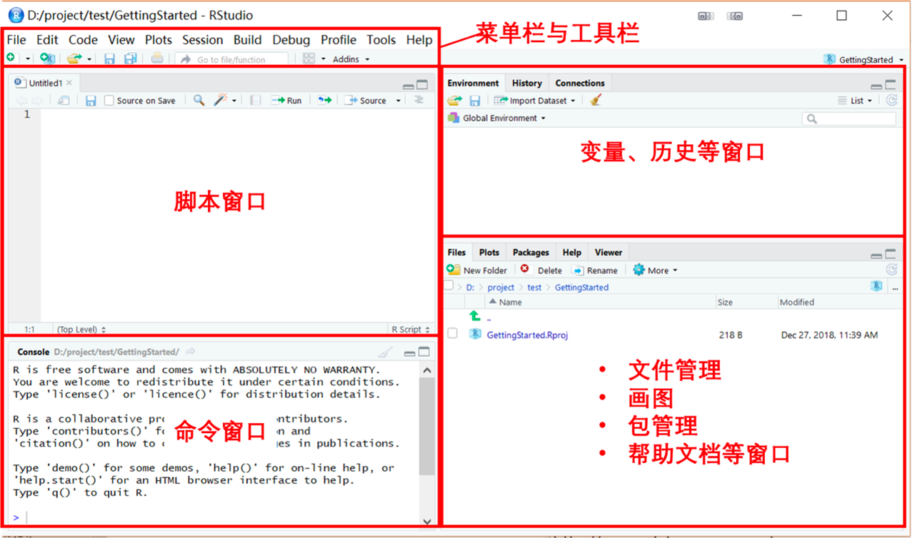

\mainmatter

# R编程基础 {#basic}

## R语言简介

R语言来自S语言，是S语言的一个变种。S语言由Rick Becker, John
Chambers等人在贝尔实验室开发，著名的C语言、Unix系统也是贝尔实验室开发的。R是一个自由软件，GPL授权，最初由新西兰Auckland
大学的Ross Ihaka 和 Robert
Gentleman于1997年发布，R实现了与S语言基本相同的功能和统计功能。现在由R核心团队开发，但全世界的用户都可以贡献软件包。

R语言最常用的编辑器是RStudio，由Posit公司（不以盈利为目的社会企业）2011年发布的一种跨平台集成开发环境。

## R语言的特点

R语言具有以下特点:

-   自由软件：免费、开放源代码，支持各个主要计算机系统
-   完整的程序设计语言-基于函数和对象，可以自定义函数，调入C、C++、Fortran编译的代码
-   高级语言：代码像伪代码一样简洁、可读
-   交互性：强调交互式数据分析，支持复杂算法描述，图形功能强，出色的文学式编程组件
-   社群：统计科研工作者广泛使用R进行计算和发表算法，R有上万软件包！
-   面向数据分析的对象，具有完善的数据对象，如向量、矩阵、因子、数据集、图、树等，支持缺失值
-   统计软件：实现了经典的、现代的统计方法，如参数和非参数假设检验、线性回归、广义线性回归、非线性回归、可加模型、树回归、混合模型、方差分析、判别、聚类、时间序列分析等

总而言之，R是一个不错的编程语言，可以独立完成整套工作流程。R是统计分析、数据可视化与文学式编程等方面的最佳工具！

## R与Rtudio的安装

### 安装R

从R语言官网（https://www.r-project.org/）根据自己的操作系统选择对应R版本。亦可通过`apt`或`brew`命令下载。

### R安装RStudio

从Rstudio官网（<https://posit.co/products/open-source/rstudio/）下载Rstudio并安装。打开RStudio可以看到下列界面>



共有四个工作区域，"脚本区域"用于编辑脚本文件；"命令窗口"用于返回代码运行结果，也可以直接运行代码；"变量窗口"显示R内部环境；"环境等窗口"显示外部环境。

### 组织R代码的三种方式

第一种是命令窗口写代码。写代码时，按Shift+Enter键为换行，按Enter键直接为执行，代码执行后便不可修改。因而在命令窗口中写代码一般只适合代码极为简单、与上下文代码不是一个整体的情况，比如试验某行代码的功能、查看帮助文档、检查某个值等。

第二种是脚本写代码。在脚本中的代码可以反复修改执行，保存为.R文件，是最常用的写代码的地方。写完之后，用光标选中需要执行的代码，点击上方的Run按钮，或按快捷键Ctrl+Enter，即可执行选中部分的代码。如果需要全部执行，全选（Ctrl+A）后按Ctrl+Enter。或者按Ctrl+Shift+Enter。如果光标没有选中任何代码，按Ctrl+Enter后，会执行光标所在那一行的代码

第三种是RMarkdown写代码。使用文学式编程方式制作一体化数据分析报告。

### R代码的组成

R代码有两种内容。第一是注释，主要用于一段代码的解析，可以让阅读者（包括自己）更易理解，编程语言的注释会被编译器忽略掉，且不会影响代码的执行R语言只支持单行注释，注释符号为`#`（快捷键是`ctrl+c`）；第二是代码正文，所有被执行的命令组成，特别注意的是代码的缩进影响代码的可读性。


## R对文件和路径的相关操作

在R语言内部可以文件与路径进行一系列操作，这些函数都在base包中。

### 路径操作

#### 查看与修改路径

工作路径（working
directory）指的是R在系统做工作的位置，R会默认在工作路径中读入写出数据。初学者往往会忽略工作路径的设置，从而给代码和数据管理带来制造混乱，我们建议每个R项目都使用独立的工作路径。下面的组命令可以对工作路径进行查看与修改。


```r
# 赋值一个工作路径变量，该路径应该是已经存在的，如果不存在需要使用下接中的dir.create函数创建
mypath = "~/myRworkingdir" 
# 为了确保路径存在，可以先查看其是否存在
file.exists(mypath)   
# 查看当前的工作路径
getwd()  
# 设定mypath为工作路径
setwd(mypath)
# 查看当前目录的子路径
list.dirs()             
# 查看当前目录的子目录和文件
dir()   
# 查看特定路径的子目录和文件
dir(mypath)  
# 列出目录下包括隐藏文件在内的所有的目录和文件
dir(mypath,all.files=TRUE)
# 只列出以字母R开头的子目录或文件
dir(mypath,pattern='^R')
# 查看当前目录权限
file.info(".")         
```

#### 创建路径

在R中可以创建新的路径，特别是可以递归的创建一个多级路径。


```r
# 在当前目录下，新建一个路径
dir.create("newdir")
# 递归创建一个3级子路径newdir1/newdir2/newdir3，使用recursive参数，直接创建会出错
dir.create(path="newdir1/newdir2/newdir3",recursive = TRUE)  
```

### 文件操作

R也可以对路径内的文件直接操作

#### 查看文件

R可以查看路径内文件的是否存在以及完整信息


```r
# 检查文件是否存在
file.exists("myfile.txt")  
# 查看文件完整信息
file.info("myfile.txt")
# 查看文件访问权限
file.access("myfile.txt",0)
#判断是文件还是目录。-d 是目录返回ture，-f是文件会ture
file_test("-d", "myfile.txt")
```

#### 创建、合并、复制文件

在R中也可以创建新的文件，并将内容写入该文件


```r
# 创建一个空文件 output.txt
file.create("output.txt")
# 把相关的内容写入output.txt件中，若没有这个文件则创建文件并写入内容 
cat("output \n", file = "output.txt") 
# 合并文件,把文件output.txt的内容合并到myfile.txt
file.append("myfile.txt", "output.txt")
#把文件myfile.txt复制到文件output.txt
file.copy("myfile.txt", "output.txt")    
```

#### 重命名文件与路径

使用file.rename函数可以重名工作路径或文件


```r
# 将文件file重名名为newfile
file.rename("myfile.txt","mynewfile.txt")
# 将路径newdir重名名为newdir_rename
file.rename("newdir", "newdir_rename")    
```

#### 删除文件

有两个函数可以使用file.remove和unlink，其中unlink函数还可以删除路径


```r
# 删除前面创建的文件
file.remove("mynewfile.txt", "myfile.txt") 
# 删除文件
unlink("output.txt")
# 删除路径
unlink("newdir", "newdir_rename")      
```

### 特殊路径

与R相关的有一些特殊路径，在debug和配置中会用到，此处列出。

-   `R.home()`可以查看R软件的相关路径

-   `.Library`可以找到R核心包的路径

-   `.Library.site`可以查看R核心包的目录和root用户安装包目录

-   `.libPaths()`可以查看R所有包的存放目录

-   `system.file()`可以查看指定包所在的目录

## 数据类型

任何计算机语言要解决的第一个问题都是以什么样的方式来储存数据。R作为一个高级语言，我们可以从研究应用的角度来理解其数据类型。这也是贯穿本书的立场。

回忆一下，我们在社会科学研究设计中学到的知识，研究变量可以分为：定类变量、定序变量、定距变量和定比变量。分别对应了R语言里面的字符型、逻辑型和数值型数据。

| 变量类型 | 数据类型       |
|:---------|:---------------|
| 定类变量 | 逻辑型、字符型 |
| 定序变量 | 逻辑型、字符型 |
| 定距变量 | 数值型         |
| 定比变量 | 数值型         |
| 缺失值   | NA             |

: 变量类型与数据类型

### 数值型

数值型可以分为整数型和浮点型，实际上操作中，大部分时间我们可以忽略这两者之间的差异。数值型直接使用数字表示，并可以进行数值运算。


```r
1
```

```
## [1] 1
```

```r
3+2
```

```
## [1] 5
```

```r
pi
```

```
## [1] 3.141593
```

### 逻辑型/布尔型

逻辑型有两个值真和假，用`TRUE`和`FALSE`表示（必须大写，也可用首字母表示）。其用于表示逻辑运算的结果，在后续的数据取子集操作中会大量使用。


```r
TRUE;FALSE
```

```
## [1] TRUE
```

```
## [1] FALSE
```

```r
T;F
```

```
## [1] TRUE
```

```
## [1] FALSE
```

### 字符型

字符型是R储存文本信息的数据类型，字符型数据用`"`或者`'`引起来。


```r
LETTERS
```

```
##  [1] "A" "B" "C" "D" "E" "F" "G" "H" "I" "J" "K" "L" "M" "N" "O" "P" "Q" "R" "S"
## [20] "T" "U" "V" "W" "X" "Y" "Z"
```

```r
month.abb
```

```
##  [1] "Jan" "Feb" "Mar" "Apr" "May" "Jun" "Jul" "Aug" "Sep" "Oct" "Nov" "Dec"
```

```r
month.name
```

```
##  [1] "January"   "February"  "March"     "April"     "May"       "June"     
##  [7] "July"      "August"    "September" "October"   "November"  "December"
```

`paste`函数可以将多个字符粘贴为一个字符，粘贴的分隔符由sep参数指定


```r
paste("Hello", "World", sep = "+")
```

```
## [1] "Hello+World"
```

`nchar`函数可以计算字符的长度


```r
nchar("Hello World")
```

```
## [1] 11
```

注意，不同于Python，R总的字符是一个整体，无法直接取出某个元素。需要使用substr来实现该功能。


```r
substr("Hello World",1,4)
```

```
## [1] "Hell"
```

### 缺失值

在实际研究中我们经常会遇到缺失数据的情况，R中使用`NA`来储存确实信息。


```r
NA
```

```
## [1] NA
```

### 数据类型判断与转换

R提供了内置的`is.`函数和`as.`函数来对数据类型进行判断与转化。

| 函数           | 作用         |
|:---------------|:-------------|
| `is.numeric`   | 数值型判断   |
| `is.integer`   | 整数型判断   |
| `is.logical`   | 逻辑型判断   |
| `is.character` | 字符型判断   |
| `is.na`        | NA判断       |
| `as.numeric`   | 转换为数值型 |
| `as.integer`   | 转换为整数型 |
| `as.logical`   | 转换为逻辑型 |
| `as.character` | 转换为字符型 |

特别注意不同类型之间的转换并不是等价的。除NA外所有类型都可以转换为字符型，但是只有本身就是"数字"的字符型才可以转化为数值型。任何数值型都可以转为逻辑型，数字`0`会转换为`FALSE`，其他数字会转换为`TRUE`；反过来，`TRUE`会转换为`1`，`FALSE`会转换为`0`。


```{=html}
<div class="grViz html-widget html-fill-item-overflow-hidden html-fill-item" id="htmlwidget-9eaba64a6b3c15adf3bc" style="width:672px;height:10%;"></div>
<script type="application/json" data-for="htmlwidget-9eaba64a6b3c15adf3bc">{"x":{"diagram":"digraph R {\n  \n  rankdir = LR\n  layout = dot\n  node [shape = box]\n  \n  num [style=\"rounded, filled\",label = \"numeric\",fillcolor = Gainsboro]\n  char [style=\"rounded, filled\", label = \"character\",fillcolor = Gainsboro]\n  log [style=\"rounded, filled\", label = \"logical\",fillcolor= Gainsboro]\n  num -> char [label = \"as.character\"]\n  char -> num [label = \"as.numeric(数字组成字符)\"]\n  num -> log [label = \"as.logical\"]\n  log -> num [label = \"as.numeric\"]\n  log -> char [label = \"as.character\"]\n}","config":{"engine":"dot","options":null}},"evals":[],"jsHooks":[]}</script>
```

**课堂练习**

-   如何将3.141592657 转换成 character
-   如何将3.141592657 转换成 logical
-   如何判断"hello world"是否是一个character
-   如何判断一个NA是否是缺失值

### 运算

数值型可以进行数值运算，逻辑运算，具体运算符如下表：

| 运算符                      | 含义                 |
|:----------------------------|:---------------------|
| `+` `-` `*` `/`             | 四则运算             |
| `^`                         | 幂运算               |
| `sqrt`                      | 开方                 |
| `>` `>=` `<` `<=` `==` `!=` | 判断大小与相等       |
| `%/%`                       | 整除                 |
| `%/%`                       | 取余数               |
| `&` `|` `!`                 | 逻辑运算：与、或、非 |

## 变量

程序语言中的变量用来保存输入的值或者计算得到的值。在R中，变量可以保存所有的数据类型，比如标量、向量、矩阵、数据框、函数等。

R使用`<-`或者`=`变量赋值，例如


```r
x <- 3.14159
```

任何一个变量都有两个属性，名字与取值，上述变量名为"x"，取值为"3.14159"。

在名字空间（namespace）中会储存一个`x`，当代码使用x是计算机会调取其取值3.14159。

还可以使用`get`和`assign`函数来提取变量的取值，以及为变量赋值，`get("name")`是提取名字为`name`的数据的值，`assign("name",value)`是将`value`赋值给`name`。这一操作目前看起来是多此一举，但是在后续遇到多此进行取值、赋值操作时候，这两个函数发挥妙用来减少重复代码。


```r
x <- 3.14159
get('x')
```

```
## [1] 3.14159
```

```r
assign('y',x)
get('y')
```

```
## [1] 3.14159
```

## 数据结构

针对数据分析的要求，R语言预先定制好了一些数据结构，包括向量、矩阵、数据框、列表等。如果把数据类型比作乐高积木的基础组件，那数据结构便是在基础组价之上搭建好的具有特定功能的组合要件。

 \### 向量

#### 向量生成

向量是将若干个**数据类型相同**的值存储在一起，`c`函数用于生成与拼接向量。


```r
v1 <- c(1,2,3,4)
v2 <- c(2,3,4,5)
v3 <- c(v1,v2)
v4 <- c(1,2,'c')
v1
```

```
## [1] 1 2 3 4
```

```r
v2
```

```
## [1] 2 3 4 5
```

```r
v3
```

```
## [1] 1 2 3 4 2 3 4 5
```

```r
v4
```

```
## [1] "1" "2" "c"
```

`seq()`用于生成等差数数列向量，`rep()`用于生成重复元素向量


```r
seq(1,10,4) # 第一个参数表示数列起点，第二个参数表示数列最大值，第三个参数表示间隔值，注意最大值不一定会被取到
```

```
## [1] 1 5 9
```

```r
1:10 #间隔为1的等差数列，是一种约定俗成的简要写法
```

```
##  [1]  1  2  3  4  5  6  7  8  9 10
```

```r
rep('a',4)
```

```
## [1] "a" "a" "a" "a"
```

特别地，`NA`可作为任何向量的元素而不会对向量类型造成干扰，这也是符合我们实际数据处理习惯的一种方式。

**课堂练习** 1. 如何生成一个空向量 2. 如何生成一个空的字符向量

#### 向量类型转换与运算

数据类型转换函数完全适用于向量。


```r
as.character(v1)
```

```
## [1] "1" "2" "3" "4"
```

对向量进行数值运算等同于对向量的每个元素进行运算。


```r
v1 + 1
```

```
## [1] 2 3 4 5
```

```r
v1 + v2
```

```
## [1] 3 5 7 9
```

```r
v1 * v2
```

```
## [1]  2  6 12 20
```

**课堂练习**

计算v1 + v3，并解释原理。（注意，当两个向量不等长时，会自动补长短向量）

特别地，向量还可以进行集合运算,

| 集合运算符  | 含义   |
|:------------|:-------|
| `%in%`      | 属于   |
| `intersect` | 取交集 |
| `union`     | 取并集 |
| `setdiff`   | 取补集 |


```r
v1 %in% v2
```

```
## [1] FALSE  TRUE  TRUE  TRUE
```

```r
intersect(v1,v2)
```

```
## [1] 2 3 4
```

下面列出一些常用函数

| 函数         | 含义                                              |
|:-------------|:--------------------------------------------------|
| `length`     | 向量长度                                          |
| `unique`     | 向量去重复                                        |
| `rev`        | 向量翻转                                          |
| `sort`       | 向量排序                                          |
| `order`      | 向量元素的顺序                                    |
| `sum`        | 求和                                              |
| `cumsum`     | 累计和                                            |
| `mean`       | 平均数                                            |
| `sd`         | 标准差                                            |
| `var`        | 方差                                              |
| `min`        | 最小值                                            |
| `max`        | 最大值                                            |
| `range`      | 取值范围                                          |
| `prod`       | 所有元素乘积                                      |
| `duplicated` | 元素是否重复                                      |
| `prod`       | 所有元素乘积                                      |
| `any`        | 是否有`TRUE`(针对逻辑向量)                        |
| `all`        | 是否所有都是`TRUE`(针对逻辑向量)                  |
| `which`      | `TRUE`对应的下标(针对逻辑向量)                    |
| `all.equal`  | 两个向量全等                                      |
| `paste`      | 将多个字符粘贴为一个字符,分割符由collapse参数指定 |
| `which.min`  | 最小值的下标                                      |
| `which.max`  | 最大值的下标                                      |

#### 向量切片

可以直接用`[]`操作符对向量进行切片，即取出子集。`[]`内的元素称为下标。

首先是数字下标，例如用`v1[1]`表示取出向量v1的第一个元素。特别地，R语言的元素是从1开始编号的，这更符合人类的直觉。Python和c语言则不同，元素是从0开始编号的，即第一个元素用0表示，这更符合计算机的直觉。在切换不同工具时，需要注意这个细节，以免出现不可察觉的错误。

其次，`[]`操作符中不仅可以使用数字，还可以使用逻辑向量来进行切片，例如


```r
v1[c(T,T,F,F)] # 相当于是取出前两个元素
```

```
## [1] 1 2
```

这事实上启发了我们可以更加灵活的来对向量进行切片。具体来说，我们可以通过生成一组逻辑向量的方式来切片，例如如果我们想取出v1中大于2的元素，则可以：


```r
index <- v1 > 2
v1[index] 
```

```
## [1] 3 4
```

```r
# 上面代码可以合并成一个
v1[v1 > 2]
```

```
## [1] 3 4
```

课堂练习

1.  取出v1的第2和第3个元素
2.  取出v1的最后一个元素
3.  取出v1的倒数第二个元素
4.  取出v1中整除3的元素
5.  v1[-1]会返回什么结果，有何启示？
6.  v1[5]会返回什么结果，有何启示？
7.  v1[] \<- 99 与 v1 \<- 99 有何不同？

#### 元素名

`names`可以为向量的每一个元素命名，在这个意义上，R语言的向量就非常接近于Python简单dict的结构。


```r
ages <- c(50, 55, 58)
names(ages) <- c('赵四','刘能','长贵')
ages <- c("赵四"=50, "刘能"=55, "长贵"=58)
ages <- setNames(c(50, 55, 58), c('赵四','刘能','长贵'))
```

这时可以用元素名或元素名向量作为向量的下标，如


```r
ages['赵四']
```

```
## 赵四 
##   50
```

```r
ages['赵四'] <- 51
```

用`names(x) <- NULL`可以去掉x的元素名。

### 因子
因子是一类特殊的向量，用于储存分类变量。


```r
x <- c("男","女","男","男","女")
gender <- factor(x)
```
每个因子都有水平标签（levels），缺省状态下，以字母序排列，有时候（例如画图时候，为了调整图例的顺序）我们需要对因子水平顺序进行调整，此时可以使用`levels`函数。


```r
levels(gender) <- rev(sort(levels(gender))) 
```

因子实际上使用数值型来储存字符型的一种向量，这样做的显而易见的好处是可以节约储存空间，从而优化运算速度。因此，因子可以转换为数值型。

```r
as.numeric(gender)
```

```
## [1] 2 1 2 2 1
```

需要注意的是，这里转化成的数字是自然序的，如果一个数值型向量被误存为因子型，保险的方式是将其先转换为字符型，然后再转换为数值型，否则有可能出错。

```r
as.numeric(factor(c(1,10,23)))
```

```
## [1] 1 2 3
```

```r
as.numeric(as.character(factor(c(1,10,23))))
```

```
## [1]  1 10 23
```
在回归中如果我们希望把一个数值变量当成分类变量使用时，可以直接在回归公式中指定其为factor，例如年份的固定效应。`y ~ x + factor(year)`

### 矩阵

矩阵是二维的数值型数据结构，可以看成是列向量的按行组合，或者行向量的按列组合。矩阵底层实际按列存储成一个向量。矩阵主要被用在科学计算上，而这是Python擅长的工作。因此，绝大部分时间我们都不会在R中使用到矩阵，这里就简单介绍一些矩阵的基本知识即可。不是我们的重点

#### 矩阵的生成
`matrix` 函数用于生成矩阵

```r
M1 <- matrix(c(3:14), nrow = 4, byrow = TRUE)
M2 <- matrix(c(2,6,5,1,10,4),nrow = 2,ncol = 3,byrow = TRUE)
```
`diag` 函数用于生成对角矩阵

```r
M3 <- diag(5.2,3)
```
#### 矩阵的维度
矩阵维度也就是行列数是矩阵的内在属性。可以用`dim`函数得到矩阵的维度，`nrow`和`ncol`函数可以得到矩阵的行数与列数。

#### 矩阵的拼接
`rbind`函数可以按行拼接矩阵，`cbind`函数可以按列拼接矩阵。

#### 矩阵的切片
矩阵使用`[]`符号来取出相应未知的元素组成新矩阵。由于矩阵是二维的，因此切片下标也需要时二维参数，用逗号分割。


```r
M1[nrow(M1):1,]
```

```
##      [,1] [,2] [,3]
## [1,]   12   13   14
## [2,]    9   10   11
## [3,]    6    7    8
## [4,]    3    4    5
```

```r
M1[,ncol(M1):1]
```

```
##      [,1] [,2] [,3]
## [1,]    5    4    3
## [2,]    8    7    6
## [3,]   11   10    9
## [4,]   14   13   12
```

#### 矩阵的行列名

矩阵的行与列都可以看作是向量，因此也可以命名。


```r
rownames(M1) <- c("r1","r2","r3","r4")
colnames(M2)<- c("c1","c2","c3")
```

#### 矩阵的运算

矩阵的运算有两种，针对矩阵元素的运算与矩阵运算，矩阵运算需要在运算符两侧添加`%%`，例如


```r
M1 %*% t(M2) # t是矩阵转置函数
```

```
##    [,1] [,2]
## r1   55   63
## r2   94  108
## r3  133  153
## r4  172  198
```

#### 矩阵的函数

| 函数  | 含义   |
|:------------|:-------|
| `t`      | 转置   |
| `det` | 行列式 |
| `sovle`     | 求逆 |

### 数据框

数据框（data.frame）是R语言最伟大的数据结构，也是处理表格数据的最佳工具。基于数据框开发出来的tibble以及data.table构成了R语言处理表格数据的强有力工具箱。Python的pandas正是对data.frame的模仿，因此我们在Python部分不推荐大家使用pandas来处理表格数据。

数据框是一个特殊的二维表，数据框每一列都有一个唯一的列名，长度都是相等的，同一列的数据类型需要一致，不同列的数据类型可以不一样。这样的要求是源自每一列对应了实际研究中的一个变量。

数据框式我们未来很长一段时间的主要工具。

#### 数据框的生成

数据框使用`data.frame`函数生成，其可以直接把矩阵转化为数据框


```r
df1 <- data.frame(c(1,7,3), c('S','A','U'),c(T,F,T))
df2 <- data.frame(M1)
```

注意，在旧版本的R中，在生成数据框时，R会默认把字符型向量转化为因子，如果不需要这样的转换，需要设置参数`stringsAsFactors = FALSE`。但是新的版本已经修改了这个参数的默认值。

#### 数据框的行列名

与矩阵一样，数据框有行列名称`names`等价于`colnames`，`rownames`用于修改行名称，列名称有重要的用途。


```r
names(df1) <- c("c1","c2","c3")
```

可以在生成数据框时，直接指定列名称，这一作法更加被鼓励


```r
df3 <- data.frame(univ = c('上海交通大学','上海交通大学','上海交通大学'), 
                  subject = c('公共管理','公共管理','公共管理'),
                  pubyear = c(2020,2021,2022),
                  pubnum = c(49,64,62))
```

#### 数据框的切片

数据框可以像矩阵一样使用`[]`来提取子集。更常见的做法是使用`$`来通过列名称切片，获对列进行赋值。或两者联合使用


```r
df3[2,3]
```

```
## [1] 2021
```

```r
df3$pubnum
```

```
## [1] 49 64 62
```

```r
df3[df3$pubyear == 2022,]
```

```
##           univ  subject pubyear pubnum
## 3 上海交通大学 公共管理    2022     62
```

```r
df3[df3$pubyear == 2022,] <- 66
df3
```

```
##           univ  subject pubyear pubnum
## 1 上海交通大学 公共管理    2020     49
## 2 上海交通大学 公共管理    2021     64
## 3           66       66      66     66
```

#### 数据框的拼接
`rbind`和`cbind`函数同样适用于数据框。

#### 数据框的函数

| 函数  | 含义   |
|:------------|:-------|
| `dim`      | 维度   |
| `str` | 列属性 |
| `summary`     | 数据框属性 |

### 列表

回想一下，前面的数据结构虽然可以满足我们大部分研究需要，但是对于复杂的数据却没有办法表达。例如，向量没有办法混合储存类型不同的数据，而数据框要求每一列的行数都相同。因此R中定制了列表这一灵活的数据结构。

列表可以看做是一类特殊的向量，不同的是，其中每一个元素又可以是任意类型的数据结构。

#### 列表的生成


```r
list_data <-list(univ = "上海交通大学",
                 startyear = 1896,
                 position = c(121.433,31.200))
```

#### 列表的名称

可以使用`names`函数为每一个元素取名


```r
names(list_data)
```

```
## [1] "univ"      "startyear" "position"
```

#### 列表的切片

列表元素的提取使用`[[]]`


```r
list_data[[1]]
```

```
## [1] "上海交通大学"
```

```r
list_data[['univ']]
```

```
## [1] "上海交通大学"
```

注意，如果使用`[]`取子集，其结果还是列表，而非列表的元素。

```r
list_data[1]
```

```
## $univ
## [1] "上海交通大学"
```

直接给列表不存在的元素名定义元素值就添加了新元素，而且不同于使用向量，对于列表而言这是很正常的做法。

```r
list_data[["category"]] <- 'C9'
```


## 数据读写

在实际操作中，我们很少通过代码赋值的方式在生成原始数据。数据往往储存在诸如csv等格式的数据文件中。R语言也有专属的数据文件RData来储存数据。本节我们介绍下常见数据格式的读写。

### csv文件

csv文件指的是逗号分隔值（Comma-Separated Values）文本文件。以纯文本形式存储表格数据（数字和文本）。纯文本意味着该文件是一个字符序列，不含必须像二进制数字那样被解读的数据。CSV文件由任意数目的记录组成，记录间以某种换行符分隔；每条记录由字段组成，字段间的分隔符是其它字符或字符串，最常见的是逗号或制表符（tsv）。

csv文件可以用MS Excel直接编辑，读写简便，跨平台。缺点是以表结构为基础，灵活性较差。

我们推荐使用`readr::read_csv`函数对csv文件进行读入。


```r
# install.packages('readr')
library(readr)
pub_211 <- read_csv('pub_211.csv')
```

**课堂练习**

1. 取出上海交通大学的论文数据

2. 计算上海交通大学2022,2021,2020年分别发表了多少ssci/sci论文

3. 计算上海交通大学2022年发表论文最多的三个学科

4. 计算上海交通大学2020-2022年每个学科平均发表论文的数量


### json文件

### 其他专用文件


## 代码风格

相信很多读者和我一样，每次回看以前写的代码就像看当年的QQ签名，浓浓的中二感。不过，我们还是得硬着头皮看，尤其是在代码第一次调试通之后，一定要再次完善代码。代码的作用本就是为了替代重复劳动，所以以后大概率还是会使用这段代码，如果代码写的一团糟，过一段时间之后，不仅别人可能看不懂，连自己也可能看不懂，有需要花大量时间去学习自己写的代码。更重要的是，代码的可读性也是可复现原则的内在要求。

本节中，我们总结了几条经验来探讨如何写出一段兼具简洁性、可读性与效率的代码，

-   代码要对机器友好，更要对人类友好。人类的时间是宝贵的，因此对人类友好（以代码的可读性为优化方向）的优先级高于对机器友好（以机器运算效率为优化方向）；

-   不吝啬写注释。注释至少能保证一段时间之后，自己能看懂代码；

-   不要使用没意义的变量名/函数名（例如a,temp），但同时要善于使用缩写，避免变量名/函数名无限长；对不同数据，不要使用同一个变量名

-   一整段代码的结构组成为：加载包-数据读入-定义函数-数据变形-运算-输出；

-   为了简化代码，重复操作函数化，数据变形使用pipeline，代码中使用缩进与换行。当然，函数中不要使用全局数据；

-   向量化与并行运算，尽量使用服务器而不是自己的笔记本，用机器时间换人类时间的同时优化机器时间；

-   数据结构是程序设计的第一步；

-   及时打印计算过程的信息，避免等待焦虑，便于debug；

-   运算符号前后加空格等方式加强代码的结构性；

-   不断询问自己有没有更好的方式，优化永无止尽。

此外，Hadley Wickham在他的著作中*The tidyverse style
guide*中介绍了丰富的细节来帮助读者规范代码风格，同时使用`styler`和`lintr`可以快速检查与规范现有代码，Rstudio也为我们提供了自动提示代码风格的功能（如下图所示）。这些都可以帮助我们更好的规范代码。


# 函数

## 函数模块化

当代码中使用的函数非常冗长时，不仅会影响代码的结构与可读性，更会给代码调试工作带来额外的负担。此时，可以将函数模块化，然后单独储存在`.R`文件中，随后可通过`source`函数在主代码中调用。

例如，我们将对处理组与对照组在变量`y`层面进行加权T检验的代码定义为函数`wttest`。将其储存为`wttest.R`文件。


```r
library(weights)
wttest <- function(data, y){
    wtd.t.test(x = data[data$treat == 1,][y] %>% pull(1),
               y = data[data$treat == 0,][y] %>% pull(1),
               weight = data$weights[data$treat == 1],
               weighty = data$weights[data$treat == 0],
               samedata = FALSE)
}
```

在主代码中，可以通过`source`函数调用`wttest.R`中的`wttest`函数。


```r
source("wttest.R")
```
