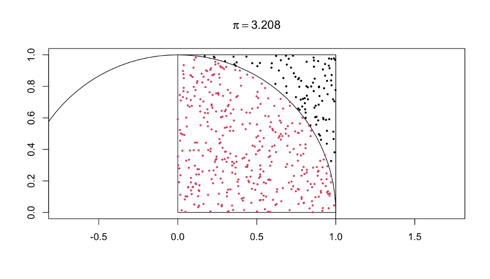
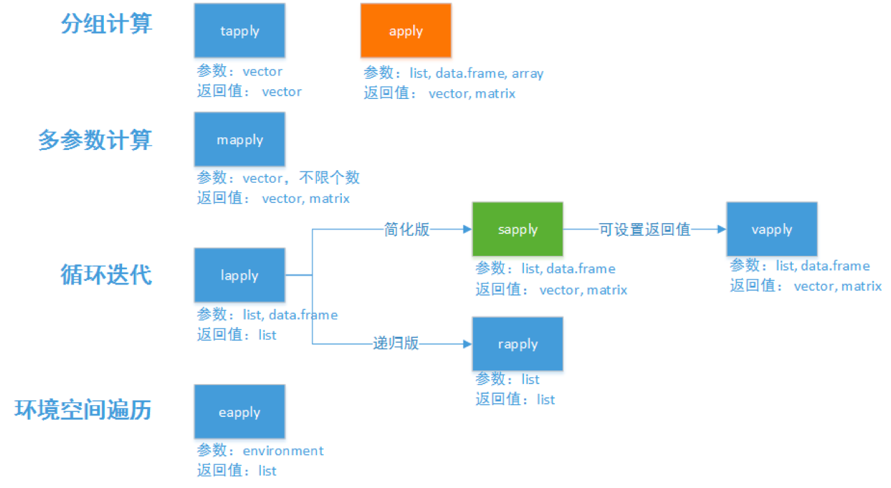

\mainmatter

# R编程基础 {#basic}


## R语言简介

R语言来自S语言，是S语言的一个变种。S语言由Rick Becker, John
Chambers等人在贝尔实验室开发，著名的C语言、Unix系统也是贝尔实验室开发的。R是一个自由软件，GPL授权，最初由新西兰Auckland
大学的Ross Ihaka 和 Robert
Gentleman于1997年发布，R实现了与S语言基本相同的功能和统计功能。现在由R核心团队开发，但全世界的用户都可以贡献软件包。

R语言最常用的编辑器是RStudio，由Posit公司（不以盈利为目的社会企业）2011年发布的一种跨平台集成开发环境。

## R语言的特点

R语言具有以下特点:

-   自由软件：免费、开放源代码，支持各个主要计算机系统
-   完整的程序设计语言-基于函数和对象，可以自定义函数，调入C、C++、Fortran编译的代码
-   高级语言：代码像伪代码一样简洁、可读
-   交互性：强调交互式数据分析，支持复杂算法描述，图形功能强，出色的文学式编程组件
-   社群：统计科研工作者广泛使用R进行计算和发表算法，R有上万软件包！
-   面向数据分析的对象，具有完善的数据对象，如向量、矩阵、因子、数据集、图、树等，支持缺失值
-   统计软件：实现了经典的、现代的统计方法，如参数和非参数假设检验、线性回归、广义线性回归、非线性回归、可加模型、树回归、混合模型、方差分析、判别、聚类、时间序列分析等

总而言之，R是一个不错的编程语言，可以独立完成整套工作流程。R是统计分析、数据可视化与文学式编程等方面的最佳工具！

## R与Rtudio的安装

### 安装R

从R语言官网（<https://www.r-project.org/）根据自己的操作系统选择对应R版本。亦可通过%60apt%60或%60brew%60命令下载>。

### R安装RStudio

从Rstudio官网（<https://posit.co/products/open-source/rstudio/）下载Rstudio并安装。打开RStudio可以看到下列界面>


共有四个工作区域，"脚本区域"用于编辑脚本文件；"命令窗口"用于返回代码运行结果，也可以直接运行代码；"变量窗口"显示R内部环境；"环境等窗口"显示外部环境。

### 组织R代码的三种方式

第一种是命令窗口写代码。写代码时，按Shift+Enter键为换行，按Enter键直接为执行，代码执行后便不可修改。因而在命令窗口中写代码一般只适合代码极为简单、与上下文代码不是一个整体的情况，比如试验某行代码的功能、查看帮助文档、检查某个值等。

第二种是脚本写代码。在脚本中的代码可以反复修改执行，保存为.R文件，是最常用的写代码的地方。写完之后，用光标选中需要执行的代码，点击上方的Run按钮，或按快捷键Ctrl+Enter，即可执行选中部分的代码。如果需要全部执行，全选（Ctrl+A）后按Ctrl+Enter。或者按Ctrl+Shift+Enter。如果光标没有选中任何代码，按Ctrl+Enter后，会执行光标所在那一行的代码

第三种是RMarkdown写代码。使用文学式编程方式制作一体化数据分析报告。

### R代码的组成

R代码有两种内容。第一是注释，主要用于一段代码的解析，可以让阅读者（包括自己）更易理解，编程语言的注释会被编译器忽略掉，且不会影响代码的执行R语言只支持单行注释，注释符号为`#`（快捷键是`ctrl+c`）；第二是代码正文，所有被执行的命令组成，特别注意的是代码的缩进影响代码的可读性。

## R对文件和路径的相关操作

在R语言内部可以文件与路径进行一系列操作，这些函数都在base包中。

### 路径操作

#### 查看与修改路径

工作路径（working
directory）指的是R在系统做工作的位置，R会默认在工作路径中读入写出数据。初学者往往会忽略工作路径的设置，从而给代码和数据管理带来制造混乱，我们建议每个R项目都使用独立的工作路径。下面的组命令可以对工作路径进行查看与修改。


```r
# 赋值一个工作路径变量，该路径应该是已经存在的，如果不存在需要使用下接中的dir.create函数创建
mypath = "~/myRworkingdir" 
# 为了确保路径存在，可以先查看其是否存在
file.exists(mypath)   
# 查看当前的工作路径
getwd()  
# 设定mypath为工作路径
setwd(mypath)
# 查看当前目录的子路径
list.dirs()             
# 查看当前目录的子目录和文件
dir()   
# 查看特定路径的子目录和文件
dir(mypath)  
# 列出目录下包括隐藏文件在内的所有的目录和文件
dir(mypath,all.files=TRUE)
# 只列出以字母R开头的子目录或文件
dir(mypath,pattern='^R')
# 查看当前目录权限
file.info(".")         
```

#### 创建路径

在R中可以创建新的路径，特别是可以递归的创建一个多级路径。


```r
# 在当前目录下，新建一个路径
dir.create("newdir")
# 递归创建一个3级子路径newdir1/newdir2/newdir3，使用recursive参数，直接创建会出错
dir.create(path="newdir1/newdir2/newdir3",recursive = TRUE)  
```

### 文件操作

R也可以对路径内的文件直接操作

#### 查看文件

R可以查看路径内文件的是否存在以及完整信息


```r
# 检查文件是否存在
file.exists("myfile.txt")  
# 查看文件完整信息
file.info("myfile.txt")
# 查看文件访问权限
file.access("myfile.txt",0)
#判断是文件还是目录。-d 是目录返回ture，-f是文件会ture
file_test("-d", "myfile.txt")
```

#### 创建、合并、复制文件

在R中也可以创建新的文件，并将内容写入该文件


```r
# 创建一个空文件 output.txt
file.create("output.txt")
# 把相关的内容写入output.txt件中，若没有这个文件则创建文件并写入内容 
cat("output \n", file = "output.txt") 
# 合并文件,把文件output.txt的内容合并到myfile.txt
file.append("myfile.txt", "output.txt")
#把文件myfile.txt复制到文件output.txt
file.copy("myfile.txt", "output.txt")    
```

#### 重命名文件与路径

使用file.rename函数可以重名工作路径或文件


```r
# 将文件file重名名为newfile
file.rename("myfile.txt","mynewfile.txt")
# 将路径newdir重名名为newdir_rename
file.rename("newdir", "newdir_rename")    
```

#### 删除文件

有两个函数可以使用file.remove和unlink，其中unlink函数还可以删除路径


```r
# 删除前面创建的文件
file.remove("mynewfile.txt", "myfile.txt") 
# 删除文件
unlink("output.txt")
# 删除路径
unlink("newdir", "newdir_rename")      
```

### 特殊路径

与R相关的有一些特殊路径，在debug和配置中会用到，此处列出。

-   `R.home()`可以查看R软件的相关路径

-   `.Library`可以找到R核心包的路径

-   `.Library.site`可以查看R核心包的目录和root用户安装包目录

-   `.libPaths()`可以查看R所有包的存放目录

-   `system.file()`可以查看指定包所在的目录

## 数据类型

任何计算机语言要解决的第一个问题都是以什么样的方式来储存数据。R作为一个高级语言，我们可以从研究应用的角度来理解其数据类型。这也是贯穿本书的立场。

回忆一下，我们在社会科学研究设计中学到的知识，研究变量可以分为：定类变量、定序变量、定距变量和定比变量。分别对应了R语言里面的字符型、逻辑型和数值型数据。

| 变量类型 | 数据类型       |
|:---------|:---------------|
| 定类变量 | 逻辑型、字符型 |
| 定序变量 | 逻辑型、字符型 |
| 定距变量 | 数值型         |
| 定比变量 | 数值型         |
| 缺失值   | NA             |

: 变量类型与数据类型

### 数值型

数值型可以分为整数型和浮点型，实际上操作中，大部分时间我们可以忽略这两者之间的差异。数值型直接使用数字表示，并可以进行数值运算。


```r
1
```

```
## [1] 1
```

```r
3+2
```

```
## [1] 5
```

```r
pi
```

```
## [1] 3.141593
```

### 逻辑型/布尔型

逻辑型有两个值真和假，用`TRUE`和`FALSE`表示（必须大写，也可用首字母表示）。其用于表示逻辑运算的结果，在后续的数据取子集操作中会大量使用。


```r
TRUE;FALSE
```

```
## [1] TRUE
```

```
## [1] FALSE
```

```r
T;F
```

```
## [1] TRUE
```

```
## [1] FALSE
```

### 字符型

字符型是R储存文本信息的数据类型，字符型数据用`"`或者`'`引起来。


```r
LETTERS
```

```
##  [1] "A" "B" "C" "D" "E" "F" "G" "H" "I" "J" "K" "L" "M" "N" "O" "P" "Q" "R" "S"
## [20] "T" "U" "V" "W" "X" "Y" "Z"
```

```r
month.abb
```

```
##  [1] "Jan" "Feb" "Mar" "Apr" "May" "Jun" "Jul" "Aug" "Sep" "Oct" "Nov" "Dec"
```

```r
month.name
```

```
##  [1] "January"   "February"  "March"     "April"     "May"       "June"     
##  [7] "July"      "August"    "September" "October"   "November"  "December"
```

`paste`函数可以将多个字符粘贴为一个字符，粘贴的分隔符由sep参数指定


```r
paste("Hello", "World", sep = "+")
```

```
## [1] "Hello+World"
```

`nchar`函数可以计算字符的长度


```r
nchar("Hello World")
```

```
## [1] 11
```

注意，不同于Python，R总的字符是一个整体，无法直接取出某个元素。需要使用substr来实现该功能。


```r
substr("Hello World",1,4)
```

```
## [1] "Hell"
```

### 缺失值

在实际研究中我们经常会遇到缺失数据的情况，R中使用`NA`来储存确实信息。


```r
NA
```

```
## [1] NA
```

### 数据类型判断与转换

R提供了内置的`is.`函数和`as.`函数来对数据类型进行判断与转化。

| 函数           | 作用         |
|:---------------|:-------------|
| `is.numeric`   | 数值型判断   |
| `is.integer`   | 整数型判断   |
| `is.logical`   | 逻辑型判断   |
| `is.character` | 字符型判断   |
| `is.na`        | NA判断       |
| `as.numeric`   | 转换为数值型 |
| `as.integer`   | 转换为整数型 |
| `as.logical`   | 转换为逻辑型 |
| `as.character` | 转换为字符型 |

特别注意不同类型之间的转换并不是等价的。除NA外所有类型都可以转换为字符型，但是只有本身就是"数字"的字符型才可以转化为数值型。任何数值型都可以转为逻辑型，数字`0`会转换为`FALSE`，其他数字会转换为`TRUE`；反过来，`TRUE`会转换为`1`，`FALSE`会转换为`0`。


```{=html}
<div class="grViz html-widget html-fill-item-overflow-hidden html-fill-item" id="htmlwidget-fe647e1332964b1dcf4a" style="width:672px;height:10%;"></div>
<script type="application/json" data-for="htmlwidget-fe647e1332964b1dcf4a">{"x":{"diagram":"digraph R {\n  \n  rankdir = LR\n  layout = dot\n  node [shape = box]\n  \n  num [style=\"rounded, filled\",label = \"numeric\",fillcolor = Gainsboro]\n  char [style=\"rounded, filled\", label = \"character\",fillcolor = Gainsboro]\n  log [style=\"rounded, filled\", label = \"logical\",fillcolor= Gainsboro]\n  num -> char [label = \"as.character\"]\n  char -> num [label = \"as.numeric(数字组成字符)\"]\n  num -> log [label = \"as.logical\"]\n  log -> num [label = \"as.numeric\"]\n  log -> char [label = \"as.character\"]\n}","config":{"engine":"dot","options":null}},"evals":[],"jsHooks":[]}</script>
```

**课堂练习**

-   如何将3.141592657 转换成 character
-   如何将3.141592657 转换成 logical
-   如何判断"hello world"是否是一个character
-   如何判断一个NA是否是缺失值

### 运算

数值型可以进行数值运算，逻辑运算，具体运算符如下表：

| 运算符                      | 含义                 |
|:----------------------------|:---------------------|
| `+` `-` `*` `/`             | 四则运算             |
| `^`                         | 幂运算               |
| `sqrt`                      | 开方                 |
| `>` `>=` `<` `<=` `==` `!=` | 判断大小与相等       |
| `%/%`                       | 整除                 |
| `%%`                       | 取余数               |
| `&` `|` `!`                 | 逻辑运算：与、或、非 |

## 变量

程序语言中的变量用来保存输入的值或者计算得到的值。在R中，变量可以保存所有的数据类型，比如标量、向量、矩阵、数据框、函数等。

R使用`<-`或者`=`变量赋值，例如


```r
x <- 3.14159
```

任何一个变量都有两个属性，名字与取值，上述变量名为"x"，取值为"3.14159"。

在名字空间（namespace）中会储存一个`x`，当代码使用x是计算机会调取其取值3.14159。

还可以使用`get`和`assign`函数来提取变量的取值，以及为变量赋值，`get("name")`是提取名字为`name`的数据的值，`assign("name",value)`是将`value`赋值给`name`。这一操作目前看起来是多此一举，但是在后续遇到多此进行取值、赋值操作时候，这两个函数发挥妙用来减少重复代码。


```r
x <- 3.14159
get('x')
```

```
## [1] 3.14159
```

```r
assign('y',x)
get('y')
```

```
## [1] 3.14159
```

## 数据结构

针对数据分析的要求，R语言预先定制好了一些数据结构，包括向量、矩阵、数据框、列表等。如果把数据类型比作乐高积木的基础组件，那数据结构便是在基础组价之上搭建好的具有特定功能的组合要件。


### 向量

#### 向量生成

向量是将若干个**数据类型相同**的值存储在一起，`c`函数用于生成与拼接向量。


```r
v1 <- c(1,2,3,4)
v2 <- c(2,3,4,5)
v3 <- c(v1,v2)
v4 <- c(1,2,'c')
v1
```

```
## [1] 1 2 3 4
```

```r
v2
```

```
## [1] 2 3 4 5
```

```r
v3
```

```
## [1] 1 2 3 4 2 3 4 5
```

```r
v4
```

```
## [1] "1" "2" "c"
```

`seq()`用于生成等差数数列向量，`rep()`用于生成重复元素向量


```r
seq(1,10,4) # 第一个参数表示数列起点，第二个参数表示数列最大值，第三个参数表示间隔值，注意最大值不一定会被取到
```

```
## [1] 1 5 9
```

```r
1:10 #间隔为1的等差数列，是一种约定俗成的简要写法
```

```
##  [1]  1  2  3  4  5  6  7  8  9 10
```

```r
rep('a',4)
```

```
## [1] "a" "a" "a" "a"
```

特别地，`NA`可作为任何向量的元素而不会对向量类型造成干扰，这也是符合我们实际数据处理习惯的一种方式。

**课堂练习**

1.  如何生成一个空向量

2.  如何生成一个空的字符向量

#### 向量类型转换与运算

数据类型转换函数完全适用于向量。


```r
as.character(v1)
```

```
## [1] "1" "2" "3" "4"
```

对向量进行数值运算等同于对向量的每个元素进行运算。


```r
v1 + 1
```

```
## [1] 2 3 4 5
```

```r
v1 + v2
```

```
## [1] 3 5 7 9
```

```r
v1 * v2
```

```
## [1]  2  6 12 20
```

**课堂练习**

计算v1 + v3，并解释原理。（注意，当两个向量不等长时，会自动补长短向量）

特别地，向量还可以进行集合运算,

| 集合运算符  | 含义   |
|:------------|:-------|
| `%in%`      | 属于   |
| `intersect` | 取交集 |
| `union`     | 取并集 |
| `setdiff`   | 取补集 |


```r
v1 %in% v2
```

```
## [1] FALSE  TRUE  TRUE  TRUE
```

```r
intersect(v1,v2)
```

```
## [1] 2 3 4
```

下面列出一些常用函数

| 函数         | 含义                                              |
|:-------------|:--------------------------------------------------|
| `length`     | 向量长度                                          |
| `unique`     | 向量去重复                                        |
| `rev`        | 向量翻转                                          |
| `sort`       | 向量排序                                          |
| `order`      | 向量元素的顺序                                    |
| `sum`        | 求和                                              |
| `cumsum`     | 累计和                                            |
| `mean`       | 平均数                                            |
| `sd`         | 标准差                                            |
| `var`        | 方差                                              |
| `min`        | 最小值                                            |
| `max`        | 最大值                                            |
| `range`      | 取值范围                                          |
| `prod`       | 所有元素乘积                                      |
| `duplicated` | 元素是否重复                                      |
| `prod`       | 所有元素乘积                                      |
| `any`        | 是否有`TRUE`(针对逻辑向量)                        |
| `all`        | 是否所有都是`TRUE`(针对逻辑向量)                  |
| `which`      | `TRUE`对应的下标(针对逻辑向量)                    |
| `all.equal`  | 两个向量全等                                      |
| `paste`      | 将多个字符粘贴为一个字符,分割符由collapse参数指定 |
| `which.min`  | 最小值的下标                                      |
| `which.max`  | 最大值的下标                                      |

#### 向量切片

可以直接用`[]`操作符对向量进行切片，即取出子集。`[]`内的元素称为下标。

首先是数字下标，例如用`v1[1]`表示取出向量v1的第一个元素。特别地，R语言的元素是从1开始编号的，这更符合人类的直觉。Python和c语言则不同，元素是从0开始编号的，即第一个元素用0表示，这更符合计算机的直觉。在切换不同工具时，需要注意这个细节，以免出现不可察觉的错误。

其次，`[]`操作符中不仅可以使用数字，还可以使用逻辑向量来进行切片，例如


```r
v1[c(T,T,F,F)] # 相当于是取出前两个元素
```

```
## [1] 1 2
```

这事实上启发了我们可以更加灵活的来对向量进行切片。具体来说，我们可以通过生成一组逻辑向量的方式来切片，例如如果我们想取出v1中大于2的元素，则可以：


```r
index <- v1 > 2
v1[index] 
```

```
## [1] 3 4
```

```r
# 上面代码可以合并成一个
v1[v1 > 2]
```

```
## [1] 3 4
```

课堂练习

1.  取出v1的第2和第3个元素
2.  取出v1的最后一个元素
3.  取出v1的倒数第二个元素
4.  取出v1中整除3的元素
5.  v1[-1]会返回什么结果，有何启示？
6.  v1[5]会返回什么结果，有何启示？
7.  v1[] \<- 99 与 v1 \<- 99 有何不同？

#### 元素名

`names`可以为向量的每一个元素命名，在这个意义上，R语言的向量就非常接近于Python简单dict的结构。


```r
ages <- c(50, 55, 58)
names(ages) <- c('赵四','刘能','长贵')
ages <- c("赵四"=50, "刘能"=55, "长贵"=58)
ages <- setNames(c(50, 55, 58), c('赵四','刘能','长贵'))
```

这时可以用元素名或元素名向量作为向量的下标，如


```r
ages['赵四']
```

```
## 赵四 
##   50
```

```r
ages['赵四'] <- 51
```

用`names(x) <- NULL`可以去掉x的元素名。

### 因子

因子是一类特殊的向量，用于储存分类变量。


```r
x <- c("男","女","男","男","女")
gender <- factor(x)
```

每个因子都有水平标签（levels），缺省状态下，以字母序排列，有时候（例如画图时候，为了调整图例的顺序）我们需要对因子水平顺序进行调整，此时可以使用`levels`函数。


```r
levels(gender) <- rev(sort(levels(gender))) 
```

因子实际上使用数值型来储存字符型的一种向量，这样做的显而易见的好处是可以节约储存空间，从而优化运算速度。因此，因子可以转换为数值型。


```r
as.numeric(gender)
```

```
## [1] 2 1 2 2 1
```

需要注意的是，这里转化成的数字是自然序的，如果一个数值型向量被误存为因子型，保险的方式是将其先转换为字符型，然后再转换为数值型，否则有可能出错。


```r
as.numeric(factor(c(1,10,23)))
```

```
## [1] 1 2 3
```

```r
as.numeric(as.character(factor(c(1,10,23))))
```

```
## [1]  1 10 23
```

在回归中如果我们希望把一个数值变量当成分类变量使用时，可以直接在回归公式中指定其为factor，例如年份的固定效应。`y ~ x + factor(year)`

### 矩阵

矩阵是二维的数值型数据结构，可以看成是列向量的按行组合，或者行向量的按列组合。矩阵底层实际按列存储成一个向量。矩阵主要被用在科学计算上，而这是Python擅长的工作。因此，绝大部分时间我们都不会在R中使用到矩阵，这里就简单介绍一些矩阵的基本知识即可。不是我们的重点

#### 矩阵的生成

`matrix` 函数用于生成矩阵


```r
M1 <- matrix(c(3:14), nrow = 4, byrow = TRUE)
M2 <- matrix(c(2,6,5,1,10,4),nrow = 2,ncol = 3,byrow = TRUE)
```

`diag` 函数用于生成对角矩阵


```r
M3 <- diag(5.2,3)
```

#### 矩阵的维度

矩阵维度也就是行列数是矩阵的内在属性。可以用`dim`函数得到矩阵的维度，`nrow`和`ncol`函数可以得到矩阵的行数与列数。

#### 矩阵的拼接

`rbind`函数可以按行拼接矩阵，`cbind`函数可以按列拼接矩阵。

#### 矩阵的切片

矩阵使用`[]`符号来取出相应未知的元素组成新矩阵。由于矩阵是二维的，因此切片下标也需要时二维参数，用逗号分割。


```r
M1[nrow(M1):1,]
```

```
##      [,1] [,2] [,3]
## [1,]   12   13   14
## [2,]    9   10   11
## [3,]    6    7    8
## [4,]    3    4    5
```

```r
M1[,ncol(M1):1]
```

```
##      [,1] [,2] [,3]
## [1,]    5    4    3
## [2,]    8    7    6
## [3,]   11   10    9
## [4,]   14   13   12
```

#### 矩阵的行列名

矩阵的行与列都可以看作是向量，因此也可以命名。


```r
rownames(M1) <- c("r1","r2","r3","r4")
colnames(M2)<- c("c1","c2","c3")
```

#### 矩阵的运算

矩阵的运算有两种，针对矩阵元素的运算与矩阵运算，矩阵运算需要在运算符两侧添加`%%`，例如


```r
M1 %*% t(M2) # t是矩阵转置函数
```

```
##    [,1] [,2]
## r1   55   63
## r2   94  108
## r3  133  153
## r4  172  198
```

#### 矩阵的函数

| 函数    | 含义   |
|:--------|:-------|
| `t`     | 转置   |
| `det`   | 行列式 |
| `sovle` | 求逆   |

### 数据框

数据框（data.frame）是R语言最伟大的数据结构，也是处理表格数据的最佳工具。基于数据框开发出来的tibble以及data.table构成了R语言处理表格数据的强有力工具箱。Python的pandas正是对data.frame的模仿，因此我们在Python部分不推荐大家使用pandas来处理表格数据。

数据框是一个特殊的二维表，数据框每一列都有一个唯一的列名，长度都是相等的，同一列的数据类型需要一致，不同列的数据类型可以不一样。这样的要求是源自每一列对应了实际研究中的一个变量。

数据框式我们未来很长一段时间的主要工具。

#### 数据框的生成

数据框使用`data.frame`函数生成，其可以直接把矩阵转化为数据框


```r
df1 <- data.frame(c(1,7,3), c('S','A','U'),c(T,F,T))
df2 <- data.frame(M1)
```

注意，在旧版本的R中，在生成数据框时，R会默认把字符型向量转化为因子，如果不需要这样的转换，需要设置参数`stringsAsFactors = FALSE`。但是新的版本已经修改了这个参数的默认值。

#### 数据框的行列名

与矩阵一样，数据框有行列名称`names`等价于`colnames`，`rownames`用于修改行名称，列名称有重要的用途。


```r
names(df1) <- c("c1","c2","c3")
```

可以在生成数据框时，直接指定列名称，这一作法更加被鼓励


```r
df3 <- data.frame(univ = c('上海交通大学','上海交通大学','上海交通大学'), 
                  subject = c('公共管理','公共管理','公共管理'),
                  pubyear = c(2020,2021,2022),
                  pubnum = c(49,64,62))
```

#### 数据框的切片

数据框可以像矩阵一样使用`[]`来提取子集。更常见的做法是使用`$`来通过列名称切片，获对列进行赋值。或两者联合使用


```r
df3[2,3]
```

```
## [1] 2021
```

```r
df3$pubnum
```

```
## [1] 49 64 62
```

```r
df3[df3$pubyear == 2022,]
```

```
##           univ  subject pubyear pubnum
## 3 上海交通大学 公共管理    2022     62
```

```r
df3[df3$pubyear == 2022,] <- 66
df3
```

```
##           univ  subject pubyear pubnum
## 1 上海交通大学 公共管理    2020     49
## 2 上海交通大学 公共管理    2021     64
## 3           66       66      66     66
```

#### 数据框的拼接

`rbind`和`cbind`函数同样适用于数据框。

#### 数据框的函数

| 函数      | 含义       |
|:----------|:-----------|
| `dim`     | 维度       |
| `str`     | 列属性     |
| `summary` | 数据框属性 |

### 列表

回想一下，前面的数据结构虽然可以满足我们大部分研究需要，但是对于复杂的数据却没有办法表达。例如，向量没有办法混合储存类型不同的数据，而数据框要求每一列的行数都相同。因此R中定制了列表这一灵活的数据结构。

列表可以看做是一类特殊的向量，不同的是，其中每一个元素又可以是任意类型的数据结构。

#### 列表的生成


```r
list_data <-list(univ = "上海交通大学",
                 startyear = 1896,
                 position = c(121.433,31.200))
```

#### 列表的名称

可以使用`names`函数为每一个元素取名


```r
names(list_data)
```

```
## [1] "univ"      "startyear" "position"
```

#### 列表的切片

列表元素的提取使用`[[]]`


```r
list_data[[1]]
```

```
## [1] "上海交通大学"
```

```r
list_data[['univ']]
```

```
## [1] "上海交通大学"
```

注意，如果使用`[]`取子集，其结果还是列表，而非列表的元素。


```r
list_data[1]
```

```
## $univ
## [1] "上海交通大学"
```

直接给列表不存在的元素名定义元素值就添加了新元素，而且不同于使用向量，对于列表而言这是很正常的做法。


```r
list_data[["category"]] <- 'C9'
```

### 数据结构之间的转化

不同的数据结构之间可以转化


```{=html}
<div class="grViz html-widget html-fill-item-overflow-hidden html-fill-item" id="htmlwidget-a5c3ce9c3f40a33aa99a" style="width:672px;height:10%;"></div>
<script type="application/json" data-for="htmlwidget-a5c3ce9c3f40a33aa99a">{"x":{"diagram":"digraph R {\n  \n  rankdir = TB\n  node [shape = box]\n  \n  v [style=\"rounded, filled\",label = \"vector\",fillcolor = Gainsboro]\n  mt [style=\"rounded, filled\", label = \"matrix\",fillcolor = Gainsboro]\n  df [style=\"rounded, filled\", label = \"data.frame\",fillcolor= Gainsboro]\n  l [style=\"rounded, filled\", label = \"list\",fillcolor= Gainsboro]\n\n  v -> mt [label = \"matrix\"]\n  v -> df [label = \"data.frame\"]\n  v -> l [label = \"list\"]\n  mt -> df [label = \"data.frame\"]\n  mt -> l [label = \"list\"]\n  mt -> v [label = \"as.vector\"]\n  df -> l [label = \"list\"]\n  df -> mt [label = \"matrix（列全部是数值型）\"]\n}","config":{"engine":"dot","options":null}},"evals":[],"jsHooks":[]}</script>
```

## 数据读写

在实际操作中，我们很少通过代码赋值的方式在生成原始数据。数据往往储存在诸如csv等格式的数据文件中。R语言也有专属的数据文件RData来储存数据。本节我们介绍下常见数据格式的读写。

按照数据的使用方式，我们可以将数据进一步分为通用数据与非通用数据，前者不限于特定的编程工具，在程序世界中扮演着"通用货币"的角色，是可以跨语言跨工具使用的标准数据，例如txt,csv,xml,json,
hdf5等；后者则是特定语言使用的数据，在一定程度上也可以跨语言使用，但是跨语言使用时经常伴随有信息的错误与损失，常见的非通用数据有dta(Stata),xls(MS
Excel),spv(SPSS),
RData(R)等。RStudio在使用非通用数据时，可以从`Import Dataset`下拉菜单中选择相应的选项。在网络通信中，通用数据是主角。

### csv文件

csv文件指的是逗号分隔值（Comma-Separated
Values）文本文件。以纯文本形式存储表格数据（数字和文本）。纯文本意味着该文件是一个字符序列，不含必须像二进制数字那样被解读的数据。CSV文件由任意数目的记录组成，记录间以某种换行符分隔；每条记录由字段组成，字段间的分隔符是其它字符或字符串，最常见的是逗号或制表符（tsv）。

csv文件可以用MS
Excel直接编辑，读写简便，跨平台。缺点是以表结构为基础，灵活性较差。

我们推荐使用`readr::read_csv`函数对csv文件进行读入。


```r
# install.packages('readr')
library(readr)
pub_211 <- read_csv('pub_211.csv')
```

**课堂练习**

1.  取出上海交通大学的论文数据

2.  计算上海交通大学2022,2021,2020年分别发表了多少ssci/sci论文

3.  计算上海交通大学2022年发表论文最多的三个学科

4.  计算上海交通大学2020-2022年每个学科平均发表论文的数量

### HDF5文件

HDF5是Hierarchical Data
Format(HDF)第5代的简称，起源于高性能计算领域，目前标准由非营利组织The
HDF Group[^03-basic-1]组织开发和维护。其优点在于

[^03-basic-1]: <https://www.hdfgroup.org/solutions/hdf5/>

-   （1）原始表示：数据不必转换成文本，不涉及到转换误差；
-   （2）自我描述：数据类型直接写在文件中，可以被自动识别；
-   （3）跨语言：支持所有主流语言，有多重查看器

但是其缺点在于并非人类直接可阅读的数据格式，且对ASCII之外的字符支持没有标准，不保证可以准确处理中文。

HDF5由数据集（Dataset）、组（Group）以及元数据（Metadata）组成。数据集用于储存多维数组；组是数据集的容器，并且可以嵌套；元数据则用于描述数据集或者组的特征，例如数据名称，数据类型等。

在R语言中使用`hdf5r`包[^03-basic-2]来读写HDF5数据，这里我们简单介绍一下hdf5r的基本操作。想更深入了解HDF5数据格式的读者可以直接到The
HDF
Group官网阅读相关文档。想了解更多hdf5r包的读者可以自学其官方教程[^03-basic-3]

[^03-basic-2]: 使用Mac操作系统的读者在安装`hdf5r`包的依赖`bit64`包时，可能会遇到报错`error: unknown type name 'uint64_t'`，此时需要将`/usr/local/include`文件夹修改为其他名字，修改名字后再次安装即可。

[^03-basic-3]: <https://cran.r-project.org/web/packages/hdf5r/vignettes/hdf5r.html>

在下面的代码中，我们通过H5File\$new命令可以创建一个新的h5文件，通过create_group函数可以创建新的组，然后我们将数据mtcars放入分组，最后再通过close_all()关闭文件。


```r
library(hdf5r)
library(datasets)
file.h5 <- H5File$new("hz.h5", mode = "w")
mtcars.grp <- file.h5$create_group("mtcars")
mtcars.grp[["mtcars"]] <- datasets::mtcars
file.h5$close_all()
```

此时在工作路径中便生成了一个h5文件"hz.h5"，我们可以在命令行中通过python3-tables的vitables命令与hdf5-tools的h5dump命令查看HDF5文件内容。

通过H5File\$new亦可以读入h5文件，然后通过names函数查看文件内的分组与数据集，并可以通过[[]]取出取出数据


```r
file.h5 <- H5File$new("hz.h5", mode = "r")
names(file.h5)
```

```
## [1] "mtcars"
```

```r
cars <- file.h5[["mtcars/mtcars"]][]
file.h5$close_all()
```

### XML

XML(Extensible Markup
Language),-可扩展标记语言-是专门设计用来传输数据的标记语言。R中我们使用**XML**包读入XML数据，


```r
library(XML)
math <- xmlParse("math_sample.xml")
math
```

```
## <?xml version="1.0" encoding="UTF-8"?>
## <publications dataset="scad-zbmath-01-limited-access">
##   <publication id="zbmath:0790.73063">
##     <title>Torsional vibrations of nonhomogeneous magnetostrictive elastic circular cylinder</title>
##     <venue>Int. J. Math. Math. Sci. 17, No.1, 181-185 (1994).</venue>
##     <year>1994</year>
##     <classification>74F15 74H45</classification>
##     <keywords>circumferential magnetic field; axial current; longitudinal magnetic field; frequency equation; displacement; stress</keywords>
##     <abstract>This paper is concerned with the torsional vibrations of a nonhomogeneous magnetostrictive elastic cylinder. The cylinder is subjected to the action of a circumferential magnetic field produced by an axial current of constant density, and the deformation of a magnetostrictive cylinder is produced by a constant longitudinal magnetic field. The frequency equation is determined, and the displacement and stress components are numerically calculated with graphical presentations.</abstract>
##     <authors>
##       <author name="Debnath, Lokenath" shortname="Debnath, L." id="debnath.lokenath"/>
##     </authors>
##   </publication>
##   <publication id="zbmath:0805.73022">
##     <title>Torsional wave propagation in an orthotropic magneto-elastic hollow circular cylinder</title>
##     <venue>Appl. Math. Comput. 63, No.2-3, 281-293 (1994).</venue>
##     <year>1994</year>
##     <classification>74J10 74F15</classification>
##     <keywords>extrema; characteristic numbers; phase velocities; first five modes</keywords>
##     <authors>
##       <author name="Abd-alla, Abo-el-nour N." shortname="Abd-alla, A." id="abd-alla.abo-el-nour-n"/>
##     </authors>
##   </publication>
## </publications>
## 
```

标准的XML可以分为标记（Markup）与内容（Content）两类。标记通常以`<`开头，以`/>`结尾，在上面的例子中，`publications`以及`publication`都是标记。

标记也称为标签Tag，是规定XML文件结构的部分，是数据的结构。

内容又称为元素Element，是标签"标记"的部分，是数据的值。上面的例子中`Torsional vibrations of nonhomogeneous magnetostrictive elastic circular cylinder`便是标记`title`的值。

每一个标签可以拥有若干属性Attribute，属性以name=value的形式出现。每个元素中，一个属性最多出现一次，一个属性只能有一个值。例如第一个`publication`标记拥有一个属性id，取值为zbmath:0790.73063。

从数据结构上来说XML是树形结构，其优点在于跨平台表现优异，可以传输结构复杂的数据。因此，经常被用作通用数据标准。但是细心的读者很容易发现XML的劣势，大部分标签名都重复出现了两次。另外，仅仅从数据传输而不是数据可视化的角度来说，属性本质上也可以用标签+内容的方式来表达，而不需要单独设置。这都使得XML在传输数据方面，显得比较"笨重"，效率还有提升的空间。

### JSON

JASON(JavaScript Object
Notation,JavaScript)-Java对象表示法-是由道格拉斯·克罗克福特构想和设计、轻量级的数据交换语言，该语言以易于让人阅读的文字为基础，用来传输由属性值或者序列性的值组成的数据对象。尽管JSON起初是为JavaScript设计的，但如今早已发展成为独立于特定语言之外的通用数据格式。

R中可以使用**jsonlite**读写JSON文件，读入数据成为一个list


```r
library(jsonlite)
leadboard <- fromJSON("leaderboards.json",flatten = TRUE)
```


JSON由对象object与数组组成。对象(object)是一个对象包含一系列非排序的名称／值对(pair)，一个对象以`{`开始，并以`}`结束。每个名称／值对之间使用`:`分割。上面的例子中`"version":3`就是一个对象，其名称是version，value是3。

数组(array)：一个数组是一个值(value)的集合，一个数组以`[`开始，并以`]`结束。数组成员之间使用`,`分割。上面例子中`"ordinals"`对应的值便是一个数组。

JSON与XML最大的不同在于XML是一个完整的标记语言，而JSON不是。XML利用标记语言的特性提供了绝佳的延展性（如XPath），在数据存储，扩展及高级检索方面具备对JSON的优势，而JSON则由于比XML更加小巧，以及浏览器的内建快速解析支持，使得其更适用于网络数据传输领域。

### 专用数据文件

R语言针对各类专用数据文件设计了读写借口，具体函数如下表：

| 数据格式 | 程序语言 | 函数 | 功能 |
|:------|:------|:------|:------|
| .RData   |  R    |  `load`   |  读入    |
| .RData   |  R    |  `save` ; `save.image`|  写出    |
| .dta    | STATA   | `haven::read_dta`|  读入     |
| .dta    | STATA   | `haven::write_stata`|  写出     |
| .sav    | SPSS     | `haven::read_sav`     |    读入     |
| .sav    | SPSS     | `haven::write_sav`     |    写出     |
| .sas  |  SAS    |  `haven::read_sas`     | 读入  |
| .xpt  |  SAS    |  `haven::read_xpt`     | 读入  |
| .xpt  |  SAS    |  `haven::write_xpt`     | 写出  |


## 流程控制
现在我们学会了R语言的基本构件（数据类型与数据结构），他们好比是盖楼使用的砖块。但是为了更好的使用这些基本构件来实现更加丰富的功能，需要掌握流程控制语句。流程控制语句类似大楼的钢筋混凝土结构，构成了一段代码的骨架。流程控制语句有两种，第一种是判断语句，第二种事循环语句。

### 条件判断

条件判断语句用于程序执行的走向，当条件判断为真时，执行一套语句；当条件判断为假时，执行另一套语句。R中有两种条件判断语句，`if..else`以及`switch`。


```{=html}
<div class="grViz html-widget html-fill-item-overflow-hidden html-fill-item" id="htmlwidget-3fb5e329b2b9375495b2" style="width:672px;height:10%;"></div>
<script type="application/json" data-for="htmlwidget-3fb5e329b2b9375495b2">{"x":{"diagram":"digraph R {\n  \n  rankdir = TB\n  \n  c1 [shape = circle, style=\"rounded, filled\",fillcolor = Gainsboro,label = \"起始\"]\n  d [shape = diamond,label = \"条件\", fillcolor = Gainsboro]\n  b1 [shape = box, style=\"rounded, filled\",label = \"执行语句1\", fillcolor = Gainsboro]\n  b2 [shape = box, style=\"rounded, filled\",label = \"执行语句2\", fillcolor = Gainsboro]\n  c2 [shape = circle, style=\"rounded, filled\",fillcolor = Gainsboro,label = \"结束\"]\n   \n  c1 -> d\n  d -> b1 [label = \"TRUE\"]\n  d -> b2 [label = \"FALSE（可选）\"]\n  b1 -> c2 \n  b2 -> c2 []\n\n}","config":{"engine":"dot","options":null}},"evals":[],"jsHooks":[]}</script>
```

#### if-else语句

`if-else`语句是R语言最基础的结构，其基础结构是一个二分形式：

```r
if(条件){
  执行语句1
}else{
  执行语句2
}
```
通过对二分形式的拓展可以引入更加复杂的判断流程，可以在引入一个`if`判断便可以生成三个两个二分结构。


```r
if(条件1){
  执行语句1
}else if(条件2){
  执行语句2
}else{
  执行语句3
}
```

下面是一段关于“数字比大小”的程序,


```r
m <- 100
n <- 50
if(m > n){
  cat(m,"is lager than", n)#cat是文本输出函数
}
```

```
## 100 is lager than 50
```

这段代码可以扩展为逻辑更完整的程序，


```r
m <- 100
n <- 50
if(m > n){
  cat(m,"is lager than", n)
}else if(m ==n){
  cat(m,"is equal to", n)
}else{
  cat(m,"is smaller than", n)
}
```

```
## 100 is lager than 50
```

看到这样的代码有没有想到一个古人


#### ifelse函数

当返回结果为一个值是，可以使用`ifelse`函数来简化代码，例如我们需要返回两个数字中更大的那个数字时，我们可以使用下面的代码：


```r
m <- 100
n <- 50
ifelse(m > n, m, n)
```

```
## [1] 100
```

这段代码中，`if_lese`函数的第一个参数是条件语句，第二个参数是条件判断为真时返回的结果，第三个参数是条件结果为假时返回的结果。

#### switch函数

`switch`函数是对`if_else`函数的拓展，可以使用更多结果的条件。`switch`函数的第一种使用方法是使用数字作为条件语句，后续参数不限制数量，当条件语句为`n`时，返回第`n+1`个参数的结果。


```r
n <- 2
switch(n,"公共管理","经济学","数学")
```

```
## [1] "经济学"
```

`switch`函数的第二种使用方法是条件判断语句为字符串，后续参数的参数名对应前面字符串的潜在选择，参数值为参数名称对应的返回值。例如，


```r
switch("史老师", 张老师 = "谁啊", 王老师 = "呵呵", 史老师 = "讲课可好玩了")
```

```
## [1] "讲课可好玩了"
```

### 循环

循环语句用于执行重复性的操作，循环语句加判断语句就可以完成R里面绝大多数工作了。R中提供了`for`，`while`, `repeat`三种形式的循环语句。R还提供了两个控制语句`break`与`next`。

循环语句的基本逻辑是，当条件判断为真时，重复执行相应的执行语句，直到条件判断为假时，退出循环。


```{=html}
<div class="grViz html-widget html-fill-item-overflow-hidden html-fill-item" id="htmlwidget-9ac2c88dc785a6344979" style="width:672px;height:10%;"></div>
<script type="application/json" data-for="htmlwidget-9ac2c88dc785a6344979">{"x":{"diagram":"digraph R {\n  \n  rankdir = TB\n  \n  c1 [shape = circle, style=\"rounded, filled\",fillcolor = Gainsboro,label = \"起始\"]\n  d [shape = diamond,label = \"条件\", fillcolor = Gainsboro]\n  b [shape = box, style=\"rounded, filled\",label = \"执行语句\", fillcolor = Gainsboro]\n  c2 [shape = circle, style=\"rounded, filled\",fillcolor = Gainsboro,label = \"结束\"]\n   \n  c1 -> d\n  d -> b [label = \"TRUE\"]\n  b -> c1 \n  d -> c2 [label = \"FALSE\"]\n\n}","config":{"engine":"dot","options":null}},"evals":[],"jsHooks":[]}</script>
```

#### for循环

`for`循环使用指标迭代器作为判断语句，其结构为：


```r
for(指标 in 迭代器){
  执行语句
}
```

一般来说，迭代器是一个向量，`for`循环执行的次数为迭代器的长度。例如，可以使用下面的代码输出前100个数字的求和。


```r
n = 1
for(i in 0:99){
    n = n + i 
    print(n)
}
```

课堂练习：

1.计算交通大学1999年到2020年的每年发表论文的数量

2.输出一份九九乘法表（提示，`\t`表示制表符，`\n`表示换行符，使用`cat`函数）


#### while循环

while循环的条件语句是一个逻辑值，当逻辑判断为TRUE是，重复执行。注意，while循环不限制循环次数，因此，特别注意，需要人为设定跳出条件，否则循环将会无限循环（即死循环当中）。

一种方式是通过为判断语句设定跳出条件来结束循环，例如上述乘法口诀表的例子可以通过下面代码来实现。其中，指标`i`是一个计数器，每一次循环都自动增加1，当循环完成9次时，判断语句`i <= 9`返回`FALSE`，跳出循环。


```r
i <- 1
while(i <= 9){
    j <- 1
    while (j <= i){
        cat(j, "*", i, "=", i*j, "\t",sep = "")
        j <- j + 1
    }
    cat("\n")
    i <- i + 1 
}
```

结束循环的另一种方式是使用`break`命令，其作用的是跳出当前循环，并运行循环后的语句。例如，上述代码等同于下列代码。`while(1)`意味着每次都会进入循环，但是当`i>9`时，触发break命令，从而跳出循环。


```r
i <- 1
while(1){
    if(i>9){break}
    j <- 1
    while (j <= i){
        cat(j, "*", i, "=", i*j, "\t",sep = "")
        j <- j + 1
    }
    cat(“\n")
    i <- i + 1 
}
```

特别地，与`break`命令相似的还有一个`next`命令，不同之处在于`next`命令跳出循环后，会回到循环的条件判断语句运行，而非执行循环之后的语句。

例如，下面代码可以打印除了大写字母D之外的其他大写字母。


```r
for ( i in LETTERS) {
    if (i == "D") {#D不会输出，跳过这次循环，进入下一次
        next
    }
    print(i)
}
```

```
## [1] "A"
## [1] "B"
## [1] "C"
## [1] "E"
## [1] "F"
## [1] "G"
## [1] "H"
## [1] "I"
## [1] "J"
## [1] "K"
## [1] "L"
## [1] "M"
## [1] "N"
## [1] "O"
## [1] "P"
## [1] "Q"
## [1] "R"
## [1] "S"
## [1] "T"
## [1] "U"
## [1] "V"
## [1] "W"
## [1] "X"
## [1] "Y"
## [1] "Z"
```

#### repeat循环

上述循环的`while(1)`命令可以用更简洁的`repeat`命令替代。

```r
i <- 1
repeat{
    if(i>9){break}
    j <- 1
    while (j <= i){
        cat(j, "*", i, "=", i*j, "\t",sep = "")
        j <- j + 1
    }
    cat(“\n")
    i <- i + 1 
}
```

*课堂练习*

1. 数字炸弹游戏

编写一段代码实现猜数字的游戏：

- 随机生成一个1-100之内的数字（sample函数）
- 用户输入一个数字（readline函数）
- 根据输入的数字做出判断，并输出提示
  - 若数字大于被猜的数字，则输出提示猜大了，并让用户继续输入新的数字
  - 若数字大于被猜的数字，则输出提示猜小了，并让用户继续输入新的数字
  - 若数字大于被猜的数字，则输出提示猜对了，并且结束游戏

2. 祖冲之一日体验卡

应用模拟的思路计算圆周率



3. 兔子数列问题

一般而言，兔子在出生两个月后，就有繁殖能力，一对兔子每个月能生出一对小兔子来。如果所有兔子都不死，那么一年以后可以繁殖多少对兔子？


通过for循环，得到第n月的兔子数量。


## 函数

通过前面的学习和练习，细心的读者应该已经发现，我们在编程的时候经常会重复自己的代码，例如，在数字炸弹游戏中我们重复使用了比大小的代码；在菲波那切数列时，要能不断修改循环的次数，来实现求和？

这种重复代码存在诸多弊端，不够简洁，移植性差，违反了一次原则。在重复过程中很容易出错，特别没有腔调，不优雅。

在几乎所有的计算机语言中，都会通过函数来将代码封装在一起实现类似的功能。定义函数后，可以在后续代码中通过调用函数的方式，实现代码复用。

编程时，将任务拆解成相互独立的模块，并将不同的模块定义成函数，可以降低程序的复杂性，增强可读性。同时，函数内部的局部变量只在函数运行时调用，避免了不同模块之间的交叉影响，符合正交原则。

### 函数的定义与调用

R语言通过`function`关键字来定义函数，具体定义方式如下：


```r
function_name <- function(arg1, arg2,...) {
  return(result)
}
```

其中，function_name为自定义的函数名，arg1等为函数的参数，相当于是函数的自变量。函数的参数可以有任意多个，或者零个。`return`命令指定了函数的返回值，如果`return`命令时，以函数内表达式的最后一个表达式为返回值。

上一节练习题的兔子数量问题，可以定一个如下函数来计算：


```r
Fibonacci <- function(N=10){
    if(N == 1){
        Fib = 0 
    }else if(N == 2){
        Fib = 1
    }else{
        n1 = 0
        n2 = 1
        for(i in 3:N){
            Fib = n1 + n2
            n1 = n2
            n2 = Fib
        }
    }
    return(Fib)
}
```

对数列基础知识了解的读者，可能已经注意到，兔子数量问题生成的就是著名的斐波那契数列。

直接使用`function_name(arg)`的方式可以调用已经定义好的函数，例如`Fibonacci(100)`可以计算第100个斐波那契数列的元素。当存在多个参数时，可以按顺序调用参数，或者通过指定`参数名称=参数值`的方式来调用函数。为了增强代码的可读性，我们建议使用后者来调用参数。

实际上，调用函数的方式我们在前文中已经使用了。

*课堂联系*

设计一个函数实现数字炸弹游戏

### 变量作用域

函数会把R语言占用的运算环境分成两个部分，函数外环境被称为全局环境，函数内环境被称为局部环境。

全局环境可以在Rstudio的“Environment”视窗中看到，使用`ls()`函数可以查看全局环境中的变量，使用`rm`函数可以删除相应的变量，`rm(list = ls())`会直接清空全局环境。

函数内局部环境中的变量被称为局部变量，函数定义时所有的局部变量都不会实际生成，只有在函数被调用时，局部变量才会生成，并且随着函数调用的结束释放。当局部变量与全局变量同名时，函数调用不会改变全局变量。

例如：


```r
global_x <- 1:3
f <- function(x){
  global_x <- x + 1
  cat('局部环境中global_x为',global_x,'\n')
}
f(2)
```

```
## 局部环境中global_x为 3
```

```r
cat('全局环境中global_x为',global_x,'\n')
```

```
## 全局环境中global_x为 1 2 3
```

在函数内部如果要修改全局变量的值，用`<<-`代替`<-`进行赋值，例如

```r
global_x <- 1:3
f <- function(x){
  global_x <<- x + 1
  cat('局部环境中global_x为',global_x,'\n')
}
f(2)
```

```
## 局部环境中global_x为 3
```

```r
cat('全局环境中global_x为',global_x,'\n')
```

```
## 全局环境中global_x为 3
```

注意，修改全局变量容易造成不易察觉的错误，一般情况下，不建议这样写代码。

## 函数模块化

当代码中使用的函数非常冗长时，不仅会影响代码的结构与可读性，更会给代码调试工作带来额外的负担。此时，可以将函数模块化，然后单独储存在`.R`文件中，随后可通过`source`函数在主代码中调用。

例如，我们将对处理组与对照组在变量`y`层面进行加权T检验的代码定义为函数`wttest`。将其储存为`wttest.R`文件。


```r
library(weights)
wttest <- function(data, y){
    wtd.t.test(x = data[data$treat == 1,][y] %>% pull(1),
               y = data[data$treat == 0,][y] %>% pull(1),
               weight = data$weights[data$treat == 1],
               weighty = data$weights[data$treat == 0],
               samedata = FALSE)
}
```

在主代码中，可以通过`source`函数调用`wttest.R`中的`wttest`函数。


```r
source("wttest.R")
```

### 包

R语言的强大之处在于其有一个全球的专业社区。其中`包`是社区成员将自己的代码贡献到社区的主要方式。R语言包是函数、实例数据、预编译代码的集合，包括R程序，注释文档、实例、测试数据等。

R语言包可以上传到CRAN平台，通过审核后，遍布在世界各地的R用户可以通过`install.packages`函数安装CRAN的包，并在代码中同构`library`函数加载。

期待读者们早日进入开发包贡献到R社区的阶段。

当前，R下载量最大的十个包为


```
##    rank     package  count       from         to
## 1     1 textshaping 111489 2023-10-09 2023-10-09
## 2     2        ragg 109813 2023-10-09 2023-10-09
## 3     3     ggplot2  95951 2023-10-09 2023-10-09
## 4     4       rlang  77696 2023-10-09 2023-10-09
## 5     5    devtools  69793 2023-10-09 2023-10-09
## 6     6         cli  67950 2023-10-09 2023-10-09
## 7     7       dplyr  66391 2023-10-09 2023-10-09
## 8     8     pkgdown  63608 2023-10-09 2023-10-09
## 9     9       fansi  63047 2023-10-09 2023-10-09
## 10   10       vctrs  62246 2023-10-09 2023-10-09
```

## 向量化

R是一种解释型语言，在执行迭代循环时，能比编译型的速度相差几十倍。对于大规模的迭代循环，可以通过将运算向量化来提高运算效率。简单地讲，向量化就是一次性在一条CPU指令上处理多份数据。

实际上，我们应在祖冲之的例子中使用过向量化的操作。当模拟N次投针试验时，可循环N次，也可以一次性生成长度为N的向量，后者可以节约大量运算时间。

在更多情形中，可以使用`apply`函数家族进行向量化运算，其基本原理是将每一次迭代的执行语句封装成为一个函数，将被执行的数据（或者索引指标）存储在一个数据结构中，然后使用`apply`函数将该函数“应用”于特定的数据结构。根据被执行数据结构以及返回数据结构的不同，可以使用不同的`apply`函数。



### apply

`apply`函数应用于矩阵和数据框，函数结构如下：


```r
apply(X, Margin, Fun,…)
```

其中，X为数组、矩阵或数据框；Margin参数取值为1表示按行计算，取值为2表示按列计算；Fun为应用于运算的函数，可使用内置函数或自定义函数。

例如返回前10位的斐波那契数列，


```r
M <- matrix(1:10, ncol = 1)
apply(M,1,Fibonacci)
```

```
##  [1]  0  1  1  2  3  5  8 13 21 34
```

### lapply
`lapply`函数应用于list、data.frame数据集进行循环，并返回和X长度同样的list结构作为结果集。函数结构如下：

```r
lapply(X, Fun,…)
```

### sapply
`sapply`是Simple lapply的缩写,相比与`lapply`增加了2个参数simplify和USE.NAMES。其结构为：

```r
sapply(X, Fun,…,simplify=TRUE, USE.NAMES = TRUE)
```
其中，参数simplify表示是否数组化，当值array时，输出结果按数组进行分组。参数USE.NAMES表示如果X为字符串，TRUE设置字符串为数据名，FALSE不设置。

### vapply
`vapply`是在`sapply`基础上增加了一个FUN.VALUE参数，用来控制返回值的行名，这样可以让程序更灵活。
其结构为：

```r
vapply(X, FUN, FUN.VALUE, ..., USE.NAMES = TRUE)
```

### mapply

`mapply`也是`sapply`的变形函数，类似多变量的`sapply`，但是参数定义有些变化。

```r
mapply(FUN, ...,MoreArgs = NULL, SIMPLIFY = TRUE,USE.NAMES = TRUE)
```

其中MoreArgs代表参数列表，例如

```r
mapply(rep, times = 1:4, x = 4:1)
mapply(rep, times = 1:4, MoreArgs = list(x = 42))
```

### 其他

其他家族成员还包括`tapply`、`rapply`以及`eapply`等，感兴趣读者可以通过官方文档阅读学习。

## 代码风格

相信很多读者和我一样，每次回看以前写的代码就像看当年的QQ签名，浓浓的中二感。不过，我们还是得硬着头皮看，尤其是在代码第一次调试通之后，一定要再次完善代码。代码的作用本就是为了替代重复劳动，所以以后大概率还是会使用这段代码，如果代码写的一团糟，过一段时间之后，不仅别人可能看不懂，连自己也可能看不懂，有需要花大量时间去学习自己写的代码。更重要的是，代码的可读性也是可复现原则的内在要求。

本节中，我们总结了几条经验来探讨如何写出一段兼具简洁性、可读性与效率的代码，

-   代码要对机器友好，更要对人类友好。人类的时间是宝贵的，因此对人类友好（以代码的可读性为优化方向）的优先级高于对机器友好（以机器运算效率为优化方向）；

-   不吝啬写注释。注释至少能保证一段时间之后，自己能看懂代码；

-   不要使用没意义的变量名/函数名（例如a,temp），但同时要善于使用缩写，避免变量名/函数名无限长；对不同数据，不要使用同一个变量名

-   一整段代码的结构组成为：加载包-数据读入-定义函数-数据变形-运算-输出；

-   为了简化代码，重复操作函数化，数据变形使用pipeline，代码中使用缩进与换行。当然，函数中不要使用全局数据；

-   向量化与并行运算，尽量使用服务器而不是自己的笔记本，用机器时间换人类时间的同时优化机器时间；

-   数据结构是程序设计的第一步；

-   及时打印计算过程的信息，避免等待焦虑，便于debug；

-   运算符号前后加空格等方式加强代码的结构性；

-   不断询问自己有没有更好的方式，优化永无止尽。

此外，Hadley Wickham在他的著作中*The tidyverse style
guide*中介绍了丰富的细节来帮助读者规范代码风格，同时使用`styler`和`lintr`可以快速检查与规范现有代码，Rstudio也为我们提供了自动提示代码风格的功能（如下图所示）。这些都可以帮助我们更好的规范代码。


# 函数

