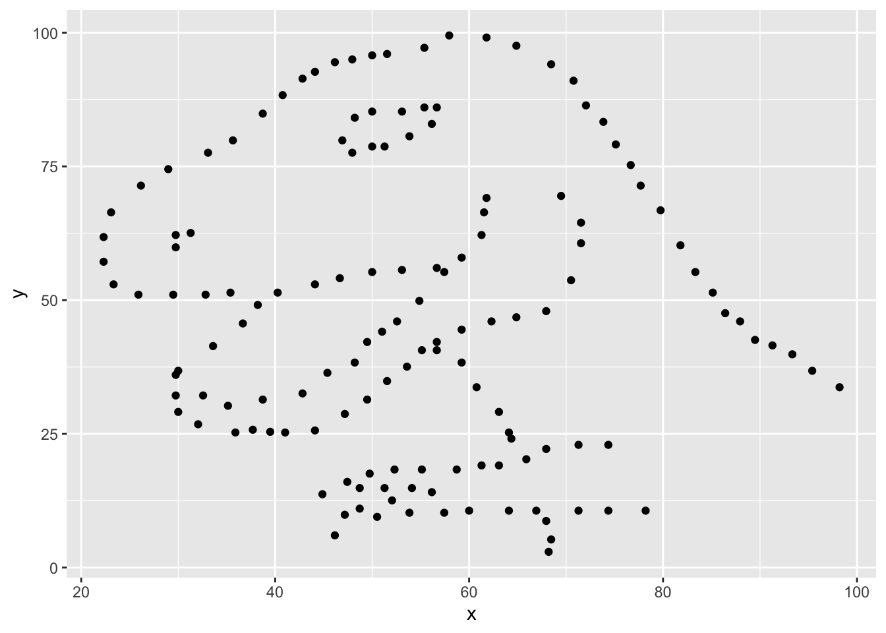
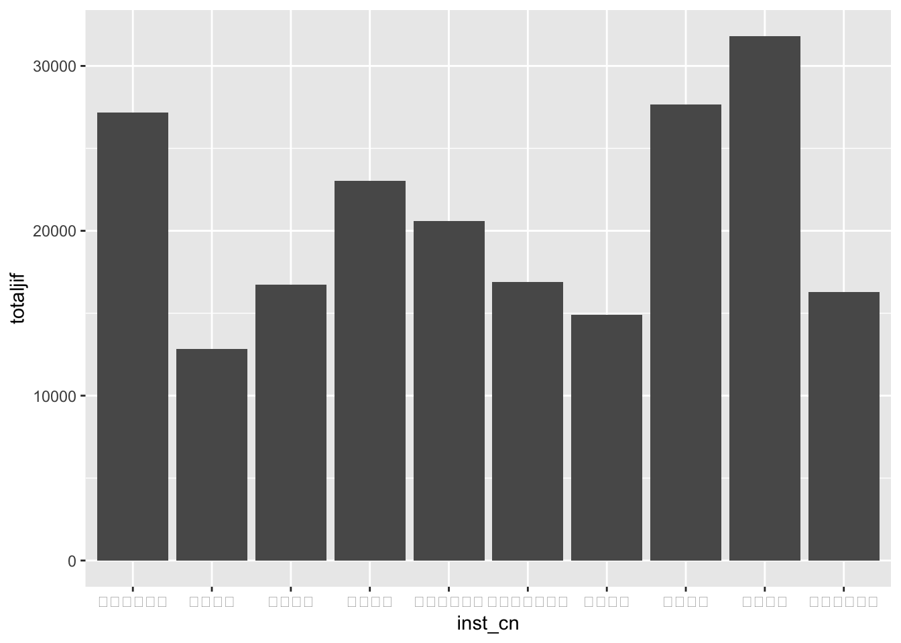
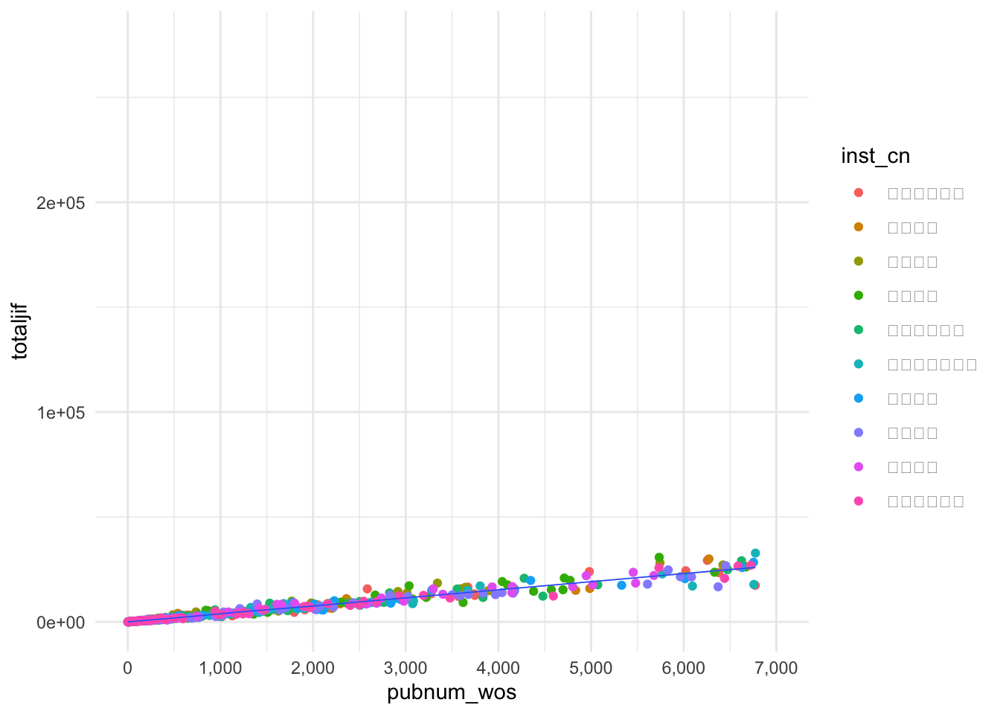
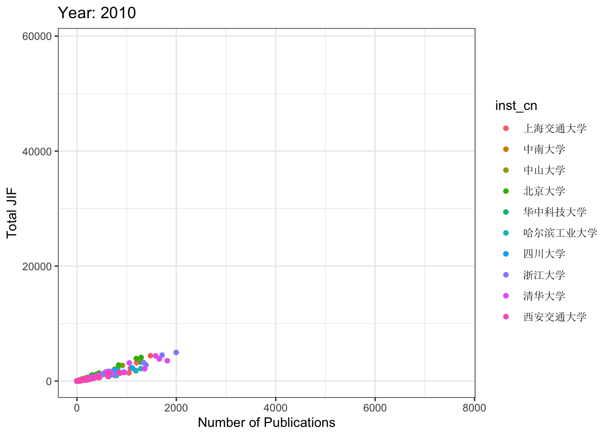

\mainmatter

# 数据可视化{#visu}

> 人都是视觉动物。

## 从一个可以画恐龙的包说起

在闲逛R论坛的时候，偶然发现有人贴了一段如下的代码，这个代码可以画出一个恐龙。

```r
# install.packages("datasauRus")
library("datasauRus")
library(ggplot2)
ggplot(subset(datasaurus_dozen, dataset=='dino'), 
             aes(x, y)) + 
  geom_point()  
```



太神奇了吧，居然有人写了个包来画恐龙！但是仔细一想，这事儿可能没有那么简单。事出非常必有妖，谁会闲到辛辛苦苦发布一个R包就为了画个恐龙呢。

果然datasauRus是一个非常有名的数据包，它包括了若干组描述性统计完全一致，但是分布却截然不同的数据集，恰恰说明了可视化的必要性。


详情可见论文，*Same Stats, Different Graphs: Generating Datasets with Varied Appearance and Identical Statistics through Simulated Annealing**


```r
library(datasauRus)
library(dplyr)
```

```
## 
## Attaching package: 'dplyr'
```

```
## The following objects are masked from 'package:stats':
## 
##     filter, lag
```

```
## The following objects are masked from 'package:base':
## 
##     intersect, setdiff, setequal, union
```

```r
datasaurus_dozen %>% 
    dplyr::group_by(dataset) %>% 
    dplyr::summarise(
      mean_x    = mean(x),
      mean_y    = mean(y),
      std_dev_x = sd(x),
      std_dev_y = sd(y),
      corr_x_y  = cor(x, y))
```

```
## # A tibble: 13 × 6
##    dataset    mean_x mean_y std_dev_x std_dev_y corr_x_y
##    <chr>       <dbl>  <dbl>     <dbl>     <dbl>    <dbl>
##  1 away         54.3   47.8      16.8      26.9  -0.0641
##  2 bullseye     54.3   47.8      16.8      26.9  -0.0686
##  3 circle       54.3   47.8      16.8      26.9  -0.0683
##  4 dino         54.3   47.8      16.8      26.9  -0.0645
##  5 dots         54.3   47.8      16.8      26.9  -0.0603
##  6 h_lines      54.3   47.8      16.8      26.9  -0.0617
##  7 high_lines   54.3   47.8      16.8      26.9  -0.0685
##  8 slant_down   54.3   47.8      16.8      26.9  -0.0690
##  9 slant_up     54.3   47.8      16.8      26.9  -0.0686
## 10 star         54.3   47.8      16.8      26.9  -0.0630
## 11 v_lines      54.3   47.8      16.8      26.9  -0.0694
## 12 wide_lines   54.3   47.8      16.8      26.9  -0.0666
## 13 x_shape      54.3   47.8      16.8      26.9  -0.0656
```

## 数据可视化的目的

数据可视化的目的是直观地向读者传递数据中包含的信息。重要的事情说三遍，**传递信息、传递信息、传递信息**！

因此，一个优秀的可视化应该具备以下的特征。

1. 重点突出。要让读者第一眼就能发现你要传达的主要信息，而不是暗戳戳的隐藏起来，等待别人发现。

2. 表意清晰。主要信息的传递要明确清晰，不要产生歧义，让读者自行发挥。充分利用注释、标题等来避免歧义。

3. 信息量大。图形的标题、注释都可以传达信息，在有限的图形内，尽可能传递更多信息。

4. 逻辑完整。数据传递的信息要有逻辑，能够独立阅读。

5. 美观。尽可能增强图形的美学水平，让读者愿意看，看着舒服，愿意分享。

## 图形语法（Grammar of Graphics）

图形语法（Grammar of Graphics，简称GG）是Leland Wilkinson开发的一套用来描述所有统计图表深层特性的语法规则，该语法回答了**什么是统计图**这一问题，以自底向上的方式组织最基本的元素形成更高级的元素。在GG看来，一张图就是从数据到几何标记对象的图形属性的一组映射，此外图形中还可能包含数据的统计变换，最后绘制在某个特定的坐标系中。此时，科学绘图就会非常接近画油画，绘图的过程就是在一张空白的画布上，一层一层地叠加图形要素。

粗略地，GG拆解的主要图形要素可以分为三大类：几何对象、美术属性与标签注释。

**几何对象**指的是将数据映射到图形之后的几何类型，包括点（point）、线（line）、直方（histgram）、柱（bar）等。

**美术属性**指的是几何对象呈现在图形中的属性，例如颜色（color）、形状（shape）、尺寸（size）、透明度（alpha）等。属性让同一类几何对象传递更加丰富的信息。

**标签注释**包括标题（title）、轴标题（x/y title）、轴标签（xlab/ylab）、文本标签（text label）、注释（note）、图例（legend）等。可以进一步丰富图形传达的信息。

通过图形语法可以实现统计绘图的自动化，满足可复现原则与一次原则。

更多关于GG的内容，可以参考Wilkinson的著作[The Grammar of Graphics](https://link.springer.com/book/10.1007/0-387-28695-0)。

## `ggplot2`

将GG在R语言中实现的又是我们熟悉的大神Wickham，他设计了`ggplot2`包，`ggplot2`及其家族现在已经成为统计制图的最佳工具。

我们看下发表在经济学人杂志的一篇文章中的图片，图片来源<http://www.economist.com/node/21541178>。数据来源，<http://www.transparency.org/content/download/64476/1031428>


这幅图首先在视觉呈现非常美观，然后信息传达非常丰富，几乎所有的图形要素都被利用了起来。可以分类总结如下：


本节的任务就是逐步学习`ggplot2`的要素，并画出此图。教学材料受到哈佛大学[IQSS](http://tutorials.iq.harvard.edu/)的启发。数据位于：[EconomistData.csv](https://drive.google.com/file/d/1CyCRpPVqLP-_BWjURiV5127rTiSHWuqe/view?usp=drive_link)。

总体来说，`ggplot`作图的标准模板为：

```
ggplot(data = <Data>) +
  <Geom_Function>(mapping = aes(<Mappings>),
  stat = <Stat>,
  position = <Position>) +
  <Coordinate_Function> +
  <Facet_Function> +
  <Scale_Function> +
  <Theme_Function>
```

`ggplot2`的语法逻辑为：

1. `ggplot`函数指定数据，然后使用`+`叠加后续绘图动作；

2. `geom_`函数族（或者`stat_`函数族）指定特定类型的几何对象；

3. `aes`函数调节几何对象的美术属性；

4. `coordinate_`函数指定坐标系统（可用于画地图）；

5. `facet_`函数进行分面；

6. `scale`函数调节坐标尺；

7. `theme`、`lab`、`guide`函数等调节主题、标题、图例等附加属性。

此外，`last_plot()`可返回上一张图片，`ggsave`用于图片输出。

### 几何对象

接下来，以绘制散点图为例介绍`ggplot2`的基本语法。以第三章使用的我国211大学发表论文的数据[pub211.csv](https://www.dropbox.com/scl/fi/nvbzqkerfaenz1dtgaitx/pub_211.csv?rlkey=n3vjai0a63oju73olrcvha43l&dl=0)为例，使用`ggplot`函数指定画图数据框为`pub_211_sum`，`aes`参数用于指定底图的x轴与y轴对应的变量，然后使用`geom_point`函数绘制散点图。


```r
library(readr)
library(dplyr)
pub_211 <- read_csv("pub_211.csv")
# 选出2022年发文最多的十所学校
top10 <- pub_211 %>% 
  filter(pubyear == 2022) %>% 
  group_by(inst_cn) %>% 
  summarise(pubnum_wos = sum(pubnum_wos)) %>% 
  arrange(desc(pubnum_wos)) %>% 
  slice(1:10)
top10_pub <- pub_211 %>% 
  semi_join(y = top10,by = "inst_cn") %>% 
  #filter(pubyear == 2022) %>% 
  group_by(inst_cn,cnsubject) %>% 
  summarise(pubnum_wos = sum(pubnum_wos),
            totaljif = sum(totaljif))

p1 <- ggplot(top10_pub, aes(x = pubnum_wos, y = totaljif))
p2 <- p1 + geom_point()
print(p2)
```


**练习题**

导入EconomistData.csv数据，该数据包括了部分国家的人类发展指数与腐败感知指数。创建一个以 CPI 为x轴，HDI为y轴的散点图。

除散点图外，ggplot还支持类型丰富的几何对象，现将主要类型总结如下：

| 几何对象                | 变量类型          | 图类型                            |
|:---------------------|:---------------|:--------------------------------|
| `geom_blank`        | 初始化           | 空白画布                           |
| `expand_limits`     | 初始化           | 扩展画布范围以囊括所有数据                  |
| `geom_curve`          | 初始化           | 一条曲线，指定起止点与弧度 |
| `geom_path`           | 初始化           | 点组成的路径                         |
| `geom_polygon`        | 初始化           | 多边形                            |
| `geom_rect`           | 初始化           | 矩形或方块                          |
| `geom_ribbon`         | 初始化           | 带状区域，常用于表示区域的不确定性或置信区间         |
| `geom_abline`         | 线段            | 斜直线                            |
| `geom_hline`         | 线段            | 竖线                             |
| `geom_vline`          | 线段            | 横线                             |
| `geom_segment`        | 线段            | 斜线段                            |
| `geom_spoke`        | 线段            | 基于原点的向量或箭头，常用于极坐标  |
| `geom_area`           | 单连续变量         | 向坐标轴的区域  |
| `geom_density`        | 单连续变量         | 核密度分布图|
| `geom_dotplot`        | 单连续变量         | 分布堆叠图，点的堆叠表示相同数值的重复次数。         |
| `geom_freqpoly`       | 单连续变量         | 频率多边形图，连续变量的频率分布情况，是一种直方图的替代方式 |
| `geom_histogram`      | 单连续变量         | 分布直方图                          |
| `geom_qq`             | 单连续变量         | Q-Q 图（Quantile-Quantile Plot）  |
| `geom_bar`            | 单离散变量         | 条形图                            |
| `geom_point`          | 双连续变量         | 散点图                            |
| `geom_rug`            | 双连续变量         | 轴须图，以类似条形码的方式在数据外侧展示变量分布密度     |
| `geom_smooth`         | 双连续变量         | 平滑拟合线                          |
| `geom_text`           | 双连续变量         | 为散点图添加文本标签      |
| `geom_col`            | 一个离散变量加一个连续变量 | 柱状图       |
| `geom_boxplot`        | 一个离散变量加一个连续变量 | 箱线图     |
| `geom_violin`         | 一个离散变量加一个连续变量 | 小提琴图  |
| `geom_count`          | 双离散变量         | 散点密度图，点大小表达该位置点的数量|
| `geom_jitter`         | 双离散变量         | 抖动散点图，对数据进行随机抖动，以展示离散点的密度分布情况  |
| `geom_bin2d`          | 双变量           | 二维直方图                          |
| `geom_density_2d`     | 双变量           | 二维核密度图                         |
| `geom_hex`           | 双变量           | 六边形分箱                          |
| `geom_line`           | 双变量           | 折线图                            |
| `geom_step`           | 双变量           | 阶梯图                            |
| `geom_crossbar`       | 误差变量          | 误差条图                           |
| `geom_errorbar`       | 误差变量          | 误差雷达图                          |
| `geom_linerange`      | 误差变量          | 误差线图                           |
| `geom_pointrange`     | 误差变量          | 误差线图（带均值点） |
| `geom_map`            | 地理变量          | 地图                             |
| `geom_contour`        | 三变量           | 等高线图                           |
| `geom_contour_filled` | 三变量           | 与`geom_contour`配合使用制作带填充的等高线图    |
| `geom_raster`         | 三变量           | 栅格图                            |
| `geom_tile`           | 三变量           | 热力图                            |

更多细节请参考，https://rstudio.github.io/cheatsheets/html/data-visualization.html#geoms。

### 美术属性

在`geom_point`函数中，`aes`可用于指定几何对象的美术属性。指定美术属性既可使用常量，例如制定颜色为红色（red），也可以使用变量，例如通过学科（cnsubject）来赋值颜色。


```r
p1 + geom_point(aes(color = "red"))
```


```r
p1 + geom_point(aes(color = inst_cn))
```


\BeginKnitrBlock{rmdnote}<div class="rmdnote">上面图中显示不出图例是因为默认字体不支持中文字体，只需要通过`theme(legend.text = element_text(family='SimSun'))`指定图例字体即可。</div>\EndKnitrBlock{rmdnote}


```r
p1 + geom_point(aes(color = inst_cn)) + theme(legend.text = element_text(family='SimSun'))
```


使用变量指定美术属性时，会出现两种情形：离散变量与连续变量。以颜色为例，离散变量对应了若干种颜色，而连续变量则对应了渐变的颜色。


```r
p1 + geom_point(aes(color = pubnum_wos,size = inst_cn)) + theme(legend.text = element_text(family='SimSun'))
```

```
## Warning: Using size for a discrete variable is not advised.
```


常用的美学属性总结如下：

| 几何对象  | 美术属性     | 作用                                     |
|:-------|:----------|:----------------------------------------|
| all   | color    | 颜色，支持色号、文本等方式赋值                        |
| all   | fill     | 填充颜色                                   |
| all   | size     | 大小                                     |
| all   | alpha    | 透明度 |
| line  | linetype | 线条类型：支持0-6共七种类型                        |
| line  | lineend  | 线条结尾：“round”, “butt” (缺省值), “square”   |
| line  | linejoin | 线条连接处：“round” (缺省值), “mitre”, “bevel”. |
| point | shape    | 点的形状：0-25共26种形状                        |
| point/line | stroke   | 图形或线条的轮廓|
| text  | family   | 指定文本的字体                                |
| text  | fontface | 指定字体样式："plain", "bold", "italic"       |
| text  | hjust    | 纵向位置：top = 1, middle = 0.5, bottom = 0 |
| text  | vjust    | 横向位置：left = 0, center = 0.5, right = 1 |

更多细节可以参考：https://ggplot2.tidyverse.org/articles/ggplot2-specs.html#colour-and-fill

**练习题**

在上一题的基础上

1. 将图的点改为蓝色(blue)；

2. 使用Region变量为点着色

### 统计变换

在`ggplot2`中，统计变换函数（statistical transformation functions）用于对数据进行统计计算或转换，以便在图表中呈现不同的数据表现形式。

例如，`stat_summary`函数可将数据按照指定的函数进行汇总，例如计算平均值、中位数等，并将汇总结果绘制到图表中。下面的代码中，`fun`参数指定了计算均值，`geom`参数制定了转换后的集合对象。


```r
ggplot(top10_pub, aes(x = inst_cn, y = totaljif)) +
  stat_summary(fun = mean, geom = "col")
```



其他统计转换数据包括，`stat_function`，允许将数学函数应用到图形中。可以使用此函数绘制自定义函数的图形；`stat_ecdf`，绘制经验累积分布函数，显示数据的累积分布情况；`stat_contour`用于创建等高线图，展示二维数据的密度分布情况；`stat_density`用于绘制核密度估计曲线，展示数据的密度分布情况；`stat_summary_hex`类似于`stat_summary`，用六边形的方式呈现数据的汇总结果。

尽管统计转换函数集成了数据转换与绘图，看上去比较方便，但是我们推荐读者实践中还是将数据转换与绘图分开，这样的代码更直观，也更加容易调整。

### 标尺

`scale_`函数族用于调整x轴，y轴以及所有美术属性对应变量的尺度。在使用标尺函数的时候，需要首先明确调整的变量是连续变量还是离散变量。`scale_*_continuous`将数据的连续取值映射为图形属性的取值，`scale_*_discrete`将数据的离散取值映射为图形属性的取值。

`scale_x_(y_)_continuous/discrete`用于调整坐标轴的范围（limits参数）、刻度（breaks，labels参数）以及位置（position参数）等特性。


```r
p3 <- p1 + geom_point(aes(color = inst_cn)) + 
  theme(legend.text = element_text(family='SimSun')) +
  geom_smooth(size = 0.3) + 
  scale_x_continuous(limits = c(0,7000),
                     breaks = seq(0,7000,1000),
                     labels = c("0","1,000","2,000",
                                "3,000","4,000","5,000",
                                "6,000","7,000"))
```

```
## Warning: Using `size` aesthetic for lines was deprecated in ggplot2 3.4.0.
## ℹ Please use `linewidth` instead.
## This warning is displayed once every 8 hours.
## Call `lifecycle::last_lifecycle_warnings()` to see where this warning was
## generated.
```

```r
print(p3)
```

```
## `geom_smooth()` using method = 'loess' and formula = 'y ~ x'
```

```
## Warning: Removed 131 rows containing non-finite values (`stat_smooth()`).
```

```
## Warning: Removed 131 rows containing missing values (`geom_point()`).
```


其他常用`scale`函数，`scale_*_binned`将数据的连续取值映射为离散 的统计堆；`scale_*_identity`使用数据的值作为图形属性的取值
`scale_*_manual(values = c())`将数据的离散取值作为手工指定的图形属性的取值；
`scale_*_date(date_labels = "%m/%d"),date_breaks = "2 weeks")`将数据值视为日期；`scale_*_datetime()`将数据视为时间。

坐标轴比例也可以调节，`scale_x_log10`以log10比例绘制x轴，
`scale_x_reverse`反转x轴方向，`scale_x_sqrt`以平方根绘制x。

例如，`scale_color_manual`函数可以根据个人的喜好来定制数据，后面小节中会介绍如何选择颜色。


```r
p4 <- p1 + geom_point(aes(color = inst_cn)) + 
  theme(legend.text = element_text(family='SimSun')) +
  geom_smooth(size = 0.3) + 
  scale_x_continuous(limits = c(0,7000),
                     breaks = seq(0,7000,1000),
                     labels = c("0","1,000","2,000",
                                "3,000","4,000","5,000",
                                "6,000","7,000")) + 
  scale_color_manual(values = c("#E69F00", "#56B4E9","#009E73", "#F0E442", "#0072B2","#D55E00","#CC79A7","#6794a7","#014d64","#01a2d9"))
print(p4)
```

```
## `geom_smooth()` using method = 'loess' and formula = 'y ~ x'
```

```
## Warning: Removed 131 rows containing non-finite values (`stat_smooth()`).
```

```
## Warning: Removed 131 rows containing missing values (`geom_point()`).
```


**练习题**
在上一个题目的基础上，

1. 使用scale_x_(y_)修改x轴与y轴的scale，以增加其可读性；

2. 使用scale_color_manual函数将散点的颜色调整为c(“red”,”blue”,"green","black","yellow","gray")，对应颜色的label调整为，c("Americas","Asia Pacific","East Europe & Central Asia","West Europe","East Asia","South Asia")

### 坐标系

`gglot2`默认使用笛卡尔坐标系，`coord_fixed`指定x和y单位之间固定长宽比的笛卡尔坐标，`coord_polar`为极坐标系，`coord_trans(y = 'sqrt')`使用变量转换后的坐标系，`coord_map`用于地理绘图中的坐标系。

### 分面
分面（facet）指的是按照某一个或两个分类变量的不同值将数据分为若干个子集，每个数据子集分别在分面上作图，使用`facet_wrap`可以直接分面，分面可以使用单个变量，也可以使用两个变量。


```r
p1 + geom_point() + 
  theme(text = element_text(family='SimSun')) +
  geom_smooth(size = 0.3) +
  facet_wrap(~ inst_cn)
```

```
## `geom_smooth()` using method = 'loess' and formula = 'y ~ x'
```


### 标签与图例

`labs`函数用于标记图中的元素，其`x/y`参数标注坐标轴，`title`参数标注图标题，`subtitle`标注图的子标题，`caption`标注图说明。

`guides`函数用于设置图例，常用的包括取消图例（设定对应美术属性为none），以及设置图例位置`theme(legend.position = "bottom")`。

`annotate`函数可以直接在图上手工添加文本。

### 主题

一张图里面的格式可以统称为主题，通过`theme`函数可以对图的每一处细节进行调整。

theme函数调用的方式为`theme(element_name = element_function())`，其中`element_name`为调整的对象，element_name涵盖了画面中的每一个要素，笼统的说，在excel里面可以调整的细节，都被其涵盖在内；`element_function`为元素函数，元素函数有四种，`element_text()`一般用于控制标签和标题的字体风格：`element_line`一般用于控制线条或线段的颜色或线条类型；`element_rect`一般用于控制背景矩形的颜色或者边界线条类型；`element_blank`不分配相应的绘图空间，即删去这个地方的绘图元素。

由于主题调整的细节非常多，此处就不一一展开了，读者可以查看theme函数的帮助文档来逐步调整。我们在后文的案例中展示了这一过程如何开展。

此外，一些常用的样式被封装在一些主题当中，例如`theme_bw()`，`theme_classic()`，`theme_minimal()`，调用这些主题会覆盖掉主题的设置。


```r
p3 + theme_bw()
```

```
## `geom_smooth()` using method = 'loess' and formula = 'y ~ x'
```

```
## Warning: Removed 131 rows containing non-finite values (`stat_smooth()`).
```

```
## Warning: Removed 131 rows containing missing values (`geom_point()`).
```


```r
p3 + theme_classic()
```

```
## `geom_smooth()` using method = 'loess' and formula = 'y ~ x'
```

```
## Warning: Removed 131 rows containing non-finite values (`stat_smooth()`).
## Removed 131 rows containing missing values (`geom_point()`).
```


```r
p3 + theme_minimal()
```

```
## `geom_smooth()` using method = 'loess' and formula = 'y ~ x'
```

```
## Warning: Removed 131 rows containing non-finite values (`stat_smooth()`).
## Removed 131 rows containing missing values (`geom_point()`).
```



`ggthemes`包提供了更丰富的格式主题，

```r
if(!require(ggthemes)) install.packages("ggthemes")
```

```
## Loading required package: ggthemes
```

```r
library(ggthemes)
p3 + theme_stata()
```

```
## `geom_smooth()` using method = 'loess' and formula = 'y ~ x'
```

```
## Warning: Removed 131 rows containing non-finite values (`stat_smooth()`).
```

```
## Warning: Removed 131 rows containing missing values (`geom_point()`).
```


```r
p3 + theme_economist()
```

```
## `geom_smooth()` using method = 'loess' and formula = 'y ~ x'
```

```
## Warning: Removed 131 rows containing non-finite values (`stat_smooth()`).
## Removed 131 rows containing missing values (`geom_point()`).
```


```r
p3 + theme_wsj()
```

```
## `geom_smooth()` using method = 'loess' and formula = 'y ~ x'
```

```
## Warning: Removed 131 rows containing non-finite values (`stat_smooth()`).
## Removed 131 rows containing missing values (`geom_point()`).
```


theme的另一种用法为讲自己设置的格式储存为主题，用于后续的图形中简单调用。


### 图例

`guides`函数用于调整图例的标题、位置、标签以及箱体。常用的用法为，`guides(color = "none)`可以移除颜色对应的图例；当多个美术属性使用同一个变量进行映射的时候，可以用下面的代码来合并图例。

```
guides(
    color = guide_legend(), 
    size = guide_legend()
  )
```

**练习题**

利用theme函数的丰富参数，绘制终极图形。


### 图形组合

很多时候，我们需要把多个图形组合成一个图形。我们推荐使用`ggpubr`包中的`ggarrange`函数来完成图形组合。被组合的图形，依次作为参数输入函数，并使用`nrow`和`ncol`指定组合的行与列，`labels`参数为子图指定标签。组合图形会自动对齐坐标轴。


```r
if(!require(ggpubr)) install.packages("ggpubr")
```

```
## Loading required package: ggpubr
```

```r
library(ggpubr)
p5 <- ggplot(top10_pub,aes(x = pubnum_wos)) + 
  geom_histogram()
p6 <- ggplot(top10_pub, aes(x = inst_cn, y = totaljif)) +
  stat_summary(fun = mean, geom = "col") + 
  theme(axis.text.x = element_text(family='SimSun'))
figure <- ggarrange(p4, p5, p6, 
          labels = c("A", "B", "C"),
          ncol = 2, nrow = 2)
```

```
## `geom_smooth()` using method = 'loess' and formula = 'y ~ x'
```

```
## `stat_bin()` using `bins = 30`. Pick better value with `binwidth`.
```

```r
print(figure)
```


`annotate_figure`函数可以用于为组合后的图形添加注释。


```r
annotate_figure(figure,
                top = text_grob("Visualizing mpg", color = "red", face = "bold", size = 14),
                bottom = text_grob("Data source: \n mtcars data set", color = "blue",
                                   hjust = 1, x = 1, face = "italic", size = 10),
                left = text_grob("Figure arranged using ggpubr", color = "green", rot = 90),
                right = "I'm done, thanks :-)!",
                fig.lab = "Figure 1", fig.lab.face = "bold"
)
```


叠加使用`ggarrange`可以按照指定的比例组合图形。


```r
ggarrange(p4,                             # 第一行散点图
          ggarrange(p5, p6, ncol = 2, labels = c("B", "C")), # 第二行箱形图和点图
          nrow = 2, 
          labels = "A"                                        # 散点图的标签
) 
```

```
## `stat_bin()` using `bins = 30`. Pick better value with `binwidth`.
## `geom_smooth()` using method = 'loess' and formula = 'y ~ x'
```


此外，`common.legend = TRUE`可以将图例合并，`legend = "bottom"`可以指定图例位置到底端。

`ggpubr`为制作可发表的图形，还提供了诸多函数，例如，`ggtexttable`可以将表格变成图形对象；`ggparagraph`将文本变成图形对象。

感兴趣的读者可以阅读官方文档，<https://rpkgs.datanovia.com/ggpubr>。


## 调色板

选择优雅的颜色是高质量数据可视化的保障。艺术造诣和编程能力并不是互斥的技能点。例如，R语言社区资深开发者（`ggplot2`包的作者）、计算认知科学家Danielle Navarro就是一名计算艺术家（computational artist）。下面是她的作品*Dancer*，更多作品可以浏览https://art.djnavarro.net/。

### ggsci
如果不是艺术造诣很高的话，选择成熟的配色是最安全的选择。`ggthemes`包封装了多种成熟的主题，`ggsci`则包括了多种杂志的配色方案，我们可以使用`scales`包的show_col函数来查看色号。

例如，我们要查看并使用经济学人杂志的调色板，可以用下面的代码


```r
library(ggthemes)
library(scales)
```

```
## 
## Attaching package: 'scales'
```

```
## The following object is masked from 'package:readr':
## 
##     col_factor
```

```r
library(ggsci)
show_col(economist_pal()(9))
```


```r
economist_pal()(9)
```

```
## [1] "#6794a7" "#014d64" "#01a2d9" "#7ad2f6" "#00887d" "#76c0c1" "#7c260b"
## [8] "#ee8f71" "#adadad"
```

如果要使用science杂志的配色，可以用下面的代码。

```r
show_col(pal_aaas()(9))
```


```r
pal_aaas()(9)
```

```
## [1] "#3B4992FF" "#EE0000FF" "#008B45FF" "#631879FF" "#008280FF" "#BB0021FF"
## [7] "#5F559BFF" "#A20056FF" "#808180FF"
```

### colorspace

`colorspace`包也提供了丰富的配色选择，我们这里介绍一下这个包的使用。根据着色遍变量的类型，`colorspace`包提供了配色模板：定性型（离散变量）、序列型（连续变量渐变）和渐扩型（连续变量不同色系扩散）。

#### 配色模板查看

colorspace包中共包括三种类型的配色模板——Qualitative、Sequential、Diverging，可以使用`hcl_palettes`查看全部配色或某一类型配色。


```r
library(colorspace)
hcl_palettes(plot = TRUE)
```


```r
hcl_palettes("sequential (single-hue)", n = 10, plot = TRUE) # n表示展示的颜色数量
```


通过`_hcl`函数可以查看相应类型中的颜色十六进制代码，也可以通过`swatchplot`函数进行可视化。


```r
diverging_hcl(n = 7, "Broc")
```

```
## [1] "#002B4B" "#2F6489" "#92A6BA" "#F9F9F9" "#A6A587" "#636212" "#292800"
```
#### 在ggplot2中应用

通过`scale_<aesthetic>_<datatype>_<colorscale>`函数实现可以将`colorspace`包的配色直接应用于`ggplot`对象，其中，colorscale 是声明颜色标度类型。


```r
p1 + geom_point(aes(color = inst_cn)) + 
  theme(legend.text = element_text(family='SimSun')) + 
  scale_color_discrete_qualitative(palette = "Pastel1")
```


## 动图

`gganimate`是基于`ggplot2`的制作动图的扩展包。动图的原理是把逐帧画图，然后通过转换设置将每一帧图连续展示。`anim_save`命令用于将动图储存为`.gif`文件。


```r
if(!require(gganimate)) install.packages('gganimate')
if(!require(gifski)) install.packages('gifski')
library(gifski) # 加载该包用于在rmarkdown中展示动图
top10_pub_year <- pub_211 %>% 
  semi_join(y = top10,by = "inst_cn") %>% 
  group_by(inst_cn,cnsubject,pubyear) %>% 
  summarise(pubnum_wos = sum(pubnum_wos),
            totaljif = sum(totaljif)) %>% 
  filter(pubyear >= 2010) %>% 
  mutate(pubyear = as.integer(pubyear))

ggplot(top10_pub_year, aes(pubnum_wos, totaljif, color = inst_cn)) +
  geom_point() +
  theme_bw() +
  theme(legend.text = element_text(family='SimSun'))+
  # 指定标签
  labs(title = 'Year: {frame_time}', x = 'Number of Publications', y = 'Total JIF') +
  transition_time(pubyear) + # 
  ease_aes('linear')
```

<!-- -->

`gganimate`主要包含五个函数族来调节动画效果：`transition_`定义动画是根据哪个变量进行动画展示，以及如何展示；`view_`定义坐标轴随数据变化；`shadow_`制作影子效果，定义逐帧相继出现的方式；`enter_/exit_`定义新数据出现和旧数据退去的方式；`ease_aes`美术属性定义，控制变化的节奏(如何让整个动画看起来更舒适)。

感兴趣的读者，推荐阅读官方文档，<https://gganimate.com/articles/gganimate.html>

## 交互图

`ggplotly`扩展包可以将`ggplot2`图以交互图的形式展示。
例如

```r
if(!require(plotly)) install.packages('plotly')
library(plotly)
ggplotly(p1 + geom_point(aes(color = inst_cn)) + theme(legend.text = element_text(family='SimSun')))
```

```{=html}
<div class="plotly html-widget html-fill-item-overflow-hidden html-fill-item" id="htmlwidget-92c77d5f566237fb48c3" style="width:672px;height:480px;"></div>
<script type="application/json" data-for="htmlwidget-92c77d5f566237fb48c3">{"x":{"data":[{"x":[2008,2665,9968,3571,3746,2801,9,26,942,6380,9,186,2173,22903,42119,41910,2369,3273,2664,2507,725,9378,55770,7867,7481,40537,11562,6022,1014,13876,2038,35150,321,6772,83,1910,13065,80,308,638,485,2165,1128,1638,34,38,6255,2585,1753,292,1470,470,464,211,107,34,257,23470,40116,1797,3670,596,4981,727,151,3742,325,217,42,347],"y":[6707.634,10357.227999999999,32116.859,12093.360000000001,12610.116,9966.3510000000006,36.942999999999998,68.299999999999997,3125.4189999999999,23455.698,24.963000000000001,513.56500000000005,8701.6219999999994,65432.228000000003,147914.66800000001,198963.94899999999,8908.2549999999992,13370.619000000001,10053.371000000001,8934.6829999999991,2331.8000000000002,33555.373999999996,277337.43300000002,19505.537,22130.665000000001,176465.49799999999,44373.587,24377.814999999999,2473.3989999999999,60055.256000000001,6053.6970000000001,118307.281,1216.8589999999999,17402.700000000001,351.22500000000002,5763.5900000000001,68044.933000000005,183.79599999999999,979.46600000000001,3230.1900000000001,1538.617,6649.8270000000002,2878.1970000000001,7607.6040000000003,174.345,108.196,29315.147000000001,15728.543,7327.1620000000003,1255.1879999999999,5256.2070000000003,1476.2670000000001,1989.9690000000001,849.03099999999995,396.67099999999999,207.732,1381.1009999999999,112427.39199999999,182579.85000000001,4524.2870000000003,16574.040000000001,1716.376,23951.591,2573.9940000000001,441.56600000000003,13306.437,1003.929,730.79200000000003,150.714,1066.1859999999999],"text":["pubnum_wos:  2008<br />totaljif:   6707.634<br />inst_cn: 上海交通大学","pubnum_wos:  2665<br />totaljif:  10357.228<br />inst_cn: 上海交通大学","pubnum_wos:  9968<br />totaljif:  32116.859<br />inst_cn: 上海交通大学","pubnum_wos:  3571<br />totaljif:  12093.360<br />inst_cn: 上海交通大学","pubnum_wos:  3746<br />totaljif:  12610.116<br />inst_cn: 上海交通大学","pubnum_wos:  2801<br />totaljif:   9966.351<br />inst_cn: 上海交通大学","pubnum_wos:     9<br />totaljif:     36.943<br />inst_cn: 上海交通大学","pubnum_wos:    26<br />totaljif:     68.300<br />inst_cn: 上海交通大学","pubnum_wos:   942<br />totaljif:   3125.419<br />inst_cn: 上海交通大学","pubnum_wos:  6380<br />totaljif:  23455.698<br />inst_cn: 上海交通大学","pubnum_wos:     9<br />totaljif:     24.963<br />inst_cn: 上海交通大学","pubnum_wos:   186<br />totaljif:    513.565<br />inst_cn: 上海交通大学","pubnum_wos:  2173<br />totaljif:   8701.622<br />inst_cn: 上海交通大学","pubnum_wos: 22903<br />totaljif:  65432.228<br />inst_cn: 上海交通大学","pubnum_wos: 42119<br />totaljif: 147914.668<br />inst_cn: 上海交通大学","pubnum_wos: 41910<br />totaljif: 198963.949<br />inst_cn: 上海交通大学","pubnum_wos:  2369<br />totaljif:   8908.255<br />inst_cn: 上海交通大学","pubnum_wos:  3273<br />totaljif:  13370.619<br />inst_cn: 上海交通大学","pubnum_wos:  2664<br />totaljif:  10053.371<br />inst_cn: 上海交通大学","pubnum_wos:  2507<br />totaljif:   8934.683<br />inst_cn: 上海交通大学","pubnum_wos:   725<br />totaljif:   2331.800<br />inst_cn: 上海交通大学","pubnum_wos:  9378<br />totaljif:  33555.374<br />inst_cn: 上海交通大学","pubnum_wos: 55770<br />totaljif: 277337.433<br />inst_cn: 上海交通大学","pubnum_wos:  7867<br />totaljif:  19505.537<br />inst_cn: 上海交通大学","pubnum_wos:  7481<br />totaljif:  22130.665<br />inst_cn: 上海交通大学","pubnum_wos: 40537<br />totaljif: 176465.498<br />inst_cn: 上海交通大学","pubnum_wos: 11562<br />totaljif:  44373.587<br />inst_cn: 上海交通大学","pubnum_wos:  6022<br />totaljif:  24377.815<br />inst_cn: 上海交通大学","pubnum_wos:  1014<br />totaljif:   2473.399<br />inst_cn: 上海交通大学","pubnum_wos: 13876<br />totaljif:  60055.256<br />inst_cn: 上海交通大学","pubnum_wos:  2038<br />totaljif:   6053.697<br />inst_cn: 上海交通大学","pubnum_wos: 35150<br />totaljif: 118307.281<br />inst_cn: 上海交通大学","pubnum_wos:   321<br />totaljif:   1216.859<br />inst_cn: 上海交通大学","pubnum_wos:  6772<br />totaljif:  17402.700<br />inst_cn: 上海交通大学","pubnum_wos:    83<br />totaljif:    351.225<br />inst_cn: 上海交通大学","pubnum_wos:  1910<br />totaljif:   5763.590<br />inst_cn: 上海交通大学","pubnum_wos: 13065<br />totaljif:  68044.933<br />inst_cn: 上海交通大学","pubnum_wos:    80<br />totaljif:    183.796<br />inst_cn: 上海交通大学","pubnum_wos:   308<br />totaljif:    979.466<br />inst_cn: 上海交通大学","pubnum_wos:   638<br />totaljif:   3230.190<br />inst_cn: 上海交通大学","pubnum_wos:   485<br />totaljif:   1538.617<br />inst_cn: 上海交通大学","pubnum_wos:  2165<br />totaljif:   6649.827<br />inst_cn: 上海交通大学","pubnum_wos:  1128<br />totaljif:   2878.197<br />inst_cn: 上海交通大学","pubnum_wos:  1638<br />totaljif:   7607.604<br />inst_cn: 上海交通大学","pubnum_wos:    34<br />totaljif:    174.345<br />inst_cn: 上海交通大学","pubnum_wos:    38<br />totaljif:    108.196<br />inst_cn: 上海交通大学","pubnum_wos:  6255<br />totaljif:  29315.147<br />inst_cn: 上海交通大学","pubnum_wos:  2585<br />totaljif:  15728.543<br />inst_cn: 上海交通大学","pubnum_wos:  1753<br />totaljif:   7327.162<br />inst_cn: 上海交通大学","pubnum_wos:   292<br />totaljif:   1255.188<br />inst_cn: 上海交通大学","pubnum_wos:  1470<br />totaljif:   5256.207<br />inst_cn: 上海交通大学","pubnum_wos:   470<br />totaljif:   1476.267<br />inst_cn: 上海交通大学","pubnum_wos:   464<br />totaljif:   1989.969<br />inst_cn: 上海交通大学","pubnum_wos:   211<br />totaljif:    849.031<br />inst_cn: 上海交通大学","pubnum_wos:   107<br />totaljif:    396.671<br />inst_cn: 上海交通大学","pubnum_wos:    34<br />totaljif:    207.732<br />inst_cn: 上海交通大学","pubnum_wos:   257<br />totaljif:   1381.101<br />inst_cn: 上海交通大学","pubnum_wos: 23470<br />totaljif: 112427.392<br />inst_cn: 上海交通大学","pubnum_wos: 40116<br />totaljif: 182579.850<br />inst_cn: 上海交通大学","pubnum_wos:  1797<br />totaljif:   4524.287<br />inst_cn: 上海交通大学","pubnum_wos:  3670<br />totaljif:  16574.040<br />inst_cn: 上海交通大学","pubnum_wos:   596<br />totaljif:   1716.376<br />inst_cn: 上海交通大学","pubnum_wos:  4981<br />totaljif:  23951.591<br />inst_cn: 上海交通大学","pubnum_wos:   727<br />totaljif:   2573.994<br />inst_cn: 上海交通大学","pubnum_wos:   151<br />totaljif:    441.566<br />inst_cn: 上海交通大学","pubnum_wos:  3742<br />totaljif:  13306.437<br />inst_cn: 上海交通大学","pubnum_wos:   325<br />totaljif:   1003.929<br />inst_cn: 上海交通大学","pubnum_wos:   217<br />totaljif:    730.792<br />inst_cn: 上海交通大学","pubnum_wos:    42<br />totaljif:    150.714<br />inst_cn: 上海交通大学","pubnum_wos:   347<br />totaljif:   1066.186<br />inst_cn: 上海交通大学"],"type":"scatter","mode":"markers","marker":{"autocolorscale":false,"color":"rgba(248,118,109,1)","opacity":1,"size":5.6692913385826778,"symbol":"circle","line":{"width":1.8897637795275593,"color":"rgba(248,118,109,1)"}},"hoveron":"points","name":"上海交通大学","legendgroup":"上海交通大学","showlegend":true,"xaxis":"x","yaxis":"y","hoverinfo":"text","frame":null},{"x":[1146,1259,4986,1715,1755,1540,6,8,320,2812,2,70,1269,10835,19169,24491,590,2292,1669,1178,668,7662,19500,2204,2204,27033,12843,2360,318,6272,567,15269,149,4834,30,1261,10604,338,211,320,378,815,214,539,12,13,3590,354,472,180,434,112,1303,50,34,15,59,7112,13002,253,1565,240,2047,169,100,1535,79,96,18,91],"y":[4177.6350000000002,4897.1319999999996,15916.130999999999,6035.8289999999997,6167.5959999999995,5499.0460000000003,15.146999999999998,15.967000000000001,1132.617,10474.93,13.474,291.17700000000002,5036.125,32908.406000000003,70744.959999999992,103883.232,2228.6179999999999,8572.5190000000002,6388.7629999999999,4178.8770000000004,2314.6599999999999,26090.185000000001,84044.879000000001,6417.8109999999997,7237.6750000000002,110210.49099999999,48515.508999999998,11038.468999999999,912.22900000000004,30010.174999999999,2178.0320000000002,52877.332999999999,532.44600000000003,15025.379000000001,148.613,4652.9949999999999,52009.949000000001,964.41499999999996,814.47299999999996,1486.077,1112.577,2948.8969999999999,728.41499999999996,4054.451,26.739000000000001,33.844000000000001,15747.360000000001,1813.1800000000001,1714.508,662.87400000000002,1638.549,384.78199999999998,4681.0680000000002,184.76499999999999,112.014,52.777999999999999,194.76300000000001,31261.896000000001,60558.565000000002,607.125,6441.1880000000001,664.62900000000002,8144.5990000000002,645.19000000000005,294.31299999999999,5504.5820000000003,307.96899999999999,361.209,40.612000000000002,319.34199999999998],"text":["pubnum_wos:  1146<br />totaljif:   4177.635<br />inst_cn: 中南大学","pubnum_wos:  1259<br />totaljif:   4897.132<br />inst_cn: 中南大学","pubnum_wos:  4986<br />totaljif:  15916.131<br />inst_cn: 中南大学","pubnum_wos:  1715<br />totaljif:   6035.829<br />inst_cn: 中南大学","pubnum_wos:  1755<br />totaljif:   6167.596<br />inst_cn: 中南大学","pubnum_wos:  1540<br />totaljif:   5499.046<br />inst_cn: 中南大学","pubnum_wos:     6<br />totaljif:     15.147<br />inst_cn: 中南大学","pubnum_wos:     8<br />totaljif:     15.967<br />inst_cn: 中南大学","pubnum_wos:   320<br />totaljif:   1132.617<br />inst_cn: 中南大学","pubnum_wos:  2812<br />totaljif:  10474.930<br />inst_cn: 中南大学","pubnum_wos:     2<br />totaljif:     13.474<br />inst_cn: 中南大学","pubnum_wos:    70<br />totaljif:    291.177<br />inst_cn: 中南大学","pubnum_wos:  1269<br />totaljif:   5036.125<br />inst_cn: 中南大学","pubnum_wos: 10835<br />totaljif:  32908.406<br />inst_cn: 中南大学","pubnum_wos: 19169<br />totaljif:  70744.960<br />inst_cn: 中南大学","pubnum_wos: 24491<br />totaljif: 103883.232<br />inst_cn: 中南大学","pubnum_wos:   590<br />totaljif:   2228.618<br />inst_cn: 中南大学","pubnum_wos:  2292<br />totaljif:   8572.519<br />inst_cn: 中南大学","pubnum_wos:  1669<br />totaljif:   6388.763<br />inst_cn: 中南大学","pubnum_wos:  1178<br />totaljif:   4178.877<br />inst_cn: 中南大学","pubnum_wos:   668<br />totaljif:   2314.660<br />inst_cn: 中南大学","pubnum_wos:  7662<br />totaljif:  26090.185<br />inst_cn: 中南大学","pubnum_wos: 19500<br />totaljif:  84044.879<br />inst_cn: 中南大学","pubnum_wos:  2204<br />totaljif:   6417.811<br />inst_cn: 中南大学","pubnum_wos:  2204<br />totaljif:   7237.675<br />inst_cn: 中南大学","pubnum_wos: 27033<br />totaljif: 110210.491<br />inst_cn: 中南大学","pubnum_wos: 12843<br />totaljif:  48515.509<br />inst_cn: 中南大学","pubnum_wos:  2360<br />totaljif:  11038.469<br />inst_cn: 中南大学","pubnum_wos:   318<br />totaljif:    912.229<br />inst_cn: 中南大学","pubnum_wos:  6272<br />totaljif:  30010.175<br />inst_cn: 中南大学","pubnum_wos:   567<br />totaljif:   2178.032<br />inst_cn: 中南大学","pubnum_wos: 15269<br />totaljif:  52877.333<br />inst_cn: 中南大学","pubnum_wos:   149<br />totaljif:    532.446<br />inst_cn: 中南大学","pubnum_wos:  4834<br />totaljif:  15025.379<br />inst_cn: 中南大学","pubnum_wos:    30<br />totaljif:    148.613<br />inst_cn: 中南大学","pubnum_wos:  1261<br />totaljif:   4652.995<br />inst_cn: 中南大学","pubnum_wos: 10604<br />totaljif:  52009.949<br />inst_cn: 中南大学","pubnum_wos:   338<br />totaljif:    964.415<br />inst_cn: 中南大学","pubnum_wos:   211<br />totaljif:    814.473<br />inst_cn: 中南大学","pubnum_wos:   320<br />totaljif:   1486.077<br />inst_cn: 中南大学","pubnum_wos:   378<br />totaljif:   1112.577<br />inst_cn: 中南大学","pubnum_wos:   815<br />totaljif:   2948.897<br />inst_cn: 中南大学","pubnum_wos:   214<br />totaljif:    728.415<br />inst_cn: 中南大学","pubnum_wos:   539<br />totaljif:   4054.451<br />inst_cn: 中南大学","pubnum_wos:    12<br />totaljif:     26.739<br />inst_cn: 中南大学","pubnum_wos:    13<br />totaljif:     33.844<br />inst_cn: 中南大学","pubnum_wos:  3590<br />totaljif:  15747.360<br />inst_cn: 中南大学","pubnum_wos:   354<br />totaljif:   1813.180<br />inst_cn: 中南大学","pubnum_wos:   472<br />totaljif:   1714.508<br />inst_cn: 中南大学","pubnum_wos:   180<br />totaljif:    662.874<br />inst_cn: 中南大学","pubnum_wos:   434<br />totaljif:   1638.549<br />inst_cn: 中南大学","pubnum_wos:   112<br />totaljif:    384.782<br />inst_cn: 中南大学","pubnum_wos:  1303<br />totaljif:   4681.068<br />inst_cn: 中南大学","pubnum_wos:    50<br />totaljif:    184.765<br />inst_cn: 中南大学","pubnum_wos:    34<br />totaljif:    112.014<br />inst_cn: 中南大学","pubnum_wos:    15<br />totaljif:     52.778<br />inst_cn: 中南大学","pubnum_wos:    59<br />totaljif:    194.763<br />inst_cn: 中南大学","pubnum_wos:  7112<br />totaljif:  31261.896<br />inst_cn: 中南大学","pubnum_wos: 13002<br />totaljif:  60558.565<br />inst_cn: 中南大学","pubnum_wos:   253<br />totaljif:    607.125<br />inst_cn: 中南大学","pubnum_wos:  1565<br />totaljif:   6441.188<br />inst_cn: 中南大学","pubnum_wos:   240<br />totaljif:    664.629<br />inst_cn: 中南大学","pubnum_wos:  2047<br />totaljif:   8144.599<br />inst_cn: 中南大学","pubnum_wos:   169<br />totaljif:    645.190<br />inst_cn: 中南大学","pubnum_wos:   100<br />totaljif:    294.313<br />inst_cn: 中南大学","pubnum_wos:  1535<br />totaljif:   5504.582<br />inst_cn: 中南大学","pubnum_wos:    79<br />totaljif:    307.969<br />inst_cn: 中南大学","pubnum_wos:    96<br />totaljif:    361.209<br />inst_cn: 中南大学","pubnum_wos:    18<br />totaljif:     40.612<br />inst_cn: 中南大学","pubnum_wos:    91<br />totaljif:    319.342<br />inst_cn: 中南大学"],"type":"scatter","mode":"markers","marker":{"autocolorscale":false,"color":"rgba(216,144,0,1)","opacity":1,"size":5.6692913385826778,"symbol":"circle","line":{"width":1.8897637795275593,"color":"rgba(216,144,0,1)"}},"hoveron":"points","name":"中南大学","legendgroup":"中南大学","showlegend":true,"xaxis":"x","yaxis":"y","hoverinfo":"text","frame":null},{"x":[1231,1594,6019,2858,3024,3675,26,23,497,3889,2,364,3905,10815,18672,26218,1576,6423,3014,2217,677,8344,34888,1625,1525,16036,3342,1769,182,7922,335,15388,135,2356,150,1981,7435,82,79,222,237,904,127,485,20,94,5744,736,942,127,667,269,585,356,149,137,1126,12352,20111,728,2916,459,3643,382,67,2392,307,108,66,146],"y":[4667.2219999999998,5954.5910000000003,21748.962,10545.829,11096.941000000001,14536.819,170.03,93.635000000000005,1601.4190000000001,14817.57,1.236,1458.768,14925.529,38001.275999999998,79272.221999999994,127379.292,5977.1360000000004,27134.507999999998,13782.224,9625.3079999999991,2541.3589999999999,35443.036999999997,169510.51800000001,5145.607,6330.5259999999998,87749.039000000004,18471.505000000001,9888.5110000000004,685.95600000000002,40472.315999999999,1542.1279999999999,64378.389999999999,565.553,9116.5110000000004,568.14999999999998,9020.8360000000011,44223.097999999998,250.429,347.31799999999998,1283.2929999999999,1022.662,3528.127,533.21000000000004,3363.643,95.786999999999992,349.94499999999999,28143.029999999999,4733.0479999999998,3625.5059999999999,542.64099999999996,3150.2869999999998,908.26700000000005,2619.4059999999999,1145.3230000000001,502.286,594.53200000000004,3436.7420000000002,60088.900999999998,95971.623999999996,2046.4260000000002,14471.499,1450.5940000000001,16433.360000000001,1206.6320000000001,222.857,9561.1959999999999,1004.0020000000001,414.654,303.11700000000002,499.24299999999999],"text":["pubnum_wos:  1231<br />totaljif:   4667.222<br />inst_cn: 中山大学","pubnum_wos:  1594<br />totaljif:   5954.591<br />inst_cn: 中山大学","pubnum_wos:  6019<br />totaljif:  21748.962<br />inst_cn: 中山大学","pubnum_wos:  2858<br />totaljif:  10545.829<br />inst_cn: 中山大学","pubnum_wos:  3024<br />totaljif:  11096.941<br />inst_cn: 中山大学","pubnum_wos:  3675<br />totaljif:  14536.819<br />inst_cn: 中山大学","pubnum_wos:    26<br />totaljif:    170.030<br />inst_cn: 中山大学","pubnum_wos:    23<br />totaljif:     93.635<br />inst_cn: 中山大学","pubnum_wos:   497<br />totaljif:   1601.419<br />inst_cn: 中山大学","pubnum_wos:  3889<br />totaljif:  14817.570<br />inst_cn: 中山大学","pubnum_wos:     2<br />totaljif:      1.236<br />inst_cn: 中山大学","pubnum_wos:   364<br />totaljif:   1458.768<br />inst_cn: 中山大学","pubnum_wos:  3905<br />totaljif:  14925.529<br />inst_cn: 中山大学","pubnum_wos: 10815<br />totaljif:  38001.276<br />inst_cn: 中山大学","pubnum_wos: 18672<br />totaljif:  79272.222<br />inst_cn: 中山大学","pubnum_wos: 26218<br />totaljif: 127379.292<br />inst_cn: 中山大学","pubnum_wos:  1576<br />totaljif:   5977.136<br />inst_cn: 中山大学","pubnum_wos:  6423<br />totaljif:  27134.508<br />inst_cn: 中山大学","pubnum_wos:  3014<br />totaljif:  13782.224<br />inst_cn: 中山大学","pubnum_wos:  2217<br />totaljif:   9625.308<br />inst_cn: 中山大学","pubnum_wos:   677<br />totaljif:   2541.359<br />inst_cn: 中山大学","pubnum_wos:  8344<br />totaljif:  35443.037<br />inst_cn: 中山大学","pubnum_wos: 34888<br />totaljif: 169510.518<br />inst_cn: 中山大学","pubnum_wos:  1625<br />totaljif:   5145.607<br />inst_cn: 中山大学","pubnum_wos:  1525<br />totaljif:   6330.526<br />inst_cn: 中山大学","pubnum_wos: 16036<br />totaljif:  87749.039<br />inst_cn: 中山大学","pubnum_wos:  3342<br />totaljif:  18471.505<br />inst_cn: 中山大学","pubnum_wos:  1769<br />totaljif:   9888.511<br />inst_cn: 中山大学","pubnum_wos:   182<br />totaljif:    685.956<br />inst_cn: 中山大学","pubnum_wos:  7922<br />totaljif:  40472.316<br />inst_cn: 中山大学","pubnum_wos:   335<br />totaljif:   1542.128<br />inst_cn: 中山大学","pubnum_wos: 15388<br />totaljif:  64378.390<br />inst_cn: 中山大学","pubnum_wos:   135<br />totaljif:    565.553<br />inst_cn: 中山大学","pubnum_wos:  2356<br />totaljif:   9116.511<br />inst_cn: 中山大学","pubnum_wos:   150<br />totaljif:    568.150<br />inst_cn: 中山大学","pubnum_wos:  1981<br />totaljif:   9020.836<br />inst_cn: 中山大学","pubnum_wos:  7435<br />totaljif:  44223.098<br />inst_cn: 中山大学","pubnum_wos:    82<br />totaljif:    250.429<br />inst_cn: 中山大学","pubnum_wos:    79<br />totaljif:    347.318<br />inst_cn: 中山大学","pubnum_wos:   222<br />totaljif:   1283.293<br />inst_cn: 中山大学","pubnum_wos:   237<br />totaljif:   1022.662<br />inst_cn: 中山大学","pubnum_wos:   904<br />totaljif:   3528.127<br />inst_cn: 中山大学","pubnum_wos:   127<br />totaljif:    533.210<br />inst_cn: 中山大学","pubnum_wos:   485<br />totaljif:   3363.643<br />inst_cn: 中山大学","pubnum_wos:    20<br />totaljif:     95.787<br />inst_cn: 中山大学","pubnum_wos:    94<br />totaljif:    349.945<br />inst_cn: 中山大学","pubnum_wos:  5744<br />totaljif:  28143.030<br />inst_cn: 中山大学","pubnum_wos:   736<br />totaljif:   4733.048<br />inst_cn: 中山大学","pubnum_wos:   942<br />totaljif:   3625.506<br />inst_cn: 中山大学","pubnum_wos:   127<br />totaljif:    542.641<br />inst_cn: 中山大学","pubnum_wos:   667<br />totaljif:   3150.287<br />inst_cn: 中山大学","pubnum_wos:   269<br />totaljif:    908.267<br />inst_cn: 中山大学","pubnum_wos:   585<br />totaljif:   2619.406<br />inst_cn: 中山大学","pubnum_wos:   356<br />totaljif:   1145.323<br />inst_cn: 中山大学","pubnum_wos:   149<br />totaljif:    502.286<br />inst_cn: 中山大学","pubnum_wos:   137<br />totaljif:    594.532<br />inst_cn: 中山大学","pubnum_wos:  1126<br />totaljif:   3436.742<br />inst_cn: 中山大学","pubnum_wos: 12352<br />totaljif:  60088.901<br />inst_cn: 中山大学","pubnum_wos: 20111<br />totaljif:  95971.624<br />inst_cn: 中山大学","pubnum_wos:   728<br />totaljif:   2046.426<br />inst_cn: 中山大学","pubnum_wos:  2916<br />totaljif:  14471.499<br />inst_cn: 中山大学","pubnum_wos:   459<br />totaljif:   1450.594<br />inst_cn: 中山大学","pubnum_wos:  3643<br />totaljif:  16433.360<br />inst_cn: 中山大学","pubnum_wos:   382<br />totaljif:   1206.632<br />inst_cn: 中山大学","pubnum_wos:    67<br />totaljif:    222.857<br />inst_cn: 中山大学","pubnum_wos:  2392<br />totaljif:   9561.196<br />inst_cn: 中山大学","pubnum_wos:   307<br />totaljif:   1004.002<br />inst_cn: 中山大学","pubnum_wos:   108<br />totaljif:    414.654<br />inst_cn: 中山大学","pubnum_wos:    66<br />totaljif:    303.117<br />inst_cn: 中山大学","pubnum_wos:   146<br />totaljif:    499.243<br />inst_cn: 中山大学"],"type":"scatter","mode":"markers","marker":{"autocolorscale":false,"color":"rgba(163,165,0,1)","opacity":1,"size":5.6692913385826778,"symbol":"circle","line":{"width":1.8897637795275593,"color":"rgba(163,165,0,1)"}},"hoveron":"points","name":"中山大学","legendgroup":"中山大学","showlegend":true,"xaxis":"x","yaxis":"y","hoverinfo":"text","frame":null},{"x":[1732,3073,9754,4380,4571,4773,20,33,793,6333,8,213,6672,17785,37022,37057,4697,9034,4711,2670,1509,11682,38163,3619,2156,26470,5735,3036,174,12093,459,21767,117,2609,235,2299,9791,83,251,221,245,938,61,842,45,274,7997,869,759,152,896,188,759,243,52,330,351,12124,19756,1357,4042,645,4099,483,100,3221,335,285,87,260],"y":[5828.5349999999999,10887.898999999999,31994.120999999999,14585.069,15303.496999999999,19788.642,201.78099999999998,136.66499999999999,2521.3299999999999,23648.727999999999,36.689999999999998,621.42600000000004,26197.237000000001,58244.703000000001,149202.21799999999,184085.03200000001,15315.129000000001,37597.866999999998,20902.891,12754.394,4519.4080000000004,47073.750999999997,202903.78200000001,9241.2999999999993,8668.759,143541.59899999999,30779.774999999998,17191.424999999999,539.13599999999997,65942.925000000003,1859.7909999999999,84759.134999999995,447.54599999999999,9119.8459999999995,842.26499999999999,9371.2800000000007,58273.968000000001,241.24699999999999,913.71799999999996,1185.1779999999999,964.08799999999997,3557.2289999999998,169.34800000000001,5520.2809999999999,278.32999999999998,1228.9490000000001,39057.012000000002,5297.1419999999998,3000.4549999999999,800.38099999999997,4628.8490000000002,711.68100000000004,3337.1750000000002,1084.4739999999999,255.821,1757.4939999999999,1455.6099999999999,59958.714,93159.498999999996,3676.5969999999998,19202.748,1721.221,17577.277999999998,1581.0840000000001,328.08699999999999,11660.27,967.67499999999995,932.34900000000005,366.34800000000001,854.83299999999997],"text":["pubnum_wos:  1732<br />totaljif:   5828.535<br />inst_cn: 北京大学","pubnum_wos:  3073<br />totaljif:  10887.899<br />inst_cn: 北京大学","pubnum_wos:  9754<br />totaljif:  31994.121<br />inst_cn: 北京大学","pubnum_wos:  4380<br />totaljif:  14585.069<br />inst_cn: 北京大学","pubnum_wos:  4571<br />totaljif:  15303.497<br />inst_cn: 北京大学","pubnum_wos:  4773<br />totaljif:  19788.642<br />inst_cn: 北京大学","pubnum_wos:    20<br />totaljif:    201.781<br />inst_cn: 北京大学","pubnum_wos:    33<br />totaljif:    136.665<br />inst_cn: 北京大学","pubnum_wos:   793<br />totaljif:   2521.330<br />inst_cn: 北京大学","pubnum_wos:  6333<br />totaljif:  23648.728<br />inst_cn: 北京大学","pubnum_wos:     8<br />totaljif:     36.690<br />inst_cn: 北京大学","pubnum_wos:   213<br />totaljif:    621.426<br />inst_cn: 北京大学","pubnum_wos:  6672<br />totaljif:  26197.237<br />inst_cn: 北京大学","pubnum_wos: 17785<br />totaljif:  58244.703<br />inst_cn: 北京大学","pubnum_wos: 37022<br />totaljif: 149202.218<br />inst_cn: 北京大学","pubnum_wos: 37057<br />totaljif: 184085.032<br />inst_cn: 北京大学","pubnum_wos:  4697<br />totaljif:  15315.129<br />inst_cn: 北京大学","pubnum_wos:  9034<br />totaljif:  37597.867<br />inst_cn: 北京大学","pubnum_wos:  4711<br />totaljif:  20902.891<br />inst_cn: 北京大学","pubnum_wos:  2670<br />totaljif:  12754.394<br />inst_cn: 北京大学","pubnum_wos:  1509<br />totaljif:   4519.408<br />inst_cn: 北京大学","pubnum_wos: 11682<br />totaljif:  47073.751<br />inst_cn: 北京大学","pubnum_wos: 38163<br />totaljif: 202903.782<br />inst_cn: 北京大学","pubnum_wos:  3619<br />totaljif:   9241.300<br />inst_cn: 北京大学","pubnum_wos:  2156<br />totaljif:   8668.759<br />inst_cn: 北京大学","pubnum_wos: 26470<br />totaljif: 143541.599<br />inst_cn: 北京大学","pubnum_wos:  5735<br />totaljif:  30779.775<br />inst_cn: 北京大学","pubnum_wos:  3036<br />totaljif:  17191.425<br />inst_cn: 北京大学","pubnum_wos:   174<br />totaljif:    539.136<br />inst_cn: 北京大学","pubnum_wos: 12093<br />totaljif:  65942.925<br />inst_cn: 北京大学","pubnum_wos:   459<br />totaljif:   1859.791<br />inst_cn: 北京大学","pubnum_wos: 21767<br />totaljif:  84759.135<br />inst_cn: 北京大学","pubnum_wos:   117<br />totaljif:    447.546<br />inst_cn: 北京大学","pubnum_wos:  2609<br />totaljif:   9119.846<br />inst_cn: 北京大学","pubnum_wos:   235<br />totaljif:    842.265<br />inst_cn: 北京大学","pubnum_wos:  2299<br />totaljif:   9371.280<br />inst_cn: 北京大学","pubnum_wos:  9791<br />totaljif:  58273.968<br />inst_cn: 北京大学","pubnum_wos:    83<br />totaljif:    241.247<br />inst_cn: 北京大学","pubnum_wos:   251<br />totaljif:    913.718<br />inst_cn: 北京大学","pubnum_wos:   221<br />totaljif:   1185.178<br />inst_cn: 北京大学","pubnum_wos:   245<br />totaljif:    964.088<br />inst_cn: 北京大学","pubnum_wos:   938<br />totaljif:   3557.229<br />inst_cn: 北京大学","pubnum_wos:    61<br />totaljif:    169.348<br />inst_cn: 北京大学","pubnum_wos:   842<br />totaljif:   5520.281<br />inst_cn: 北京大学","pubnum_wos:    45<br />totaljif:    278.330<br />inst_cn: 北京大学","pubnum_wos:   274<br />totaljif:   1228.949<br />inst_cn: 北京大学","pubnum_wos:  7997<br />totaljif:  39057.012<br />inst_cn: 北京大学","pubnum_wos:   869<br />totaljif:   5297.142<br />inst_cn: 北京大学","pubnum_wos:   759<br />totaljif:   3000.455<br />inst_cn: 北京大学","pubnum_wos:   152<br />totaljif:    800.381<br />inst_cn: 北京大学","pubnum_wos:   896<br />totaljif:   4628.849<br />inst_cn: 北京大学","pubnum_wos:   188<br />totaljif:    711.681<br />inst_cn: 北京大学","pubnum_wos:   759<br />totaljif:   3337.175<br />inst_cn: 北京大学","pubnum_wos:   243<br />totaljif:   1084.474<br />inst_cn: 北京大学","pubnum_wos:    52<br />totaljif:    255.821<br />inst_cn: 北京大学","pubnum_wos:   330<br />totaljif:   1757.494<br />inst_cn: 北京大学","pubnum_wos:   351<br />totaljif:   1455.610<br />inst_cn: 北京大学","pubnum_wos: 12124<br />totaljif:  59958.714<br />inst_cn: 北京大学","pubnum_wos: 19756<br />totaljif:  93159.499<br />inst_cn: 北京大学","pubnum_wos:  1357<br />totaljif:   3676.597<br />inst_cn: 北京大学","pubnum_wos:  4042<br />totaljif:  19202.748<br />inst_cn: 北京大学","pubnum_wos:   645<br />totaljif:   1721.221<br />inst_cn: 北京大学","pubnum_wos:  4099<br />totaljif:  17577.278<br />inst_cn: 北京大学","pubnum_wos:   483<br />totaljif:   1581.084<br />inst_cn: 北京大学","pubnum_wos:   100<br />totaljif:    328.087<br />inst_cn: 北京大学","pubnum_wos:  3221<br />totaljif:  11660.270<br />inst_cn: 北京大学","pubnum_wos:   335<br />totaljif:    967.675<br />inst_cn: 北京大学","pubnum_wos:   285<br />totaljif:    932.349<br />inst_cn: 北京大学","pubnum_wos:    87<br />totaljif:    366.348<br />inst_cn: 北京大学","pubnum_wos:   260<br />totaljif:    854.833<br />inst_cn: 北京大学"],"type":"scatter","mode":"markers","marker":{"autocolorscale":false,"color":"rgba(57,182,0,1)","opacity":1,"size":5.6692913385826778,"symbol":"circle","line":{"width":1.8897637795275593,"color":"rgba(57,182,0,1)"}},"hoveron":"points","name":"北京大学","legendgroup":"北京大学","showlegend":true,"xaxis":"x","yaxis":"y","hoverinfo":"text","frame":null},{"x":[1471,1803,7463,2726,2818,2379,5,14,719,4174,11,156,1590,16934,32668,30152,1538,2501,1517,1502,744,6474,34645,4480,5072,30143,7504,6624,400,14366,1488,28399,286,3834,79,1724,10089,38,173,587,252,1070,282,1532,22,19,4278,941,651,248,953,113,236,81,58,13,93,15297,26568,333,2825,415,3555,224,115,2764,241,145,23,263],"y":[5090.6289999999999,6739.348,24958.98,9594.1579999999994,9841.0760000000009,8663.8590000000004,19.41,22.874000000000002,2540.6320000000001,15739.042000000001,35.900999999999996,444.84800000000001,6136.0920000000006,54879.290999999997,126779.224,150863.75899999999,5761.625,9688.5190000000002,6361.3440000000001,6262.8959999999997,2733.9410000000003,24896.787,167080.76000000001,12259.156999999999,17677.971000000001,145138.33499999999,35172.438000000002,29112.804,1231.1310000000001,66552.721000000005,5312.7780000000002,102892.374,1174.337,11629.395,253.54400000000001,5371.6379999999999,60407.906000000003,115.35899999999999,627.82399999999996,3190.547,840.11400000000003,3903.2370000000001,1026.3030000000001,8905.6990000000005,65.709000000000003,60.747,20778.743999999999,5740.7699999999995,2633.9949999999999,944.02700000000004,4232.8869999999997,412.82600000000002,1004.7139999999999,383.80400000000003,200.39099999999999,54.847999999999999,407.80200000000002,73808.070999999996,127808.48,908.952,13807.73,1227.981,15673.098,835.10900000000004,276.947,9280.1740000000009,625.42399999999998,508.90199999999999,38.459000000000003,735.04099999999994],"text":["pubnum_wos:  1471<br />totaljif:   5090.629<br />inst_cn: 华中科技大学","pubnum_wos:  1803<br />totaljif:   6739.348<br />inst_cn: 华中科技大学","pubnum_wos:  7463<br />totaljif:  24958.980<br />inst_cn: 华中科技大学","pubnum_wos:  2726<br />totaljif:   9594.158<br />inst_cn: 华中科技大学","pubnum_wos:  2818<br />totaljif:   9841.076<br />inst_cn: 华中科技大学","pubnum_wos:  2379<br />totaljif:   8663.859<br />inst_cn: 华中科技大学","pubnum_wos:     5<br />totaljif:     19.410<br />inst_cn: 华中科技大学","pubnum_wos:    14<br />totaljif:     22.874<br />inst_cn: 华中科技大学","pubnum_wos:   719<br />totaljif:   2540.632<br />inst_cn: 华中科技大学","pubnum_wos:  4174<br />totaljif:  15739.042<br />inst_cn: 华中科技大学","pubnum_wos:    11<br />totaljif:     35.901<br />inst_cn: 华中科技大学","pubnum_wos:   156<br />totaljif:    444.848<br />inst_cn: 华中科技大学","pubnum_wos:  1590<br />totaljif:   6136.092<br />inst_cn: 华中科技大学","pubnum_wos: 16934<br />totaljif:  54879.291<br />inst_cn: 华中科技大学","pubnum_wos: 32668<br />totaljif: 126779.224<br />inst_cn: 华中科技大学","pubnum_wos: 30152<br />totaljif: 150863.759<br />inst_cn: 华中科技大学","pubnum_wos:  1538<br />totaljif:   5761.625<br />inst_cn: 华中科技大学","pubnum_wos:  2501<br />totaljif:   9688.519<br />inst_cn: 华中科技大学","pubnum_wos:  1517<br />totaljif:   6361.344<br />inst_cn: 华中科技大学","pubnum_wos:  1502<br />totaljif:   6262.896<br />inst_cn: 华中科技大学","pubnum_wos:   744<br />totaljif:   2733.941<br />inst_cn: 华中科技大学","pubnum_wos:  6474<br />totaljif:  24896.787<br />inst_cn: 华中科技大学","pubnum_wos: 34645<br />totaljif: 167080.760<br />inst_cn: 华中科技大学","pubnum_wos:  4480<br />totaljif:  12259.157<br />inst_cn: 华中科技大学","pubnum_wos:  5072<br />totaljif:  17677.971<br />inst_cn: 华中科技大学","pubnum_wos: 30143<br />totaljif: 145138.335<br />inst_cn: 华中科技大学","pubnum_wos:  7504<br />totaljif:  35172.438<br />inst_cn: 华中科技大学","pubnum_wos:  6624<br />totaljif:  29112.804<br />inst_cn: 华中科技大学","pubnum_wos:   400<br />totaljif:   1231.131<br />inst_cn: 华中科技大学","pubnum_wos: 14366<br />totaljif:  66552.721<br />inst_cn: 华中科技大学","pubnum_wos:  1488<br />totaljif:   5312.778<br />inst_cn: 华中科技大学","pubnum_wos: 28399<br />totaljif: 102892.374<br />inst_cn: 华中科技大学","pubnum_wos:   286<br />totaljif:   1174.337<br />inst_cn: 华中科技大学","pubnum_wos:  3834<br />totaljif:  11629.395<br />inst_cn: 华中科技大学","pubnum_wos:    79<br />totaljif:    253.544<br />inst_cn: 华中科技大学","pubnum_wos:  1724<br />totaljif:   5371.638<br />inst_cn: 华中科技大学","pubnum_wos: 10089<br />totaljif:  60407.906<br />inst_cn: 华中科技大学","pubnum_wos:    38<br />totaljif:    115.359<br />inst_cn: 华中科技大学","pubnum_wos:   173<br />totaljif:    627.824<br />inst_cn: 华中科技大学","pubnum_wos:   587<br />totaljif:   3190.547<br />inst_cn: 华中科技大学","pubnum_wos:   252<br />totaljif:    840.114<br />inst_cn: 华中科技大学","pubnum_wos:  1070<br />totaljif:   3903.237<br />inst_cn: 华中科技大学","pubnum_wos:   282<br />totaljif:   1026.303<br />inst_cn: 华中科技大学","pubnum_wos:  1532<br />totaljif:   8905.699<br />inst_cn: 华中科技大学","pubnum_wos:    22<br />totaljif:     65.709<br />inst_cn: 华中科技大学","pubnum_wos:    19<br />totaljif:     60.747<br />inst_cn: 华中科技大学","pubnum_wos:  4278<br />totaljif:  20778.744<br />inst_cn: 华中科技大学","pubnum_wos:   941<br />totaljif:   5740.770<br />inst_cn: 华中科技大学","pubnum_wos:   651<br />totaljif:   2633.995<br />inst_cn: 华中科技大学","pubnum_wos:   248<br />totaljif:    944.027<br />inst_cn: 华中科技大学","pubnum_wos:   953<br />totaljif:   4232.887<br />inst_cn: 华中科技大学","pubnum_wos:   113<br />totaljif:    412.826<br />inst_cn: 华中科技大学","pubnum_wos:   236<br />totaljif:   1004.714<br />inst_cn: 华中科技大学","pubnum_wos:    81<br />totaljif:    383.804<br />inst_cn: 华中科技大学","pubnum_wos:    58<br />totaljif:    200.391<br />inst_cn: 华中科技大学","pubnum_wos:    13<br />totaljif:     54.848<br />inst_cn: 华中科技大学","pubnum_wos:    93<br />totaljif:    407.802<br />inst_cn: 华中科技大学","pubnum_wos: 15297<br />totaljif:  73808.071<br />inst_cn: 华中科技大学","pubnum_wos: 26568<br />totaljif: 127808.480<br />inst_cn: 华中科技大学","pubnum_wos:   333<br />totaljif:    908.952<br />inst_cn: 华中科技大学","pubnum_wos:  2825<br />totaljif:  13807.730<br />inst_cn: 华中科技大学","pubnum_wos:   415<br />totaljif:   1227.981<br />inst_cn: 华中科技大学","pubnum_wos:  3555<br />totaljif:  15673.098<br />inst_cn: 华中科技大学","pubnum_wos:   224<br />totaljif:    835.109<br />inst_cn: 华中科技大学","pubnum_wos:   115<br />totaljif:    276.947<br />inst_cn: 华中科技大学","pubnum_wos:  2764<br />totaljif:   9280.174<br />inst_cn: 华中科技大学","pubnum_wos:   241<br />totaljif:    625.424<br />inst_cn: 华中科技大学","pubnum_wos:   145<br />totaljif:    508.902<br />inst_cn: 华中科技大学","pubnum_wos:    23<br />totaljif:     38.459<br />inst_cn: 华中科技大学","pubnum_wos:   263<br />totaljif:    735.041<br />inst_cn: 华中科技大学"],"type":"scatter","mode":"markers","marker":{"autocolorscale":false,"color":"rgba(0,191,125,1)","opacity":1,"size":5.6692913385826778,"symbol":"circle","line":{"width":1.8897637795275593,"color":"rgba(0,191,125,1)"}},"hoveron":"points","name":"华中科技大学","legendgroup":"华中科技大学","showlegend":true,"xaxis":"x","yaxis":"y","hoverinfo":"text","frame":null},{"x":[1416,1119,7073,1830,1904,1012,1,5,884,3084,1,136,1070,19544,38838,28730,2094,2189,2447,2199,1003,8035,16630,6757,6094,42918,13484,5769,996,14980,2507,31056,457,7721,47,2066,14176,25,252,1682,365,3074,380,1327,15,20,6774,408,1205,126,1552,106,539,70,8,7,103,3668,3803,180,349,44,518,28,88,1903,128,96,13,172],"y":[4436.8919999999998,4193.4899999999998,22827.775000000001,6138.5879999999997,6405.1049999999996,3115.7510000000002,4.7199999999999998,7.0129999999999999,3057.3420000000001,9948.1219999999994,2.5459999999999998,584.44799999999998,4095.4870000000001,56118.071000000004,129144.246,132383.628,5731.3019999999997,8420.8909999999996,8870.378999999999,7644.3589999999995,3035.8339999999998,26107.359,73303.664999999994,17818.447,17081.339,163689.29300000001,47418.061000000002,22866.396000000001,2540.6239999999998,61188.987999999998,7887.576,101025.148,1625.4269999999999,21360.401000000002,197.80799999999999,6100.1710000000003,74582.384999999995,71.876000000000005,889.47900000000004,8712.3029999999999,1028.721,8673.6589999999997,1209.502,6898.8490000000002,67.298999999999992,49.412999999999997,32772.889000000003,2159.5099999999998,5785.9059999999999,529.78099999999995,6000.3339999999998,339.55700000000002,2176.2710000000002,276.11000000000001,22.789000000000001,11.475,369.06299999999999,15001.712,17121.487000000001,342.97199999999998,1364.3330000000001,129.06399999999999,2441.2379999999998,123.98099999999999,198.09899999999999,6863.8460000000005,442.005,261.49299999999999,32.042999999999999,490.34800000000001],"text":["pubnum_wos:  1416<br />totaljif:   4436.892<br />inst_cn: 哈尔滨工业大学","pubnum_wos:  1119<br />totaljif:   4193.490<br />inst_cn: 哈尔滨工业大学","pubnum_wos:  7073<br />totaljif:  22827.775<br />inst_cn: 哈尔滨工业大学","pubnum_wos:  1830<br />totaljif:   6138.588<br />inst_cn: 哈尔滨工业大学","pubnum_wos:  1904<br />totaljif:   6405.105<br />inst_cn: 哈尔滨工业大学","pubnum_wos:  1012<br />totaljif:   3115.751<br />inst_cn: 哈尔滨工业大学","pubnum_wos:     1<br />totaljif:      4.720<br />inst_cn: 哈尔滨工业大学","pubnum_wos:     5<br />totaljif:      7.013<br />inst_cn: 哈尔滨工业大学","pubnum_wos:   884<br />totaljif:   3057.342<br />inst_cn: 哈尔滨工业大学","pubnum_wos:  3084<br />totaljif:   9948.122<br />inst_cn: 哈尔滨工业大学","pubnum_wos:     1<br />totaljif:      2.546<br />inst_cn: 哈尔滨工业大学","pubnum_wos:   136<br />totaljif:    584.448<br />inst_cn: 哈尔滨工业大学","pubnum_wos:  1070<br />totaljif:   4095.487<br />inst_cn: 哈尔滨工业大学","pubnum_wos: 19544<br />totaljif:  56118.071<br />inst_cn: 哈尔滨工业大学","pubnum_wos: 38838<br />totaljif: 129144.246<br />inst_cn: 哈尔滨工业大学","pubnum_wos: 28730<br />totaljif: 132383.628<br />inst_cn: 哈尔滨工业大学","pubnum_wos:  2094<br />totaljif:   5731.302<br />inst_cn: 哈尔滨工业大学","pubnum_wos:  2189<br />totaljif:   8420.891<br />inst_cn: 哈尔滨工业大学","pubnum_wos:  2447<br />totaljif:   8870.379<br />inst_cn: 哈尔滨工业大学","pubnum_wos:  2199<br />totaljif:   7644.359<br />inst_cn: 哈尔滨工业大学","pubnum_wos:  1003<br />totaljif:   3035.834<br />inst_cn: 哈尔滨工业大学","pubnum_wos:  8035<br />totaljif:  26107.359<br />inst_cn: 哈尔滨工业大学","pubnum_wos: 16630<br />totaljif:  73303.665<br />inst_cn: 哈尔滨工业大学","pubnum_wos:  6757<br />totaljif:  17818.447<br />inst_cn: 哈尔滨工业大学","pubnum_wos:  6094<br />totaljif:  17081.339<br />inst_cn: 哈尔滨工业大学","pubnum_wos: 42918<br />totaljif: 163689.293<br />inst_cn: 哈尔滨工业大学","pubnum_wos: 13484<br />totaljif:  47418.061<br />inst_cn: 哈尔滨工业大学","pubnum_wos:  5769<br />totaljif:  22866.396<br />inst_cn: 哈尔滨工业大学","pubnum_wos:   996<br />totaljif:   2540.624<br />inst_cn: 哈尔滨工业大学","pubnum_wos: 14980<br />totaljif:  61188.988<br />inst_cn: 哈尔滨工业大学","pubnum_wos:  2507<br />totaljif:   7887.576<br />inst_cn: 哈尔滨工业大学","pubnum_wos: 31056<br />totaljif: 101025.148<br />inst_cn: 哈尔滨工业大学","pubnum_wos:   457<br />totaljif:   1625.427<br />inst_cn: 哈尔滨工业大学","pubnum_wos:  7721<br />totaljif:  21360.401<br />inst_cn: 哈尔滨工业大学","pubnum_wos:    47<br />totaljif:    197.808<br />inst_cn: 哈尔滨工业大学","pubnum_wos:  2066<br />totaljif:   6100.171<br />inst_cn: 哈尔滨工业大学","pubnum_wos: 14176<br />totaljif:  74582.385<br />inst_cn: 哈尔滨工业大学","pubnum_wos:    25<br />totaljif:     71.876<br />inst_cn: 哈尔滨工业大学","pubnum_wos:   252<br />totaljif:    889.479<br />inst_cn: 哈尔滨工业大学","pubnum_wos:  1682<br />totaljif:   8712.303<br />inst_cn: 哈尔滨工业大学","pubnum_wos:   365<br />totaljif:   1028.721<br />inst_cn: 哈尔滨工业大学","pubnum_wos:  3074<br />totaljif:   8673.659<br />inst_cn: 哈尔滨工业大学","pubnum_wos:   380<br />totaljif:   1209.502<br />inst_cn: 哈尔滨工业大学","pubnum_wos:  1327<br />totaljif:   6898.849<br />inst_cn: 哈尔滨工业大学","pubnum_wos:    15<br />totaljif:     67.299<br />inst_cn: 哈尔滨工业大学","pubnum_wos:    20<br />totaljif:     49.413<br />inst_cn: 哈尔滨工业大学","pubnum_wos:  6774<br />totaljif:  32772.889<br />inst_cn: 哈尔滨工业大学","pubnum_wos:   408<br />totaljif:   2159.510<br />inst_cn: 哈尔滨工业大学","pubnum_wos:  1205<br />totaljif:   5785.906<br />inst_cn: 哈尔滨工业大学","pubnum_wos:   126<br />totaljif:    529.781<br />inst_cn: 哈尔滨工业大学","pubnum_wos:  1552<br />totaljif:   6000.334<br />inst_cn: 哈尔滨工业大学","pubnum_wos:   106<br />totaljif:    339.557<br />inst_cn: 哈尔滨工业大学","pubnum_wos:   539<br />totaljif:   2176.271<br />inst_cn: 哈尔滨工业大学","pubnum_wos:    70<br />totaljif:    276.110<br />inst_cn: 哈尔滨工业大学","pubnum_wos:     8<br />totaljif:     22.789<br />inst_cn: 哈尔滨工业大学","pubnum_wos:     7<br />totaljif:     11.475<br />inst_cn: 哈尔滨工业大学","pubnum_wos:   103<br />totaljif:    369.063<br />inst_cn: 哈尔滨工业大学","pubnum_wos:  3668<br />totaljif:  15001.712<br />inst_cn: 哈尔滨工业大学","pubnum_wos:  3803<br />totaljif:  17121.487<br />inst_cn: 哈尔滨工业大学","pubnum_wos:   180<br />totaljif:    342.972<br />inst_cn: 哈尔滨工业大学","pubnum_wos:   349<br />totaljif:   1364.333<br />inst_cn: 哈尔滨工业大学","pubnum_wos:    44<br />totaljif:    129.064<br />inst_cn: 哈尔滨工业大学","pubnum_wos:   518<br />totaljif:   2441.238<br />inst_cn: 哈尔滨工业大学","pubnum_wos:    28<br />totaljif:    123.981<br />inst_cn: 哈尔滨工业大学","pubnum_wos:    88<br />totaljif:    198.099<br />inst_cn: 哈尔滨工业大学","pubnum_wos:  1903<br />totaljif:   6863.846<br />inst_cn: 哈尔滨工业大学","pubnum_wos:   128<br />totaljif:    442.005<br />inst_cn: 哈尔滨工业大学","pubnum_wos:    96<br />totaljif:    261.493<br />inst_cn: 哈尔滨工业大学","pubnum_wos:    13<br />totaljif:     32.043<br />inst_cn: 哈尔滨工业大学","pubnum_wos:   172<br />totaljif:    490.348<br />inst_cn: 哈尔滨工业大学"],"type":"scatter","mode":"markers","marker":{"autocolorscale":false,"color":"rgba(0,191,196,1)","opacity":1,"size":5.6692913385826778,"symbol":"circle","line":{"width":1.8897637795275593,"color":"rgba(0,191,196,1)"}},"hoveron":"points","name":"哈尔滨工业大学","legendgroup":"哈尔滨工业大学","showlegend":true,"xaxis":"x","yaxis":"y","hoverinfo":"text","frame":null},{"x":[1127,1449,5330,2548,2633,2126,13,13,406,2857,2,135,1840,10889,21376,33806,927,2940,1347,1258,414,6014,30078,2109,1646,27266,6630,2229,135,6753,309,15180,125,2839,121,812,11509,137,216,390,98,457,110,550,22,55,3281,1777,1176,216,484,223,434,111,79,59,203,12182,19838,2046,2013,469,4348,151,186,1970,171,149,23,132],"y":[3921.2919999999999,5449.2780000000002,17459.153999999999,8971.6700000000001,9258.9220000000005,7566.1199999999999,42.093999999999994,39.599000000000004,1250.6420000000001,10570.852000000001,1.4750000000000001,590.48900000000003,6713.5929999999998,31360.846000000001,70134.478999999992,141219.03599999999,3176.6669999999999,10740.557999999999,5155.884,4513.1440000000002,1387.1179999999999,20593.614000000001,139042.56700000001,5660.8770000000004,6358.3959999999997,114274.663,25870.207000000002,10060.057000000001,431.91300000000001,28387.582999999999,1279.6099999999999,54007.226999999999,420.13999999999999,8892.7919999999995,468.32600000000002,3124.239,51120.496999999996,404.06700000000001,701.11900000000003,1857.7829999999999,335.66899999999998,1598.6379999999999,370.13799999999998,3031.4690000000001,100.59400000000001,139.21199999999999,15119.602000000001,9284.2440000000006,4208.0519999999997,906.279,2240.7950000000001,701.95100000000002,1783.5650000000001,475.58299999999997,284.584,202.20500000000001,674.65599999999995,57201.010000000002,86985.053,5898.8990000000003,8541.121000000001,1312.6590000000001,19745.73,497.31999999999999,684.45799999999997,7141.8940000000002,481.928,593.79999999999995,53.090000000000003,444.38],"text":["pubnum_wos:  1127<br />totaljif:   3921.292<br />inst_cn: 四川大学","pubnum_wos:  1449<br />totaljif:   5449.278<br />inst_cn: 四川大学","pubnum_wos:  5330<br />totaljif:  17459.154<br />inst_cn: 四川大学","pubnum_wos:  2548<br />totaljif:   8971.670<br />inst_cn: 四川大学","pubnum_wos:  2633<br />totaljif:   9258.922<br />inst_cn: 四川大学","pubnum_wos:  2126<br />totaljif:   7566.120<br />inst_cn: 四川大学","pubnum_wos:    13<br />totaljif:     42.094<br />inst_cn: 四川大学","pubnum_wos:    13<br />totaljif:     39.599<br />inst_cn: 四川大学","pubnum_wos:   406<br />totaljif:   1250.642<br />inst_cn: 四川大学","pubnum_wos:  2857<br />totaljif:  10570.852<br />inst_cn: 四川大学","pubnum_wos:     2<br />totaljif:      1.475<br />inst_cn: 四川大学","pubnum_wos:   135<br />totaljif:    590.489<br />inst_cn: 四川大学","pubnum_wos:  1840<br />totaljif:   6713.593<br />inst_cn: 四川大学","pubnum_wos: 10889<br />totaljif:  31360.846<br />inst_cn: 四川大学","pubnum_wos: 21376<br />totaljif:  70134.479<br />inst_cn: 四川大学","pubnum_wos: 33806<br />totaljif: 141219.036<br />inst_cn: 四川大学","pubnum_wos:   927<br />totaljif:   3176.667<br />inst_cn: 四川大学","pubnum_wos:  2940<br />totaljif:  10740.558<br />inst_cn: 四川大学","pubnum_wos:  1347<br />totaljif:   5155.884<br />inst_cn: 四川大学","pubnum_wos:  1258<br />totaljif:   4513.144<br />inst_cn: 四川大学","pubnum_wos:   414<br />totaljif:   1387.118<br />inst_cn: 四川大学","pubnum_wos:  6014<br />totaljif:  20593.614<br />inst_cn: 四川大学","pubnum_wos: 30078<br />totaljif: 139042.567<br />inst_cn: 四川大学","pubnum_wos:  2109<br />totaljif:   5660.877<br />inst_cn: 四川大学","pubnum_wos:  1646<br />totaljif:   6358.396<br />inst_cn: 四川大学","pubnum_wos: 27266<br />totaljif: 114274.663<br />inst_cn: 四川大学","pubnum_wos:  6630<br />totaljif:  25870.207<br />inst_cn: 四川大学","pubnum_wos:  2229<br />totaljif:  10060.057<br />inst_cn: 四川大学","pubnum_wos:   135<br />totaljif:    431.913<br />inst_cn: 四川大学","pubnum_wos:  6753<br />totaljif:  28387.583<br />inst_cn: 四川大学","pubnum_wos:   309<br />totaljif:   1279.610<br />inst_cn: 四川大学","pubnum_wos: 15180<br />totaljif:  54007.227<br />inst_cn: 四川大学","pubnum_wos:   125<br />totaljif:    420.140<br />inst_cn: 四川大学","pubnum_wos:  2839<br />totaljif:   8892.792<br />inst_cn: 四川大学","pubnum_wos:   121<br />totaljif:    468.326<br />inst_cn: 四川大学","pubnum_wos:   812<br />totaljif:   3124.239<br />inst_cn: 四川大学","pubnum_wos: 11509<br />totaljif:  51120.497<br />inst_cn: 四川大学","pubnum_wos:   137<br />totaljif:    404.067<br />inst_cn: 四川大学","pubnum_wos:   216<br />totaljif:    701.119<br />inst_cn: 四川大学","pubnum_wos:   390<br />totaljif:   1857.783<br />inst_cn: 四川大学","pubnum_wos:    98<br />totaljif:    335.669<br />inst_cn: 四川大学","pubnum_wos:   457<br />totaljif:   1598.638<br />inst_cn: 四川大学","pubnum_wos:   110<br />totaljif:    370.138<br />inst_cn: 四川大学","pubnum_wos:   550<br />totaljif:   3031.469<br />inst_cn: 四川大学","pubnum_wos:    22<br />totaljif:    100.594<br />inst_cn: 四川大学","pubnum_wos:    55<br />totaljif:    139.212<br />inst_cn: 四川大学","pubnum_wos:  3281<br />totaljif:  15119.602<br />inst_cn: 四川大学","pubnum_wos:  1777<br />totaljif:   9284.244<br />inst_cn: 四川大学","pubnum_wos:  1176<br />totaljif:   4208.052<br />inst_cn: 四川大学","pubnum_wos:   216<br />totaljif:    906.279<br />inst_cn: 四川大学","pubnum_wos:   484<br />totaljif:   2240.795<br />inst_cn: 四川大学","pubnum_wos:   223<br />totaljif:    701.951<br />inst_cn: 四川大学","pubnum_wos:   434<br />totaljif:   1783.565<br />inst_cn: 四川大学","pubnum_wos:   111<br />totaljif:    475.583<br />inst_cn: 四川大学","pubnum_wos:    79<br />totaljif:    284.584<br />inst_cn: 四川大学","pubnum_wos:    59<br />totaljif:    202.205<br />inst_cn: 四川大学","pubnum_wos:   203<br />totaljif:    674.656<br />inst_cn: 四川大学","pubnum_wos: 12182<br />totaljif:  57201.010<br />inst_cn: 四川大学","pubnum_wos: 19838<br />totaljif:  86985.053<br />inst_cn: 四川大学","pubnum_wos:  2046<br />totaljif:   5898.899<br />inst_cn: 四川大学","pubnum_wos:  2013<br />totaljif:   8541.121<br />inst_cn: 四川大学","pubnum_wos:   469<br />totaljif:   1312.659<br />inst_cn: 四川大学","pubnum_wos:  4348<br />totaljif:  19745.730<br />inst_cn: 四川大学","pubnum_wos:   151<br />totaljif:    497.320<br />inst_cn: 四川大学","pubnum_wos:   186<br />totaljif:    684.458<br />inst_cn: 四川大学","pubnum_wos:  1970<br />totaljif:   7141.894<br />inst_cn: 四川大学","pubnum_wos:   171<br />totaljif:    481.928<br />inst_cn: 四川大学","pubnum_wos:   149<br />totaljif:    593.800<br />inst_cn: 四川大学","pubnum_wos:    23<br />totaljif:     53.090<br />inst_cn: 四川大学","pubnum_wos:   132<br />totaljif:    444.380<br />inst_cn: 四川大学"],"type":"scatter","mode":"markers","marker":{"autocolorscale":false,"color":"rgba(0,176,246,1)","opacity":1,"size":5.6692913385826778,"symbol":"circle","line":{"width":1.8897637795275593,"color":"rgba(0,176,246,1)"}},"hoveron":"points","name":"四川大学","legendgroup":"四川大学","showlegend":true,"xaxis":"x","yaxis":"y","hoverinfo":"text","frame":null},{"x":[2220,2435,10622,3968,4158,3587,18,38,958,6084,11,319,3836,22123,41815,55297,2076,5964,3025,3676,1026,12665,58789,6371,5609,42154,8955,6453,668,16433,1643,34148,251,7067,151,2665,19217,107,349,1035,409,1444,529,1210,148,143,9950,1397,4174,225,3502,2023,1701,948,222,192,774,17810,26673,689,2831,766,5833,319,127,4039,373,230,62,388],"y":[7054.2960000000003,9110.7090000000007,32324.343000000001,13005.123,13682.143,12411.866,55.095999999999997,62.047000000000004,3157.4639999999999,21432.918999999998,12.198,924.25400000000002,13712.588,62635.296000000002,151069.72399999999,236875.04300000001,7509.1059999999998,21511.023000000001,12099.48,13063.171,3223.3449999999998,42610.773000000001,266399.71399999998,16712.991000000002,17985.399000000001,188822.95999999999,39761.930999999997,26777.344000000001,1928.287,71738.805000000008,5633.8100000000004,118178.32400000001,884.87,20072.584000000003,474.77100000000002,9272.0299999999988,91387.900999999998,310.87799999999999,1068.1089999999999,4682.1539999999995,1235.732,5283.5739999999996,1642.6600000000001,6322.3230000000003,669.28399999999999,618.92899999999997,41609.714,8519.3189999999995,14764.252,1175.9179999999999,12932.563,5902.3559999999998,6654.2340000000004,2557.9279999999999,660.92999999999995,951.11199999999997,2538.0410000000002,82742.830000000002,120553.46800000001,1718.549,12706.163,2024.702,24755.391,1027.0070000000001,485.27600000000001,13948.194,1126.1669999999999,849.63200000000006,216.49900000000002,1106.223],"text":["pubnum_wos:  2220<br />totaljif:   7054.296<br />inst_cn: 浙江大学","pubnum_wos:  2435<br />totaljif:   9110.709<br />inst_cn: 浙江大学","pubnum_wos: 10622<br />totaljif:  32324.343<br />inst_cn: 浙江大学","pubnum_wos:  3968<br />totaljif:  13005.123<br />inst_cn: 浙江大学","pubnum_wos:  4158<br />totaljif:  13682.143<br />inst_cn: 浙江大学","pubnum_wos:  3587<br />totaljif:  12411.866<br />inst_cn: 浙江大学","pubnum_wos:    18<br />totaljif:     55.096<br />inst_cn: 浙江大学","pubnum_wos:    38<br />totaljif:     62.047<br />inst_cn: 浙江大学","pubnum_wos:   958<br />totaljif:   3157.464<br />inst_cn: 浙江大学","pubnum_wos:  6084<br />totaljif:  21432.919<br />inst_cn: 浙江大学","pubnum_wos:    11<br />totaljif:     12.198<br />inst_cn: 浙江大学","pubnum_wos:   319<br />totaljif:    924.254<br />inst_cn: 浙江大学","pubnum_wos:  3836<br />totaljif:  13712.588<br />inst_cn: 浙江大学","pubnum_wos: 22123<br />totaljif:  62635.296<br />inst_cn: 浙江大学","pubnum_wos: 41815<br />totaljif: 151069.724<br />inst_cn: 浙江大学","pubnum_wos: 55297<br />totaljif: 236875.043<br />inst_cn: 浙江大学","pubnum_wos:  2076<br />totaljif:   7509.106<br />inst_cn: 浙江大学","pubnum_wos:  5964<br />totaljif:  21511.023<br />inst_cn: 浙江大学","pubnum_wos:  3025<br />totaljif:  12099.480<br />inst_cn: 浙江大学","pubnum_wos:  3676<br />totaljif:  13063.171<br />inst_cn: 浙江大学","pubnum_wos:  1026<br />totaljif:   3223.345<br />inst_cn: 浙江大学","pubnum_wos: 12665<br />totaljif:  42610.773<br />inst_cn: 浙江大学","pubnum_wos: 58789<br />totaljif: 266399.714<br />inst_cn: 浙江大学","pubnum_wos:  6371<br />totaljif:  16712.991<br />inst_cn: 浙江大学","pubnum_wos:  5609<br />totaljif:  17985.399<br />inst_cn: 浙江大学","pubnum_wos: 42154<br />totaljif: 188822.960<br />inst_cn: 浙江大学","pubnum_wos:  8955<br />totaljif:  39761.931<br />inst_cn: 浙江大学","pubnum_wos:  6453<br />totaljif:  26777.344<br />inst_cn: 浙江大学","pubnum_wos:   668<br />totaljif:   1928.287<br />inst_cn: 浙江大学","pubnum_wos: 16433<br />totaljif:  71738.805<br />inst_cn: 浙江大学","pubnum_wos:  1643<br />totaljif:   5633.810<br />inst_cn: 浙江大学","pubnum_wos: 34148<br />totaljif: 118178.324<br />inst_cn: 浙江大学","pubnum_wos:   251<br />totaljif:    884.870<br />inst_cn: 浙江大学","pubnum_wos:  7067<br />totaljif:  20072.584<br />inst_cn: 浙江大学","pubnum_wos:   151<br />totaljif:    474.771<br />inst_cn: 浙江大学","pubnum_wos:  2665<br />totaljif:   9272.030<br />inst_cn: 浙江大学","pubnum_wos: 19217<br />totaljif:  91387.901<br />inst_cn: 浙江大学","pubnum_wos:   107<br />totaljif:    310.878<br />inst_cn: 浙江大学","pubnum_wos:   349<br />totaljif:   1068.109<br />inst_cn: 浙江大学","pubnum_wos:  1035<br />totaljif:   4682.154<br />inst_cn: 浙江大学","pubnum_wos:   409<br />totaljif:   1235.732<br />inst_cn: 浙江大学","pubnum_wos:  1444<br />totaljif:   5283.574<br />inst_cn: 浙江大学","pubnum_wos:   529<br />totaljif:   1642.660<br />inst_cn: 浙江大学","pubnum_wos:  1210<br />totaljif:   6322.323<br />inst_cn: 浙江大学","pubnum_wos:   148<br />totaljif:    669.284<br />inst_cn: 浙江大学","pubnum_wos:   143<br />totaljif:    618.929<br />inst_cn: 浙江大学","pubnum_wos:  9950<br />totaljif:  41609.714<br />inst_cn: 浙江大学","pubnum_wos:  1397<br />totaljif:   8519.319<br />inst_cn: 浙江大学","pubnum_wos:  4174<br />totaljif:  14764.252<br />inst_cn: 浙江大学","pubnum_wos:   225<br />totaljif:   1175.918<br />inst_cn: 浙江大学","pubnum_wos:  3502<br />totaljif:  12932.563<br />inst_cn: 浙江大学","pubnum_wos:  2023<br />totaljif:   5902.356<br />inst_cn: 浙江大学","pubnum_wos:  1701<br />totaljif:   6654.234<br />inst_cn: 浙江大学","pubnum_wos:   948<br />totaljif:   2557.928<br />inst_cn: 浙江大学","pubnum_wos:   222<br />totaljif:    660.930<br />inst_cn: 浙江大学","pubnum_wos:   192<br />totaljif:    951.112<br />inst_cn: 浙江大学","pubnum_wos:   774<br />totaljif:   2538.041<br />inst_cn: 浙江大学","pubnum_wos: 17810<br />totaljif:  82742.830<br />inst_cn: 浙江大学","pubnum_wos: 26673<br />totaljif: 120553.468<br />inst_cn: 浙江大学","pubnum_wos:   689<br />totaljif:   1718.549<br />inst_cn: 浙江大学","pubnum_wos:  2831<br />totaljif:  12706.163<br />inst_cn: 浙江大学","pubnum_wos:   766<br />totaljif:   2024.702<br />inst_cn: 浙江大学","pubnum_wos:  5833<br />totaljif:  24755.391<br />inst_cn: 浙江大学","pubnum_wos:   319<br />totaljif:   1027.007<br />inst_cn: 浙江大学","pubnum_wos:   127<br />totaljif:    485.276<br />inst_cn: 浙江大学","pubnum_wos:  4039<br />totaljif:  13948.194<br />inst_cn: 浙江大学","pubnum_wos:   373<br />totaljif:   1126.167<br />inst_cn: 浙江大学","pubnum_wos:   230<br />totaljif:    849.632<br />inst_cn: 浙江大学","pubnum_wos:    62<br />totaljif:    216.499<br />inst_cn: 浙江大学","pubnum_wos:   388<br />totaljif:   1106.223<br />inst_cn: 浙江大学"],"type":"scatter","mode":"markers","marker":{"autocolorscale":false,"color":"rgba(149,144,255,1)","opacity":1,"size":5.6692913385826778,"symbol":"circle","line":{"width":1.8897637795275593,"color":"rgba(149,144,255,1)"}},"hoveron":"points","name":"浙江大学","legendgroup":"浙江大学","showlegend":true,"xaxis":"x","yaxis":"y","hoverinfo":"text","frame":null},{"x":[2687,3933,14060,4801,5018,2736,10,25,1240,5481,4,284,4948,31046,60915,51094,4145,8171,5455,4149,1185,15298,36464,10689,8549,57213,13830,10685,1312,22775,2576,48689,743,9368,377,3401,21484,99,566,1415,970,2979,516,3296,58,116,15076,1653,1086,414,1483,146,948,122,54,117,268,9713,10096,425,1609,208,1801,238,243,5678,401,227,68,585],"y":[8892.7260000000006,16645.776999999998,48926.947,16796.666000000001,17663.509999999998,11334.42,59.579000000000001,66.784000000000006,4560.8299999999999,18482.84,4.3570000000000002,807.88,21984.470000000001,97665.224000000002,224753.65400000001,245892.18799999999,13968.071,35053.023999999998,23617.457999999999,16805.401000000002,4475.067,55064.548000000003,194712.54800000001,27545.036,29356.503000000001,250008.28200000001,61656.964,47409.084000000003,3862.451,99870.057000000001,8498.3269999999993,173028.052,2773.4830000000002,26589.150999999998,1414.8320000000001,13164.108,110609.42600000001,312.98000000000002,2072.5410000000002,6545.6400000000003,3258.1840000000002,9845.5750000000007,1791.3579999999999,15715.130999999999,268.62400000000002,474.34399999999999,70611.160999999993,8315.737000000001,4710.0940000000001,1688.442,5965.4719999999998,571.78099999999995,4320.4639999999999,559.57000000000005,250.649,566.16399999999999,837.923,52825.321000000004,55242.955000000002,850.00400000000002,8354.0730000000003,564.20000000000005,8863.9060000000009,781.83699999999999,660.30099999999993,22106.703000000001,1183.7190000000001,861.55500000000006,229.35400000000001,1781.818],"text":["pubnum_wos:  2687<br />totaljif:   8892.726<br />inst_cn: 清华大学","pubnum_wos:  3933<br />totaljif:  16645.777<br />inst_cn: 清华大学","pubnum_wos: 14060<br />totaljif:  48926.947<br />inst_cn: 清华大学","pubnum_wos:  4801<br />totaljif:  16796.666<br />inst_cn: 清华大学","pubnum_wos:  5018<br />totaljif:  17663.510<br />inst_cn: 清华大学","pubnum_wos:  2736<br />totaljif:  11334.420<br />inst_cn: 清华大学","pubnum_wos:    10<br />totaljif:     59.579<br />inst_cn: 清华大学","pubnum_wos:    25<br />totaljif:     66.784<br />inst_cn: 清华大学","pubnum_wos:  1240<br />totaljif:   4560.830<br />inst_cn: 清华大学","pubnum_wos:  5481<br />totaljif:  18482.840<br />inst_cn: 清华大学","pubnum_wos:     4<br />totaljif:      4.357<br />inst_cn: 清华大学","pubnum_wos:   284<br />totaljif:    807.880<br />inst_cn: 清华大学","pubnum_wos:  4948<br />totaljif:  21984.470<br />inst_cn: 清华大学","pubnum_wos: 31046<br />totaljif:  97665.224<br />inst_cn: 清华大学","pubnum_wos: 60915<br />totaljif: 224753.654<br />inst_cn: 清华大学","pubnum_wos: 51094<br />totaljif: 245892.188<br />inst_cn: 清华大学","pubnum_wos:  4145<br />totaljif:  13968.071<br />inst_cn: 清华大学","pubnum_wos:  8171<br />totaljif:  35053.024<br />inst_cn: 清华大学","pubnum_wos:  5455<br />totaljif:  23617.458<br />inst_cn: 清华大学","pubnum_wos:  4149<br />totaljif:  16805.401<br />inst_cn: 清华大学","pubnum_wos:  1185<br />totaljif:   4475.067<br />inst_cn: 清华大学","pubnum_wos: 15298<br />totaljif:  55064.548<br />inst_cn: 清华大学","pubnum_wos: 36464<br />totaljif: 194712.548<br />inst_cn: 清华大学","pubnum_wos: 10689<br />totaljif:  27545.036<br />inst_cn: 清华大学","pubnum_wos:  8549<br />totaljif:  29356.503<br />inst_cn: 清华大学","pubnum_wos: 57213<br />totaljif: 250008.282<br />inst_cn: 清华大学","pubnum_wos: 13830<br />totaljif:  61656.964<br />inst_cn: 清华大学","pubnum_wos: 10685<br />totaljif:  47409.084<br />inst_cn: 清华大学","pubnum_wos:  1312<br />totaljif:   3862.451<br />inst_cn: 清华大学","pubnum_wos: 22775<br />totaljif:  99870.057<br />inst_cn: 清华大学","pubnum_wos:  2576<br />totaljif:   8498.327<br />inst_cn: 清华大学","pubnum_wos: 48689<br />totaljif: 173028.052<br />inst_cn: 清华大学","pubnum_wos:   743<br />totaljif:   2773.483<br />inst_cn: 清华大学","pubnum_wos:  9368<br />totaljif:  26589.151<br />inst_cn: 清华大学","pubnum_wos:   377<br />totaljif:   1414.832<br />inst_cn: 清华大学","pubnum_wos:  3401<br />totaljif:  13164.108<br />inst_cn: 清华大学","pubnum_wos: 21484<br />totaljif: 110609.426<br />inst_cn: 清华大学","pubnum_wos:    99<br />totaljif:    312.980<br />inst_cn: 清华大学","pubnum_wos:   566<br />totaljif:   2072.541<br />inst_cn: 清华大学","pubnum_wos:  1415<br />totaljif:   6545.640<br />inst_cn: 清华大学","pubnum_wos:   970<br />totaljif:   3258.184<br />inst_cn: 清华大学","pubnum_wos:  2979<br />totaljif:   9845.575<br />inst_cn: 清华大学","pubnum_wos:   516<br />totaljif:   1791.358<br />inst_cn: 清华大学","pubnum_wos:  3296<br />totaljif:  15715.131<br />inst_cn: 清华大学","pubnum_wos:    58<br />totaljif:    268.624<br />inst_cn: 清华大学","pubnum_wos:   116<br />totaljif:    474.344<br />inst_cn: 清华大学","pubnum_wos: 15076<br />totaljif:  70611.161<br />inst_cn: 清华大学","pubnum_wos:  1653<br />totaljif:   8315.737<br />inst_cn: 清华大学","pubnum_wos:  1086<br />totaljif:   4710.094<br />inst_cn: 清华大学","pubnum_wos:   414<br />totaljif:   1688.442<br />inst_cn: 清华大学","pubnum_wos:  1483<br />totaljif:   5965.472<br />inst_cn: 清华大学","pubnum_wos:   146<br />totaljif:    571.781<br />inst_cn: 清华大学","pubnum_wos:   948<br />totaljif:   4320.464<br />inst_cn: 清华大学","pubnum_wos:   122<br />totaljif:    559.570<br />inst_cn: 清华大学","pubnum_wos:    54<br />totaljif:    250.649<br />inst_cn: 清华大学","pubnum_wos:   117<br />totaljif:    566.164<br />inst_cn: 清华大学","pubnum_wos:   268<br />totaljif:    837.923<br />inst_cn: 清华大学","pubnum_wos:  9713<br />totaljif:  52825.321<br />inst_cn: 清华大学","pubnum_wos: 10096<br />totaljif:  55242.955<br />inst_cn: 清华大学","pubnum_wos:   425<br />totaljif:    850.004<br />inst_cn: 清华大学","pubnum_wos:  1609<br />totaljif:   8354.073<br />inst_cn: 清华大学","pubnum_wos:   208<br />totaljif:    564.200<br />inst_cn: 清华大学","pubnum_wos:  1801<br />totaljif:   8863.906<br />inst_cn: 清华大学","pubnum_wos:   238<br />totaljif:    781.837<br />inst_cn: 清华大学","pubnum_wos:   243<br />totaljif:    660.301<br />inst_cn: 清华大学","pubnum_wos:  5678<br />totaljif:  22106.703<br />inst_cn: 清华大学","pubnum_wos:   401<br />totaljif:   1183.719<br />inst_cn: 清华大学","pubnum_wos:   227<br />totaljif:    861.555<br />inst_cn: 清华大学","pubnum_wos:    68<br />totaljif:    229.354<br />inst_cn: 清华大学","pubnum_wos:   585<br />totaljif:   1781.818<br />inst_cn: 清华大学"],"type":"scatter","mode":"markers","marker":{"autocolorscale":false,"color":"rgba(231,107,243,1)","opacity":1,"size":5.6692913385826778,"symbol":"circle","line":{"width":1.8897637795275593,"color":"rgba(231,107,243,1)"}},"hoveron":"points","name":"清华大学","legendgroup":"清华大学","showlegend":true,"xaxis":"x","yaxis":"y","hoverinfo":"text","frame":null},{"x":[1295,1901,7164,2400,2495,1971,12,22,581,3478,1,102,1940,16686,35810,25918,1244,3191,2547,2159,971,7569,18784,8850,6441,35872,8675,6586,409,13500,1009,24360,206,4593,39,1251,9971,24,506,358,102,1170,226,2930,15,47,5733,941,304,150,496,41,287,61,50,27,53,6722,10503,594,1471,194,1947,151,87,2680,200,74,22,230],"y":[4131.6689999999999,7274.8410000000003,22304.476999999999,7852.9200000000001,8155.723,6855.3109999999997,22.882000000000001,75.656999999999996,2160.9929999999999,11373.02,0,344.76999999999998,7404.9769999999999,48822.667000000001,124819.508,117257.11900000001,3760.3270000000002,12620.940000000001,9842.2549999999992,8614.5429999999997,3616.4139999999998,27635.815999999999,81334.713999999993,23487.255000000001,20720.543000000001,147115.182,35946.606,26572.18,1182.7359999999999,57335.014999999999,3659.1509999999998,81574.997000000003,812.02099999999996,12302.496999999999,161.36099999999999,4376.7030000000004,52517.300999999999,91.983000000000004,1803.394,1863.933,399.488,3547.1190000000001,784.31299999999999,12402.411,52.058,143.809,25790.226999999999,5073.5199999999995,1182.2839999999999,708.02800000000002,1769.499,139.53799999999998,1112.1780000000001,247.91899999999998,120.928,110.449,391.12899999999996,26984.228999999999,43238.110000000001,1469.5809999999999,5665.2659999999996,557.22000000000003,7604.8630000000003,377.80599999999998,210.351,9536.4969999999994,709.029,232.34800000000001,52.451999999999998,676.60199999999998],"text":["pubnum_wos:  1295<br />totaljif:   4131.669<br />inst_cn: 西安交通大学","pubnum_wos:  1901<br />totaljif:   7274.841<br />inst_cn: 西安交通大学","pubnum_wos:  7164<br />totaljif:  22304.477<br />inst_cn: 西安交通大学","pubnum_wos:  2400<br />totaljif:   7852.920<br />inst_cn: 西安交通大学","pubnum_wos:  2495<br />totaljif:   8155.723<br />inst_cn: 西安交通大学","pubnum_wos:  1971<br />totaljif:   6855.311<br />inst_cn: 西安交通大学","pubnum_wos:    12<br />totaljif:     22.882<br />inst_cn: 西安交通大学","pubnum_wos:    22<br />totaljif:     75.657<br />inst_cn: 西安交通大学","pubnum_wos:   581<br />totaljif:   2160.993<br />inst_cn: 西安交通大学","pubnum_wos:  3478<br />totaljif:  11373.020<br />inst_cn: 西安交通大学","pubnum_wos:     1<br />totaljif:      0.000<br />inst_cn: 西安交通大学","pubnum_wos:   102<br />totaljif:    344.770<br />inst_cn: 西安交通大学","pubnum_wos:  1940<br />totaljif:   7404.977<br />inst_cn: 西安交通大学","pubnum_wos: 16686<br />totaljif:  48822.667<br />inst_cn: 西安交通大学","pubnum_wos: 35810<br />totaljif: 124819.508<br />inst_cn: 西安交通大学","pubnum_wos: 25918<br />totaljif: 117257.119<br />inst_cn: 西安交通大学","pubnum_wos:  1244<br />totaljif:   3760.327<br />inst_cn: 西安交通大学","pubnum_wos:  3191<br />totaljif:  12620.940<br />inst_cn: 西安交通大学","pubnum_wos:  2547<br />totaljif:   9842.255<br />inst_cn: 西安交通大学","pubnum_wos:  2159<br />totaljif:   8614.543<br />inst_cn: 西安交通大学","pubnum_wos:   971<br />totaljif:   3616.414<br />inst_cn: 西安交通大学","pubnum_wos:  7569<br />totaljif:  27635.816<br />inst_cn: 西安交通大学","pubnum_wos: 18784<br />totaljif:  81334.714<br />inst_cn: 西安交通大学","pubnum_wos:  8850<br />totaljif:  23487.255<br />inst_cn: 西安交通大学","pubnum_wos:  6441<br />totaljif:  20720.543<br />inst_cn: 西安交通大学","pubnum_wos: 35872<br />totaljif: 147115.182<br />inst_cn: 西安交通大学","pubnum_wos:  8675<br />totaljif:  35946.606<br />inst_cn: 西安交通大学","pubnum_wos:  6586<br />totaljif:  26572.180<br />inst_cn: 西安交通大学","pubnum_wos:   409<br />totaljif:   1182.736<br />inst_cn: 西安交通大学","pubnum_wos: 13500<br />totaljif:  57335.015<br />inst_cn: 西安交通大学","pubnum_wos:  1009<br />totaljif:   3659.151<br />inst_cn: 西安交通大学","pubnum_wos: 24360<br />totaljif:  81574.997<br />inst_cn: 西安交通大学","pubnum_wos:   206<br />totaljif:    812.021<br />inst_cn: 西安交通大学","pubnum_wos:  4593<br />totaljif:  12302.497<br />inst_cn: 西安交通大学","pubnum_wos:    39<br />totaljif:    161.361<br />inst_cn: 西安交通大学","pubnum_wos:  1251<br />totaljif:   4376.703<br />inst_cn: 西安交通大学","pubnum_wos:  9971<br />totaljif:  52517.301<br />inst_cn: 西安交通大学","pubnum_wos:    24<br />totaljif:     91.983<br />inst_cn: 西安交通大学","pubnum_wos:   506<br />totaljif:   1803.394<br />inst_cn: 西安交通大学","pubnum_wos:   358<br />totaljif:   1863.933<br />inst_cn: 西安交通大学","pubnum_wos:   102<br />totaljif:    399.488<br />inst_cn: 西安交通大学","pubnum_wos:  1170<br />totaljif:   3547.119<br />inst_cn: 西安交通大学","pubnum_wos:   226<br />totaljif:    784.313<br />inst_cn: 西安交通大学","pubnum_wos:  2930<br />totaljif:  12402.411<br />inst_cn: 西安交通大学","pubnum_wos:    15<br />totaljif:     52.058<br />inst_cn: 西安交通大学","pubnum_wos:    47<br />totaljif:    143.809<br />inst_cn: 西安交通大学","pubnum_wos:  5733<br />totaljif:  25790.227<br />inst_cn: 西安交通大学","pubnum_wos:   941<br />totaljif:   5073.520<br />inst_cn: 西安交通大学","pubnum_wos:   304<br />totaljif:   1182.284<br />inst_cn: 西安交通大学","pubnum_wos:   150<br />totaljif:    708.028<br />inst_cn: 西安交通大学","pubnum_wos:   496<br />totaljif:   1769.499<br />inst_cn: 西安交通大学","pubnum_wos:    41<br />totaljif:    139.538<br />inst_cn: 西安交通大学","pubnum_wos:   287<br />totaljif:   1112.178<br />inst_cn: 西安交通大学","pubnum_wos:    61<br />totaljif:    247.919<br />inst_cn: 西安交通大学","pubnum_wos:    50<br />totaljif:    120.928<br />inst_cn: 西安交通大学","pubnum_wos:    27<br />totaljif:    110.449<br />inst_cn: 西安交通大学","pubnum_wos:    53<br />totaljif:    391.129<br />inst_cn: 西安交通大学","pubnum_wos:  6722<br />totaljif:  26984.229<br />inst_cn: 西安交通大学","pubnum_wos: 10503<br />totaljif:  43238.110<br />inst_cn: 西安交通大学","pubnum_wos:   594<br />totaljif:   1469.581<br />inst_cn: 西安交通大学","pubnum_wos:  1471<br />totaljif:   5665.266<br />inst_cn: 西安交通大学","pubnum_wos:   194<br />totaljif:    557.220<br />inst_cn: 西安交通大学","pubnum_wos:  1947<br />totaljif:   7604.863<br />inst_cn: 西安交通大学","pubnum_wos:   151<br />totaljif:    377.806<br />inst_cn: 西安交通大学","pubnum_wos:    87<br />totaljif:    210.351<br />inst_cn: 西安交通大学","pubnum_wos:  2680<br />totaljif:   9536.497<br />inst_cn: 西安交通大学","pubnum_wos:   200<br />totaljif:    709.029<br />inst_cn: 西安交通大学","pubnum_wos:    74<br />totaljif:    232.348<br />inst_cn: 西安交通大学","pubnum_wos:    22<br />totaljif:     52.452<br />inst_cn: 西安交通大学","pubnum_wos:   230<br />totaljif:    676.602<br />inst_cn: 西安交通大学"],"type":"scatter","mode":"markers","marker":{"autocolorscale":false,"color":"rgba(255,98,188,1)","opacity":1,"size":5.6692913385826778,"symbol":"circle","line":{"width":1.8897637795275593,"color":"rgba(255,98,188,1)"}},"hoveron":"points","name":"西安交通大学","legendgroup":"西安交通大学","showlegend":true,"xaxis":"x","yaxis":"y","hoverinfo":"text","frame":null}],"layout":{"margin":{"t":26.228310502283108,"r":7.3059360730593621,"b":40.182648401826498,"l":54.794520547945211},"plot_bgcolor":"rgba(235,235,235,1)","paper_bgcolor":"rgba(255,255,255,1)","font":{"color":"rgba(0,0,0,1)","family":"","size":14.611872146118724},"xaxis":{"domain":[0,1],"automargin":true,"type":"linear","autorange":false,"range":[-3044.7000000000003,63960.699999999997],"tickmode":"array","ticktext":["0","20000","40000","60000"],"tickvals":[0,20000,40000,60000],"categoryorder":"array","categoryarray":["0","20000","40000","60000"],"nticks":null,"ticks":"outside","tickcolor":"rgba(51,51,51,1)","ticklen":3.6529680365296811,"tickwidth":0,"showticklabels":true,"tickfont":{"color":"rgba(77,77,77,1)","family":"","size":11.68949771689498},"tickangle":-0,"showline":false,"linecolor":null,"linewidth":0,"showgrid":true,"gridcolor":"rgba(255,255,255,1)","gridwidth":0,"zeroline":false,"anchor":"y","title":{"text":"pubnum_wos","font":{"color":"rgba(0,0,0,1)","family":"","size":14.611872146118724}},"hoverformat":".2f"},"yaxis":{"domain":[0,1],"automargin":true,"type":"linear","autorange":false,"range":[-13866.871650000001,291204.30465000001],"tickmode":"array","ticktext":["0e+00","1e+05","2e+05"],"tickvals":[-1.8189894035458565e-12,99999.999999999985,200000],"categoryorder":"array","categoryarray":["0e+00","1e+05","2e+05"],"nticks":null,"ticks":"outside","tickcolor":"rgba(51,51,51,1)","ticklen":3.6529680365296811,"tickwidth":0,"showticklabels":true,"tickfont":{"color":"rgba(77,77,77,1)","family":"","size":11.68949771689498},"tickangle":-0,"showline":false,"linecolor":null,"linewidth":0,"showgrid":true,"gridcolor":"rgba(255,255,255,1)","gridwidth":0,"zeroline":false,"anchor":"x","title":{"text":"totaljif","font":{"color":"rgba(0,0,0,1)","family":"","size":14.611872146118724}},"hoverformat":".2f"},"shapes":[{"type":"rect","fillcolor":null,"line":{"color":null,"width":0,"linetype":[]},"yref":"paper","xref":"paper","x0":0,"x1":1,"y0":0,"y1":1}],"showlegend":true,"legend":{"bgcolor":"rgba(255,255,255,1)","bordercolor":"transparent","borderwidth":0,"font":{"color":"rgba(0,0,0,1)","family":"SimSun","size":11.68949771689498},"title":{"text":"inst_cn","font":{"color":"rgba(0,0,0,1)","family":"","size":14.611872146118724}}},"hovermode":"closest","barmode":"relative"},"config":{"doubleClick":"reset","modeBarButtonsToAdd":["hoverclosest","hovercompare"],"showSendToCloud":false},"source":"A","attrs":{"fa8819c6c4ad":{"x":{},"y":{},"colour":{},"type":"scatter"}},"cur_data":"fa8819c6c4ad","visdat":{"fa8819c6c4ad":["function (y) ","x"]},"highlight":{"on":"plotly_click","persistent":false,"dynamic":false,"selectize":false,"opacityDim":0.20000000000000001,"selected":{"opacity":1},"debounce":0},"shinyEvents":["plotly_hover","plotly_click","plotly_selected","plotly_relayout","plotly_brushed","plotly_brushing","plotly_clickannotation","plotly_doubleclick","plotly_deselect","plotly_afterplot","plotly_sunburstclick"],"base_url":"https://plot.ly"},"evals":[],"jsHooks":[]}</script>
```

## 数据大屏Dashboard

数据大屏Dashboard用于集中展示数据可视化的成果。`R`中的`Shiny`包可用于制作炫酷的数据大屏。但是这要求用户了解HHTML语言，我们在附录章节中介绍`Shiny`包的基本用法。

`flexdashboard`包支持使用`Rmarkdown`语法制作数据大屏，已经可以满足绝大多数的大屏需求。

`flexdashboard`包的基本原理是将Dashiboard分为两部分，一是内容，二是页面布局。内容可以主要是`ggplot`以及扩展包的可视化图形；页面布局则通过简单的语法来进行设置，从而达到轻量级制作大屏的目的。

### flexdashboard安装


```r
install.packages("flexdashboard")
```

### 新建dashboard

安装完成后，可以在`New File->Rmarkdown->From Template`中看到`flexdashboard`模板，选择创建。


### dashboard布局

在flexdashboard中，使用三级markdown标题来标记不同的组成部分，通过制定属性的方式来设置组成部分的尺寸。


感兴趣的读者，推荐通过官方介绍深入学习，<https://pkgs.rstudio.com/flexdashboard/index.html>。


## 其他参考资料

希望深入了解`ggplot2`语法的读者，推荐直接阅读Wickham的著作，ggplot2: Elegant Graphics for Data Analysis，https://ggplot2-book.org/

The R Graph Gallery网页提供了丰富的可视化样品作为参考，<https://r-graph-gallery.com/index.html>


