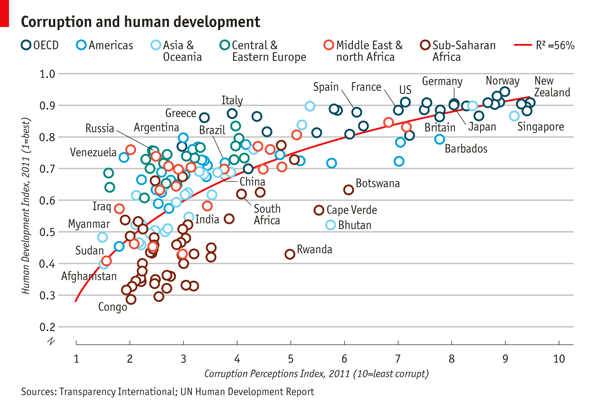
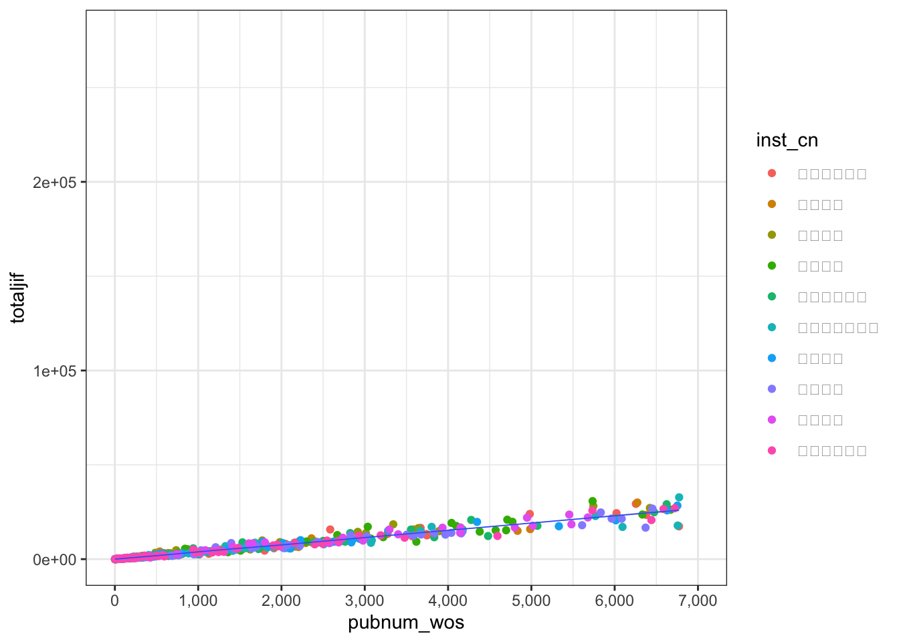

\mainmatter

# 数据可视化{#visu}

> 人都是视觉动物。

## 从一个可以画恐龙的包说起

在闲逛R论坛的时候，偶然发现有人贴了一段如下的代码，这个代码可以画出一个恐龙。

```r
# install.packages("datasauRus")
library("datasauRus")
library(ggplot2)
ggplot(subset(datasaurus_dozen, dataset=='dino'), 
             aes(x, y)) + 
  geom_point()  
```


太神奇了吧，居然有人写了个包来画恐龙！但是仔细一想，这事儿可能没有那么简单。事出非常必有妖，谁会闲到辛辛苦苦发布一个R包就为了画个恐龙呢。

果然datasauRus是一个非常有名的数据包，他包括了若干组描述性统计完全一致，但是分布却截然不同的数据集，恰恰说明了可视化的必要性。


详情可见论文，*Same Stats, Different Graphs: Generating Datasets with Varied Appearance and Identical Statistics through Simulated Annealing**


```r
library(datasauRus)
library(dplyr)
```

```
## 
## Attaching package: 'dplyr'
```

```
## The following objects are masked from 'package:stats':
## 
##     filter, lag
```

```
## The following objects are masked from 'package:base':
## 
##     intersect, setdiff, setequal, union
```

```r
datasaurus_dozen %>% 
    dplyr::group_by(dataset) %>% 
    dplyr::summarise(
      mean_x    = mean(x),
      mean_y    = mean(y),
      std_dev_x = sd(x),
      std_dev_y = sd(y),
      corr_x_y  = cor(x, y))
```

```
## # A tibble: 13 × 6
##    dataset    mean_x mean_y std_dev_x std_dev_y corr_x_y
##    <chr>       <dbl>  <dbl>     <dbl>     <dbl>    <dbl>
##  1 away         54.3   47.8      16.8      26.9  -0.0641
##  2 bullseye     54.3   47.8      16.8      26.9  -0.0686
##  3 circle       54.3   47.8      16.8      26.9  -0.0683
##  4 dino         54.3   47.8      16.8      26.9  -0.0645
##  5 dots         54.3   47.8      16.8      26.9  -0.0603
##  6 h_lines      54.3   47.8      16.8      26.9  -0.0617
##  7 high_lines   54.3   47.8      16.8      26.9  -0.0685
##  8 slant_down   54.3   47.8      16.8      26.9  -0.0690
##  9 slant_up     54.3   47.8      16.8      26.9  -0.0686
## 10 star         54.3   47.8      16.8      26.9  -0.0630
## 11 v_lines      54.3   47.8      16.8      26.9  -0.0694
## 12 wide_lines   54.3   47.8      16.8      26.9  -0.0666
## 13 x_shape      54.3   47.8      16.8      26.9  -0.0656
```

## 数据可视化的目的

数据可视化的目的是直观地向读者传递数据中包含的信息。重要的事情说三遍，**传递信息、传递信息、传递信息**！

因此，一个优秀的可视化应该具备以下的特征。

1. 重点突出。要让读者第一眼就能发现你要传达的主要信息，而不是暗戳戳的隐藏起来，等待别人发现。

2. 表意清晰。主要信息的传递要明确清晰，不要产生歧义，让读者自行发挥。充分利用注释、标题等来避免歧义。

3. 信息量大。图形的标题、注释都可以传达信息，在有限的图形内，尽可能传递更多信息。

4. 逻辑完整。数据传递的信息要有逻辑，能够独立阅读。

5. 美观。尽可能增强图形的美学水平，让读者愿意看，看着舒服，愿意分享。

## 图形语法（Grammar of Graphics）

图形语法（Grammar of Graphics，简称GG）是Leland Wilkinson开发的一套用来描述所有统计图表深层特性的语法规则，该语法回答了**什么是统计图表**这一问题，以自底向上的方式组织最基本的元素形成更高级的元素。在GG看来，一张图就是从数据到几何标记对象的图形属性的一组映射，此外图形中还可能包含数据的统计变换，最后绘制在某个特定的坐标系中。此时，科学绘图就会非常接近画油画，绘图的过程就是在一张空白的画布上，一层一层地叠加图形要素。

粗略地，GG拆解的主要图形要素可以分为三大类：几何对象、美术属性与标签注释。

**几何对象**指的是将数据映射到图形之后的几何类型，包括点（point）、线（line）、直方（histgram）、柱（bar）等。

**美术属性**指的是几何对象呈现在图形中的属性，例如颜色（color）、形状（shape）、尺寸（size）、透明度（alpha）等。属性让同一类几何对象传递更加丰富的信息。

**标签注释**包括标题（title）、轴标题（x/y title）、轴标签（xlab/ylab）、文本标签（text label）、注释（note）、图例（legend）等。可以进一步丰富图形传达的信息。

通过图形语法可以实现统计绘图的自动化，满足可复现原则与一次原则。

更多关于GG的内容，可以参考Wilkinson的著作[The Grammar of Graphics](https://link.springer.com/book/10.1007/0-387-28695-0)。

## `ggplot2`

将GG在R语言中实现的又是我们熟悉的大神Wickham，他设计了`ggplot2`包，`ggplot2`及其家族现在已经成为统制图的最佳工具。

我们看下发表在经济学人杂志的一篇文章中的图片，图片来源<http://www.economist.com/node/21541178>。数据来源，



这幅图首先在视觉呈现非常美观，然后信息传达非常丰富，几乎所有的图形要素都被利用了起来。可以分类总结如下：


本节的任务就是逐步学习`ggplot2`的要素，并画出此图。教学材料受到哈佛大学[IQSS](http://tutorials.iq.harvard.edu/)的启发。数据位于：[EconomistData.csv](https://drive.google.com/file/d/1CyCRpPVqLP-_BWjURiV5127rTiSHWuqe/view?usp=drive_link)。

总体来说，`ggplot`作图的标准模板为：

```
ggplot(data = <Data>) +
  <Geom_Function>(mapping = aes(<Mappings>),
  stat = <Stat>,
  position = <Position>) +
  <Coordinate_Function> +
  <Facet_Function> +
  <Scale_Function> +
  <Theme_Function>
```

`ggplot2`的语法逻辑为：

1. `ggplot`函数指定数据，然后使用`+`叠加后续绘图动作；

2. `geom_`函数族（或者`stat_`函数族）指定特定类型的几何对象；

3. `aes`函数调节几何对象的美术属性；

4. `coordinate_`函数指定坐标系统（可用于画地图）；

5. `facet_`函数进行分面；

6. `scale`函数调节坐标尺；

7. `theme`、`lab`、`guide`函数等调节主题、标题、图例等附加属性。

此外，`last_plot()`可返回上一张图片，`ggsave`用于图片输出。

### 几何对象

接下来，以绘制散点图为例介绍`ggplot2`的基本语法。以第三章使用的我国211大学发表论文的数据[pub211.csv](https://www.dropbox.com/scl/fi/nvbzqkerfaenz1dtgaitx/pub_211.csv?rlkey=n3vjai0a63oju73olrcvha43l&dl=0)为例，使用`ggplot`函数指定画图数据框为`pub_211_sum`，`aes`参数用于指定底图的x轴与y轴对应的变量，然后使用`geom_point`函数绘制散点图。


```r
library(readr)
library(dplyr)
pub_211 <- read_csv("pub_211.csv")
# 选出2022年发文最多的十所学校
top10 <- pub_211 %>% 
  filter(pubyear == 2022) %>% 
  group_by(inst_cn) %>% 
  summarise(pubnum_wos = sum(pubnum_wos)) %>% 
  arrange(desc(pubnum_wos)) %>% 
  slice(1:10)
top10_pub <- pub_211 %>% 
  semi_join(y = top10,by = "inst_cn") %>% 
  filter(pubyear == 2022) %>% 
  group_by(inst_cn,cnsubject) %>% 
  summarise(pubnum_wos = sum(pubnum_wos),
            totaljif = sum(totaljif))

p1 <- ggplot(top10_pub, aes(x = pubnum_wos, y = totaljif))
p2 <- p1 + geom_point()
print(p2)
```


**练习题**

导入EconomistData.csv数据，该数据包括了部分国家的人类发展指数与腐败感知指数。创建一个以 CPI 为x轴，HDI为y轴的散点图。

除散点图外，ggplot还支持类型丰富的几何对象，现将主要类型总结如下：

| 几何对象                | 变量类型          | 图类型                            |
|:---------------------|:---------------|:--------------------------------|
| `geom_blank`        | 初始化           | 空白画布                           |
| `expand_limits`     | 初始化           | 扩展画布范围以囊括所有数据                  |
| `geom_curve`          | 初始化           | 一条曲线，指定起止点与弧度 |
| `geom_path`           | 初始化           | 点组成的路径                         |
| `geom_polygon`        | 初始化           | 多边形                            |
| `geom_rect`           | 初始化           | 矩形或方块                          |
| `geom_ribbon`         | 初始化           | 带状区域，常用于表示区域的不确定性或置信区间         |
| `geom_abline`         | 线段            | 斜直线                            |
| `geom_hline`         | 线段            | 竖线                             |
| `geom_vline`          | 线段            | 横线                             |
| `geom_segment`        | 线段            | 斜线段                            |
| `geom_spoke`        | 线段            | 基于原点的向量或箭头，常用于极坐标  |
| `geom_area`           | 单连续变量         | 向坐标轴的区域  |
| `geom_density`        | 单连续变量         | 核密度分布图|
| `geom_dotplot`        | 单连续变量         | 分布堆叠图，点的堆叠表示相同数值的重复次数。         |
| `geom_freqpoly`       | 单连续变量         | 频率多边形图，连续变量的频率分布情况，是一种直方图的替代方式 |
| `geom_histogram`      | 单连续变量         | 分布直方图                          |
| `geom_qq`             | 单连续变量         | Q-Q 图（Quantile-Quantile Plot）  |
| `geom_bar`            | 单离散变量         | 条形图                            |
| `geom_point`          | 双连续变量         | 散点图                            |
| `geom_rug`            | 双连续变量         | 轴须图，以类似条形码的方式在数据外侧展示变量分布密度     |
| `geom_smooth`         | 双连续变量         | 平滑拟合线                          |
| `geom_text`           | 双连续变量         | 为散点图添加文本标签      |
| `geom_col`            | 一个离散变量加一个连续变量 | 柱状图       |
| `geom_boxplot`        | 一个离散变量加一个连续变量 | 箱线图     |
| `geom_violin`         | 一个离散变量加一个连续变量 | 小提琴图  |
| `geom_count`          | 双离散变量         | 散点密度图，点大小表达该位置点的数量|
| `geom_jitter`         | 双离散变量         | 抖动散点图，对数据进行随机抖动，以展示离散点的密度分布情况  |
| `geom_bin2d`          | 双变量           | 二维直方图                          |
| `geom_density_2d`     | 双变量           | 二维核密度图                         |
| `geom_hex`           | 双变量           | 六边形分箱                          |
| `geom_line`           | 双变量           | 折线图                            |
| `geom_step`           | 双变量           | 阶梯图                            |
| `geom_crossbar`       | 误差变量          | 误差条图                           |
| `geom_errorbar`       | 误差变量          | 误差雷达图                          |
| `geom_linerange`      | 误差变量          | 误差线图                           |
| `geom_pointrange`     | 误差变量          | 误差线图（带均值点） |
| `geom_map`            | 地理变量          | 地图                             |
| `geom_contour`        | 三变量           | 等高线图                           |
| `geom_contour_filled` | 三变量           | 与`geom_contour`配合使用制作带填充的等高线图    |
| `geom_raster`         | 三变量           | 栅格图                            |
| `geom_tile`           | 三变量           | 热力图                            |

更多细节请参考，https://rstudio.github.io/cheatsheets/html/data-visualization.html#geoms。

### 美术属性

在`geom_point`函数中，`aes`可用于指定几何对象的美术属性。指定美术属性既可使用常量，例如制定颜色为红色（red），也可以使用变量，例如通过学科（cnsubject）来赋值颜色。


```r
p1 + geom_point(aes(color = "red"))
```


```r
p1 + geom_point(aes(color = inst_cn))
```


\BeginKnitrBlock{rmdnote}<div class="rmdnote">上面图中显示不出图例是因为默认字体不支持中文字体，只需要通过`theme(legend.text = element_text(family='SimSun'))`指定图例字体即可。</div>\EndKnitrBlock{rmdnote}


```r
p1 + geom_point(aes(color = inst_cn)) + theme(legend.text = element_text(family='SimSun'))
```


使用变量指定美术属性时，会出现两种情形：离散变量与连续变量。以颜色为例，离散变量对应了若干种颜色，而连续变量则对应了渐变的颜色。


```r
p1 + geom_point(aes(color = pubnum_wos,size = inst_cn)) + theme(legend.text = element_text(family='SimSun'))
```

```
## Warning: Using size for a discrete variable is not advised.
```


常用的美学属性总结如下：

| 几何对象  | 美术属性     | 作用                                     |
|:-------|:----------|:----------------------------------------|
| all   | color    | 颜色，支持色号、文本等方式赋值                        |
| all   | fill     | 填充颜色                                   |
| all   | size     | 大小                                     |
| all   | alpha    | 透明度 |
| line  | linetype | 线条类型：支持0-6共七种类型                        |
| line  | lineend  | 线条结尾：“round”, “butt” (缺省值), “square”   |
| line  | linejoin | 线条连接处：“round” (缺省值), “mitre”, “bevel”. |
| point | shape    | 点的形状：0-25共26种形状                        |
| point/line | stroke   | 图形或线条的轮廓|
| text  | family   | 指定文本的字体                                |
| text  | fontface | 指定字体样式："plain", "bold", "italic"       |
| text  | hjust    | 纵向位置：top = 1, middle = 0.5, bottom = 0 |
| text  | vjust    | 横向位置：left = 0, center = 0.5, right = 1 |

更多细节可以参考：https://ggplot2.tidyverse.org/articles/ggplot2-specs.html#colour-and-fill

**练习题**

在上一题的基础上

1. 将图的点改为蓝色(blue)；

2. 使用Region变量为点着色

### 统计变换

在`ggplot2`中，统计变换函数（statistical transformation functions）用于对数据进行统计计算或转换，以便在图表中呈现不同的数据表现形式。

例如，`stat_summary`函数可将数据按照指定的函数进行汇总，例如计算平均值、中位数等，并将汇总结果绘制到图表中。下面的代码中，`fun`参数指定了计算均值，`geom`参数制定了转换后的集合对象。


```r
ggplot(top10_pub, aes(x = inst_cn, y = totaljif)) +
  stat_summary(fun = mean, geom = "col")
```


其他统计转换数据包括，`stat_function`，允许将数学函数应用到图形中。可以使用此函数绘制自定义函数的图形；`stat_ecdf`，绘制经验累积分布函数，显示数据的累积分布情况；`stat_contour`用于创建等高线图，展示二维数据的密度分布情况；`stat_density`用于绘制核密度估计曲线，展示数据的密度分布情况；`stat_summary_hex`类似于`stat_summary`，用六边形的方式呈现数据的汇总结果。

尽管统计转换函数集成了数据转换与绘图，看上去比较方便，但是我们推荐读者实践中还是将数据转换与绘图分开，这样的代码更直观，也更加容易调整。

### 标尺

`scale_`函数族用于调整x轴，y轴以及所有美术属性对应变量的尺度。在使用标尺函数的时候，需要首先明确调整的变量是连续变量还是离散变量。`scale_*_continuous`将数据的连续取值映射为图形属性的取值，`scale_*_discrete`将数据的离散取值映射为图形属性的取值。

`scale_x_(y_)_continuous/discrete`用于调整坐标轴的范围（limits参数）、刻度（breaks，labels参数）以及位置（position参数）等特性。


```r
p3 <- p1 + geom_point(aes(color = inst_cn)) + 
  theme(legend.text = element_text(family='SimSun')) +
  geom_smooth(size = 0.3) + 
  scale_x_continuous(limits = c(0,7000),
                     breaks = seq(0,7000,1000),
                     labels = c("0","1,000","2,000",
                                "3,000","4,000","5,000",
                                "6,000","7,000"))
```

```
## Warning: Using `size` aesthetic for lines was deprecated in ggplot2 3.4.0.
## ℹ Please use `linewidth` instead.
## This warning is displayed once every 8 hours.
## Call `lifecycle::last_lifecycle_warnings()` to see where this warning was
## generated.
```

```r
print(p3)
```

```
## `geom_smooth()` using method = 'loess' and formula = 'y ~ x'
```


其他常用`scale`函数，`scale_*_binned`将数据的连续取值映射为离散的统计堆；`scale_*_identity`使用数据的值作为图形属性的取值
`scale_*_manual(values = c())`将数据的离散取值作为手工指定的图形属性的取值；
`scale_*_date(date_labels = "%m/%d"),date_breaks = "2 weeks")`将数据值视为日期；`scale_*_datetime()`将数据视为时间。

坐标轴比例也可以调节，`scale_x_log10`以log10比例绘制x轴，
`scale_x_reverse`反转x轴方向，`scale_x_sqrt`以平方根绘制x。

例如，`scale_color_manual`函数可以根据个人的喜好来定制数据，后面小节中会介绍如何选择颜色。


```r
p1 + geom_point(aes(color = inst_cn)) + 
  theme(legend.text = element_text(family='SimSun')) +
  geom_smooth(size = 0.3) + 
  scale_x_continuous(limits = c(0,7000),
                     breaks = seq(0,7000,1000),
                     labels = c("0","1,000","2,000",
                                "3,000","4,000","5,000",
                                "6,000","7,000")) + 
  scale_color_manual(values = c("#E69F00", "#56B4E9","#009E73", "#F0E442", "#0072B2","#D55E00","#CC79A7","#6794a7","#014d64","#01a2d9"))
```

```
## `geom_smooth()` using method = 'loess' and formula = 'y ~ x'
```


**练习题**
在上一个题目的基础上，

1. 使用scale_x_(y_)修改x轴与y轴的scale，以增加其可读性；

2. 使用scale_color_manual函数将散点的颜色调整为c(“red”,”blue”,"green","black","yellow","gray")，对应颜色的label调整为，c("Americas","Asia Pacific","East Europe & Central Asia","West Europe","East Asia","South Asia")

### 坐标系

`gglot2`默认使用笛卡尔坐标系，`coord_fixed`指定x和y单位之间固定长宽比的笛卡尔坐标，`coord_polar`为极坐标系，`coord_trans(y = 'sqrt')`使用变量转换后的坐标系，`coord_map`用于地理绘图中的坐标系。

### 分面
分面（facet）指的是按照某一个或两个分类变量的不同值将数据分为若干个子集，每个数据子集分别在分面上作图，使用`facet_wrap`可以直接分面，分面可以使用单个变量，也可以使用两个变量。


```r
p1 + geom_point() + 
  theme(text = element_text(family='SimSun')) +
  geom_smooth(size = 0.3) +
  facet_wrap(~ inst_cn)
```

```
## `geom_smooth()` using method = 'loess' and formula = 'y ~ x'
```


### 标签与图例

`labs`函数用于标记图中的元素，其`x/y`参数标注坐标轴，`title`参数标注图标题，`subtitle`标注图的子标题，`caption`标注图说明。

`guides`函数用于设置图例，常用的包括取消图例（设定对应美术属性为none），以及设置图例位置`theme(legend.position = "bottom")`。

`annotate`函数可以直接在图上手工添加文本。

### 主题

一张图里面的格式可以统称为主题，通过`theme`函数可以对图的每一处细节进行调整，可以调整的选项非常丰富，可以查看theme函数的帮助文档来逐步调整。


```r
?theme
```

此外，一些常用的格式被封装在一些主题当中，例如`theme_bw()`，`theme_classic()`，`theme_minimal()`，调用这些主题会覆盖掉主题的设置。


```r
p3 + theme_bw()
```

```
## `geom_smooth()` using method = 'loess' and formula = 'y ~ x'
```



```r
p3 + theme_classic()
```

```
## `geom_smooth()` using method = 'loess' and formula = 'y ~ x'
```


```r
p3 + theme_minimal()
```

```
## `geom_smooth()` using method = 'loess' and formula = 'y ~ x'
```


`ggthemes`包提供了更丰富的格式主题，

```r
if(!require(ggthemes)) install.packages("ggthemes")
```

```
## Loading required package: ggthemes
```

```r
library(ggthemes)
p3 + theme_stata()
```

```
## `geom_smooth()` using method = 'loess' and formula = 'y ~ x'
```


```r
p3 + theme_economist()
```

```
## `geom_smooth()` using method = 'loess' and formula = 'y ~ x'
```


```r
p3 + theme_wsj()
```

```
## `geom_smooth()` using method = 'loess' and formula = 'y ~ x'
```


theme的另一种用法为讲自己设置的格式储存为主题，用于后续的图形中简单调用。

**练习题**

利用theme函数的丰富参数，绘制终极图形。

### 拼接图形


#### 调色板

选择优雅的颜色是高质量数据可视化的保障。如果不是艺术造诣很高的话，选择成熟的配色是最安全的选择。`ggthemes`包封装了多种成熟的主题，`ggsci`则包括了多种杂志的配色方案，我们可以使用`scales`包的show_col函数来查看色号。

例如，我们要查看并使用经济学人杂志的调色板，可以用下面的代码


```r
library(ggthemes)
library(scales)
```

```
## 
## Attaching package: 'scales'
```

```
## The following object is masked from 'package:readr':
## 
##     col_factor
```

```r
library(ggsci)
show_col(economist_pal()(9))
```


```r
economist_pal()(9)
```

```
## [1] "#6794a7" "#014d64" "#01a2d9" "#7ad2f6" "#00887d" "#76c0c1" "#7c260b"
## [8] "#ee8f71" "#adadad"
```

如果要使用science杂志的配色，可以用下面的代码。

```r
show_col(pal_aaas()(9))
```


```r
pal_aaas()(9)
```

```
## [1] "#3B4992FF" "#EE0000FF" "#008B45FF" "#631879FF" "#008280FF" "#BB0021FF"
## [7] "#5F559BFF" "#A20056FF" "#808180FF"
```

当然，艺术造诣和编程能力并不是互斥的技能点。例如，R语言社区资深开发者（`ggplot2`包的作者）、计算认知科学家Danielle Navarro就是一名计算艺术家（computational artist）。下面是她的作品*Dancer*，更多作品可以浏览https://art.djnavarro.net/。

```
The munsell package, by Charlotte Wickham, makes it easy to choose specific colours using a system designed by Albert H. Munsell. If you invest a little in learning the system, it provides a convenient way of specifying aesthetically pleasing colours.
munsell::mnsl("5PB 5/10")
#> [1] "#447DBF"
```

## 交互

## 动图

## 大屏

### 交互式
